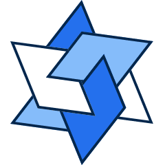

  </a>
   
  <h1> The Thanos Monorepo</h1>

## TL;DR
This is core repository for Thanos maintained by [Tokamak Network](https://tokamak.network/#/)

## Documentation

More detailed documentation of Thanos can be found [here](https://docs.tokamak.network/home/service-guide/tokamak-l2/thanos-stack).

Tokamak Network also facilitates Thanos-based rollup deployments through the [Tokamak Rollup Hub](https://rolluphub.tokamak.network/). For further details and deployment guidelines, please review the following resources:

- **Devnet:** [Rollup Hub - Devnet](https://docs.tokamak.network/home/service-guide/rollup-hub/devnet)
- **Mainnet/Testnet:** [Rollup Hub - Mainnet Beta](https://docs.tokamak.network/home/service-guide/rollup-hub/mainnet-beta)

## Directory Structure

<pre>
├── <a href="./docs">docs</a>: A collection of documents including audits and post-mortems
├── <a href="./op-batcher">op-batcher</a>: L2-Batch Submitter, submits bundles of batches to L1
├── <a href="./op-bootnode">op-bootnode</a>: Standalone op-node discovery bootnode
├── <a href="./op-chain-ops">op-chain-ops</a>: State surgery utilities
├── <a href="./op-challenger">op-challenger</a>: Dispute game challenge agent
├── <a href="./op-e2e">op-e2e</a>: End-to-End testing of all bedrock components in Go
├── <a href="./op-heartbeat">op-heartbeat</a>: Heartbeat monitor service
├── <a href="./op-node">op-node</a>: rollup consensus-layer client
├── <a href="./op-preimage">op-preimage</a>: Go bindings for Preimage Oracle
├── <a href="./op-program">op-program</a>: Fault proof program
├── <a href="./op-proposer">op-proposer</a>: L2-Output Submitter, submits proposals to L1
├── <a href="./op-service">op-service</a>: Common codebase utilities
├── <a href="./op-ufm">op-ufm</a>: Simulations for monitoring end-to-end transaction latency
├── <a href="./op-wheel">op-wheel</a>: Database utilities
├── <a href="./ops">ops</a>: Various operational packages
├── <a href="./ops-bedrock">ops-bedrock</a>: Bedrock devnet work for Thanos
├── <a href="./packages/tokamak">packages for Thanos</a>
│   ├── <a href="./packages/tokamak/contracts-bedrock">contracts-bedrock</a>: Bedrock + Thanos smart contracts
│   ├── <a href="./packages/tokamak/sdk">sdk</a>: provides a set of tools for interacting with Thanos
│   ├── <a href="./packages/tokamak/core-utils">core-utils</a>: provides core utilities for interacting with Thanos
├── <a href="./proxyd">proxyd</a>: Configurable RPC request router and proxy
├── <a href="./specs">specs</a>: Specs of the rollup starting at the Bedrock upgrade
</pre>

## License

Thanos is forked from [`optimism (OP Stack v1.7.7)`](https://github.com/ethereum-optimism/optimism/tree/v1.7.7) is licensed under the MIT License unless stated otherwise.

## Community

[Discord](https://discord.com/invite/J4chV2zuAK) | [Wwitter](https://twitter.com/tokamak_network) | [Medium](https://medium.com/@tokamak_network) | [Telegram](https://t.me/tokamak_network)
