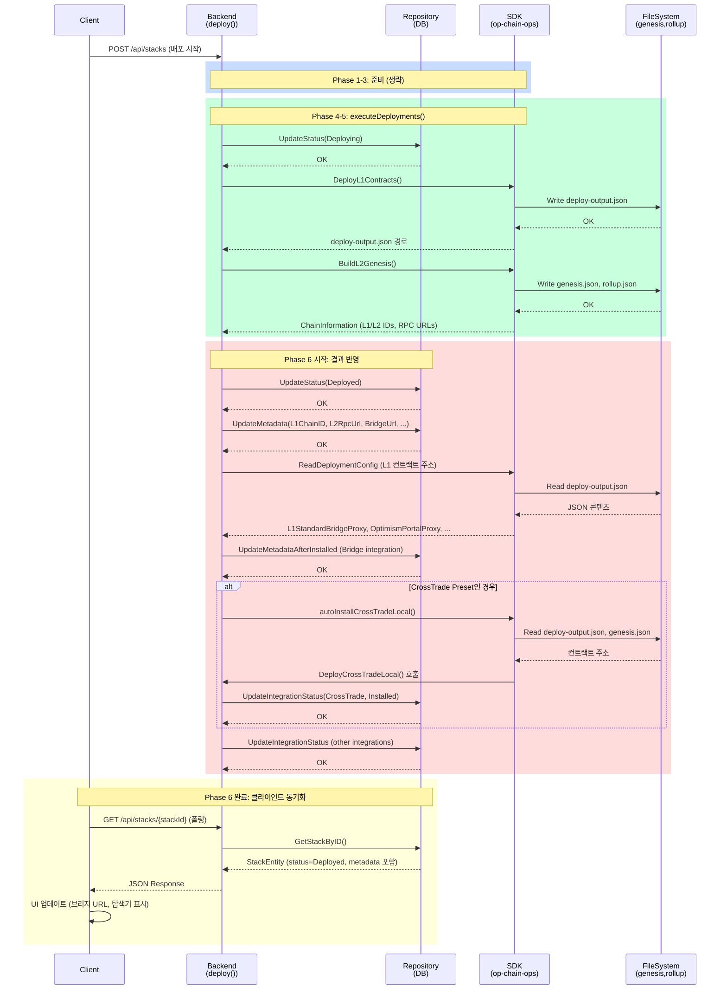

# Phase 6 분석: 결과 반영 및 알림 (Result Persistence and Notification)

## 목차

1. [개요](#개요)
2. [용어 정의](#용어-정의)
3. [상세 분석](#상세-분석)
4. [호출 시퀀스](#호출-시퀀스)
5. [데이터 구조](#데이터-구조)
6. [에러 시나리오](#에러-시나리오)
7. [알려진 함정 및 개선 포인트](#알려진-함정-및-개선-포인트)

---

## 개요

Phase 6는 Phase 5에서 생성된 L1/L2 배포 결과(genesis.json, rollup.json, 배포 산출물)를 백엔드 데이터베이스에 영속적으로 저장하고, 클라이언트에게 배포 완료 알림을 전달하는 과정을 다룬다. 이 단계는:

- **역할**: BuildL2Genesis() 완료 후, 배포 결과를 DB와 파일시스템에 저장하고 스택 상태 전이
- **입력**: 
  - Phase 5의 genesis.json, rollup.json (DeploymentPath에 저장됨)
  - Phase 4의 deploy-output.json (L1 컨트랙트 주소들)
  - 배포 메타데이터 (L1/L2 RPC URL, Chain ID, Bridge URL 등)
- **출력**:
  - Database: Stack 레코드 상태 변경 (`StackStatusDeploying` → `StackStatusDeployed`)
  - Database: StackMetadata 업데이트 (L1/L2 정보, 브리지 URL, 모니터링 URL)
  - File System: genesis.json, rollup.json 영속 저장 (DeploymentPath/)
  - Client Notification: 배포 완료 알림 또는 에러 알림
- **특징**:
  - 트랜잭션 일관성: DB 업데이트와 파일 저장의 원자성 보장
  - 상태 전이 검증: 유효한 상태 경로만 허용 (Deploying → Deployed 또는 → FailedToDeploy)
  - 메타데이터 통합: L1/L2 체인 정보, 외부 서비스 URL 중앙 집중식 저장
  - 에러 복구: 부분 실패 시 롤백 또는 재시도 메커니즘

---

## 용어 정의

### 스택 생명주기 관련

- **StackStatus**: 스택의 현재 상태를 나타내는 열거형
  - `Pending`: 배포 대기 중
  - `Deploying`: 배포 진행 중 (L1 컨트랙트 배포 또는 L2 Genesis 생성 진행)
  - `Deployed`: 배포 완료 (DB에 저장됨, 메타데이터 포함)
  - `FailedToDeploy`: 배포 실패 (reason 필드에 에러 메시지)
  - `Updating`: 업데이트 진행 중
  - `Terminated`: 스택 종료됨 (수동으로 삭제되거나 정리됨)
  - `Unknown`: 상태 불명

- **StackMetadata**: 배포 완료 후 체인 정보를 저장하는 구조
  - `Layer1`: L1 체인명 (e.g., "Ethereum", "Ethereum Sepolia")
  - `Layer2`: L2 체인명 (항상 "Thanos Stack")
  - `L1ChainId`: L1 체인 ID (uint64, e.g., 1 for Mainnet, 11155111 for Sepolia)
  - `L2ChainId`: L2 체인 ID (배포 설정에서 지정)
  - `L1RpcUrl`: L1 노드 RPC URL (배포 입력에서 제공)
  - `L2RpcUrl`: L2 op-geth 노드 RPC URL (로컬: http://localhost:8545, AWS: DNS명)
  - `BridgeUrl`: 크로스 체인 브리지 인터페이스 URL
  - `ExplorerUrl`: L2 블록 익스플로러 URL
  - `RollupConfigUrl`: rollup.json 파일 경로 또는 HTTP URL
  - `MonitoringUrl`: 스택 모니터링 대시보드 URL (Grafana 등)

- **DeploymentResult**: 배포 완료 시 생성되는 최종 결과 객체
  - StackID, 배포 상태, 메타데이터, 파일 경로, 타임스탬프 포함

- **ArtifactStore**: 배포 산출물(artifact)을 저장하는 추상화 계층
  - 로컬 파일시스템: DeploymentPath (예: /var/deployments/thanos/{stackId}/)
  - 각 파일은 타임스탬프 또는 버전 정보와 함께 저장

### 파일 및 설정 관련

- **genesis.json**: L2 체인의 초기 상태 파일
  - 위치: `{DeploymentPath}/genesis.json`
  - 내용: 초기 계정 잔액, predeploy 컨트랙트 코드, 저장소 상태
  - 크기: 대부분 ~20MB-100MB (predeploy 크기에 따라 다름)

- **rollup.json**: L2 Rollup 프로토콜 설정 파일
  - 위치: `{DeploymentPath}/rollup.json`
  - 내용: RollupConfig 구조체를 JSON으로 인코딩 (ChainID, L1 정보, 수수료 파라미터, Hard Fork 시간)
  - 크기: ~5KB-50KB

- **deploy-output.json**: Phase 4에서 생성된 L1 컨트랙트 배포 결과
  - 위치: `{DeploymentPath}/deploy-output.json`
  - 내용: OptimismPortal, L1CrossDomainMessenger, L1StandardBridge 등의 배포 주소 및 트랜잭션 해시

- **DeploymentPath**: 스택별 배포 산출물 저장 디렉토리
  - 구조: `/deployments/{stackName}/{network}/{stackId}/`
  - 예: `/deployments/thanos/sepolia/550e8400-e29b-41d4-a716-446655440000/`

### 데이터베이스 관련

- **StackEntity**: 스택 레코드를 나타내는 도메인 엔티티
  - 필드: ID, Name, Type, Network, Config, Metadata, DeploymentPath, Status, Reason, CreatedAt, UpdatedAt, DeletedAt
  - 기본 키: ID (UUID)
  - 인덱스: Status (상태 조회 성능), Network (네트워크별 필터링)

- **Stack 테이블**: 스택 레코드를 저장하는 PostgreSQL 테이블
  - 컬럼: id (UUID), name (text), type (text), network (enum), config (jsonb), metadata (jsonb), deployment_path (text), status (enum), reason (text), created_at (timestamp), updated_at (timestamp), deleted_at (timestamp)
  - 제약: PK (id), Unique (id), NOT NULL (id, name, type, network, status)

- **Transaction Safety**: GORM을 사용한 트랜잭션 관리
  - `tx.Begin()`: 트랜잭션 시작
  - `tx.Commit()`: 원자적 커밋
  - `tx.Rollback()`: 실패 시 롤백

### 알림 및 클라이언트 관련

- **ClientNotification**: 배포 상태 변화를 클라이언트에게 알리기 위한 메시지
  - 채널: REST API long-polling 또는 WebSocket (구현에 따라)
  - 페이로드: StackID, Status, Metadata, ErrorMessage (실패 시)
  - 전달 보장: Best-effort (재시도 로직은 선택적)

- **StatusUpdate**: 스택 상태 변화 이벤트
  - 발행자: 백엔드 서비스 (executeDeployments, deploy 등)
  - 구독자: 클라이언트 (API 폴링 또는 WebSocket 리스너)

- **long-polling**: 클라이언트가 주기적으로 상태를 조회하는 패턴
  - 클라이언트: GetStackStatus API를 주기적으로 호출 (예: 1초 간격)
  - 응답: 현재 상태, 메타데이터, 에러 메시지

- **WebSocket**: 양방향 통신 채널 (선택사항, 향후 구현 가능)
  - 클라이언트: ws://backend:port/ws/stacks/{stackId} 연결
  - 서버: 상태 변화 시 즉시 푸시

### 에러 및 복구 관련

- **ErrorState**: 배포 실패 상태
  - DB: StackStatus = `FailedToDeploy`, Reason = 에러 메시지
  - 파일: 부분적으로 저장된 genesis.json, rollup.json (정리 필요)
  - 클라이언트: 에러 알림 + 재시도 옵션

- **RollbackMechanism**: 부분 실패 시 복구 전략
  - 파일 저장 실패: DB 롤백, 파일 정리
  - DB 업데이트 실패: 파일 삭제, 상태 리셋
  - 원자성 목표: (File + DB) 성공 또는 모두 실패

- **RetryLogic**: 배포 재시도
  - 클라이언트: 실패한 deployment 엔티티의 상태를 Pending으로 리셋하고 재배포 트리거
  - 백엔드: executeDeployments 다시 호출

- **PartialFailure**: 일부 성공 시나리오
  - L1 배포 성공, L2 Genesis 생성 실패: L1 결과 저장 되지만 StackStatus = Failed
  - 파일 저장 성공, DB 업데이트 실패: 파일 정리 및 재시도 필요

### 통합 관련

- **Integration**: 스택과 연동되는 외부 서비스 또는 플러그인
  - 유형: `bridge` (크로스 체인 브리지), `crossTrade` (교환 서비스), `uptimeService` (모니터링)
  - 생명주기: Pending → InProgress → Installed/Failed
  - 자동 설치: 배포 완료 후 특정 preset에서 자동으로 설정됨

- **Preset**: 스택 구성 템플릿
  - 예: "gaming" (DRB injection), "usdc" (USDC 지원)
  - 메타데이터: 활성화된 모듈 (uptimeService, crossTrade 등)

- **auto-install**: 배포 완료 후 자동 설치되는 통합
  - CrossTrade: 로컬 배포에서 L2 컨트랙트 배포 및 L1 등록
  - UptimeService: 모니터링 대시보드 자동 설정
  - 실행: deploy() 메서드 내 후처리로 처리

---

## 상세 분석

### 6.1 메인 배포 진입점: deploy() 함수

**파일**: `trh-backend/pkg/services/thanos/deployment.go`

**함수 범위**: `deploy()` (라인 31-437)

**함수 시그니처**:
```go
func (s *ThanosStackDeploymentService) deploy(ctx context.Context, stackId uuid.UUID)
```

**목적**: 배포 실행 후 결과를 DB와 파일에 저장하고, 성공 시 스택 상태를 `Deployed`로 전이. 실패 시 `FailedToDeploy`로 설정.

**입력**:
- `ctx`: 컨텍스트 (취소, 타임아웃 신호 전달용)
- `stackId`: 배포할 스택 UUID

**출력**: 없음 (부수효과로 DB 업데이트 및 파일 저장)

**핵심 로직**:

1. **에러 처리 및 상태 전이 (라인 32-62)**:
   ```
   - executeDeployments(stackId) 호출 → Phase 4, 5 실행
   - 에러 발생 시:
     - 컨텍스트 취소 예외: 조용히 반환
     - 일반 에러: StackStatusFailedToDeploy로 업데이트, 통합 상태도 Failed로 설정
   - 성공 시: 계속 진행 → 메타데이터 수집 및 DB 저장
   ```

2. **메타데이터 수집 (라인 64-141)**:
   ```
   - GetStackByID(): 스택 엔티티 조회
   - StackStatus → StackStatusDeployed로 업데이트 (라인 71)
   - Config를 DeployThanosRequest로 언마샬
   - SDK 클라이언트 생성
   - ShowChainInformation() 또는 BuildLocalChainInformation() 호출:
     * L1ChainID, L2ChainID, L2RpcUrl, BridgeUrl, BlockExplorerUrl 추출
   - UpdateMetadata(): 수집된 정보를 Stack.Metadata에 저장
   ```

3. **통합 자동 설치 (라인 145-432)**:
   ```
   - Bridge 통합: SetupBridge() 호출 (라인 167-177)
   - CrossTrade 통합 (로컬 배포):
     * autoInstallCrossTradeLocal() 호출 → L2 컨트랙트 배포 및 L1 등록
     * 실패 시: 통합 상태 = Failed
   - 기타 통합: uptimeService 등 자동 설정
   - AA Operator: 로컬 배포에서 필요 시 시작
   ```

**관련 파일**:
- `trh-backend/pkg/services/thanos/service.go` (ThanosStackDeploymentService 정의)
- `trh-backend/pkg/infrastructure/postgres/repositories/stack.go` (UpdateStatus, UpdateMetadata)
- `trh-sdk/pkg/stacks/thanos/client.go` (ShowChainInformation)

---

### 6.2 배포 실행 함수: executeDeployments()

**파일**: `trh-backend/pkg/services/thanos/deployment.go`

**함수 범위**: `executeDeployments()` (라인 439-653)

**함수 시그니처**:
```go
func (s *ThanosStackDeploymentService) executeDeployments(ctx context.Context, stackId uuid.UUID) error
```

**목적**: Phase 4 (L1 배포), Phase 5 (L2 Genesis 생성)를 순차적으로 실행하고 배포 상태를 추적.

**입력**:
- `ctx`: 컨텍스트
- `stackId`: 스택 UUID

**출력**: 
- 성공: `nil`
- 실패: 에러 객체 (배포 단계별 에러)

**핵심 로직**:

1. **상태 초기화 (라인 440-448)**:
   ```
   - StackStatus → StackStatusDeploying
   - statusChan, errChan 생성 (상태 업데이트 및 에러 처리용)
   ```

2. **배포 필터링 (라인 452-501)**:
   ```
   - GetDeploymentsByStackIDAndStatus() → Pending 배포만 조회
   - "deploy-l1-contracts" 스텝: L1 배포
   - "deploy-aws-infra" 또는 로컬 인프라 배포: AWS 또는 로컬 인프라
   - 순서 보장: L1 먼저, 인프라 나중
   ```

3. **상태 업데이트 루프 (라인 503-519)**:
   ```
   - statusChan으로 수신한 상태 변화를 DB에 저장:
     * UpdateDeploymentStatus() 호출
     * 모든 배포 성공 시 errChan에 nil 전송
   ```

4. **배포 실행 (라인 521-648)**:
   ```
   for each deployment in pendingDeployments:
     - 이미 성공한 배포: 스킵 (resume 지원)
     - SDK 클라이언트 생성
     - statusChan ← InProgress
     - switch deployment.Step:
       * "deploy-l1-contracts": DeployL1Contracts() 호출 → genesis.json, rollup.json, deploy-output.json 생성
       * "deploy-aws-infra": DeployAWSInfrastructure() 또는 DeployLocalInfrastructure() 호출
     - 성공 시: statusChan ← Success
     - 실패 시: statusChan ← Failed, return err
   ```

**관련 파일**:
- `trh-sdk/pkg/stacks/thanos/deploy.go` (DeployL1Contracts, DeployAWSInfrastructure)
- `trh-backend/pkg/infrastructure/postgres/repositories/deployment.go` (UpdateDeploymentStatus)

---

### 6.3 스택 상태 업데이트: UpdateStatus()

**파일**: `trh-backend/pkg/infrastructure/postgres/repositories/stack.go`

**함수 범위**: `UpdateStatus()` (라인 82-92)

**함수 시그니처**:
```go
func (r *StackRepository) UpdateStatus(
    id string,
    status entities.StackStatus,
    reason string,
) error
```

**목적**: 스택의 현재 상태를 DB에 업데이트. 실패 시 reason 필드도 함께 저장.

**입력**:
- `id`: 스택 UUID
- `status`: 새로운 StackStatus (Pending, Deploying, Deployed, FailedToDeploy, Updating, Terminated, Unknown)
- `reason`: 상태 변경 이유 또는 에러 메시지 (선택사항)

**출력**:
- 성공: `nil`
- 실패: GORM 에러

**핵심 로직**:

1. **단순 상태 업데이트** (reason이 빈 문자열):
   ```sql
   UPDATE stack SET status = ? WHERE id = ?
   ```

2. **상태 + 이유 업데이트** (reason이 제공됨):
   ```sql
   UPDATE stack SET status = ?, reason = ? WHERE id = ?
   ```

**주의사항**:
- 상태 전이 검증 없음: 호출자가 유효한 전이인지 확인해야 함
  - 유효한 경로: Pending → Deploying → Deployed/FailedToDeploy
  - 유효한 경로: Deployed → Updating → Deployed/FailedToDeploy
  - 유효한 경로: * → Terminated (언제든 종료 가능)
- 동시성: 여러 작업이 동시에 업데이트 시 race condition 가능 (SELECT-UPDATE 사이의 간격)

**관련 파일**:
- `trh-backend/pkg/infrastructure/postgres/schemas/stack.go` (Stack 스키마)

---

### 6.4 메타데이터 저장: UpdateMetadata()

**파일**: `trh-backend/pkg/infrastructure/postgres/repositories/stack.go`

**함수 범위**: `UpdateMetadata()` (라인 94-106)

**함수 시그니처**:
```go
func (r *StackRepository) UpdateMetadata(
    id string,
    metadata *entities.StackMetadata,
) error
```

**목적**: L1/L2 체인 정보, 브리지 URL, 모니터링 URL 등을 StackMetadata 구조로 직렬화하여 DB에 저장.

**입력**:
- `id`: 스택 UUID
- `metadata`: StackMetadata 구조체 포인터 (nil 불가)

**출력**:
- 성공: `nil`
- 실패: GORM 에러 또는 마샬링 에러

**핵심 로직**:

1. **nil 검증**: metadata가 nil이면 즉시 에러 반환 (라인 98-100)

2. **JSON 마샬링** (라인 101-104):
   ```go
   metadata.Marshal() → []byte (JSON 형식)
   ```

3. **DB 업데이트** (라인 105):
   ```sql
   UPDATE stack SET metadata = ? WHERE id = ?
   ```

**데이터 구조 (StackMetadata)**:
```json
{
  "layer1": "Ethereum Sepolia",
  "layer2": "Thanos Stack",
  "l1ChainId": 11155111,
  "l2ChainId": 777,
  "l1RpcUrl": "https://sepolia.infura.io/v3/...",
  "l2RpcUrl": "http://localhost:8545",
  "bridgeUrl": "http://localhost:3000/bridge",
  "explorerUrl": "http://localhost:4000",
  "rollupConfigUrl": "/deployments/thanos/sepolia/.../rollup.json",
  "monitoringUrl": "http://localhost:3001"
}
```

**관련 파일**:
- `trh-backend/pkg/domain/entities/stack.go` (StackMetadata 정의)

---

### 6.5 Genesis/Rollup 파일 저장: 암묵적 저장

**파일**: 
- `tokamak-thanos/op-chain-ops/cmd/registry-data/main.go` (genesis 생성)
- SDK 클라이언트 내부 로직 (파일 시스템 기록)

**목적**: Phase 5에서 생성한 genesis.json, rollup.json을 DeploymentPath에 저장.

**입력**: 
- DeploymentPath: `/deployments/{name}/{network}/{stackId}/`
- Genesis 상태: ~20-100MB JSONL 형식
- Rollup 설정: ~5-50KB JSON

**출력**:
- 파일 시스템:
  - `{DeploymentPath}/genesis.json` (생성됨)
  - `{DeploymentPath}/rollup.json` (생성됨)
  - `{DeploymentPath}/deploy-output.json` (Phase 4에서 생성)

**핵심 로직**:

1. **Genesis 파일 쓰기**:
   ```
   - op-chain-ops의 BuildL2Genesis()에서 생성된 genesis.State 객체
   - JSON 직렬화 → {DeploymentPath}/genesis.json 기록
   - 인코딩: JSON (UTF-8, GZIP 압축 없음)
   - 크기: predeploy 코드에 따라 20-100MB
   ```

2. **Rollup 파일 쓰기**:
   ```
   - RollupConfig 구조체 → JSON 마샬링
   - {DeploymentPath}/rollup.json 기록
   - 내용: ChainID, L1Config, SystemConfig, Hard Fork 정보
   ```

**주의사항**:
- 파일 쓰기가 실패해도 에러가 DB에 반영되지 않을 수 있음 (SDK 내부 로직이므로)
- 디스크 용량 부족 시 부분적인 파일만 생성될 수 있음
- 권한 문제: DeploymentPath의 쓰기 권한 필요 (컨테이너 내 `/var/deployments`)

**관련 파일**:
- `tokamak-thanos/op-chain-ops/` (genesis, rollup 생성 로직)
- `trh-backend/pkg/services/thanos/deployment.go` (DeploymentPath 설정)

---

### 6.6 통합 설정: SetupBridge()

**파일**: `trh-backend/pkg/services/thanos/deployment.go`

**함수 범위**: `deploy()` 내 라인 145-177 (SetupBridge 호출 부분)

**호출 함수**: `s.integrationRepo.UpdateMetadataAfterInstalled()`

**목적**: 배포 완료 후 Bridge 통합을 자동 설정. Bridge URL과 메타데이터를 Integration 레코드에 저장.

**입력**:
- `stackId`: 스택 UUID
- `chainInformation`: L1/L2 RPC URL 및 Chain ID 정보

**출력**:
- DB: Integration 레코드 업데이트 (Bridge URL 저장, 상태 = Installed)

**핵심 로직**:

1. **Bridge 통합 조회** (라인 145-150):
   ```go
   integrationRepo.GetIntegration(stackId, "bridge") → *IntegrationEntity
   ```

2. **브리지 컨트랙트 주소 읽기** (라인 152-156):
   ```
   ReadDeployementConfigFromJSONFile(stackId)
   → OptimismPortalProxy, L1StandardBridgeProxy, L1CrossDomainMessengerProxy 등 추출
   ```

3. **메타데이터 저장** (라인 157-177):
   ```
   UpdateMetadataAfterInstalled(
     integrationId,
     metadata: {
       "portalAddress": OptimismPortalProxy,
       "bridgeAddress": L1StandardBridgeProxy,
       ...
     }
   )
   ```

**관련 파일**:
- `trh-backend/pkg/infrastructure/postgres/repositories/integration.go` (UpdateMetadataAfterInstalled)
- `trh-sdk/pkg/utils/` (ReadDeployementConfigFromJSONFile)

---

### 6.7 CrossTrade 자동 설치: autoInstallCrossTradeLocal()

**파일**: `trh-backend/pkg/services/thanos/deployment.go`

**함수 범위**: `autoInstallCrossTradeLocal()` (라인 672-732)

**함수 시그니처**:
```go
func (s *ThanosStackDeploymentService) autoInstallCrossTradeLocal(
    ctx context.Context,
    stack *entities.StackEntity,
    stackConfig *dtos.DeployThanosRequest,
    chainInfo *thanosSDKTypes.ChainInformation,
) (*thanosSDKStack.DeployCrossTradeLocalOutput, error)
```

**목적**: 로컬 배포에서 preset이 "crossTrade"를 포함할 때, L2에 CrossTrade 컨트랙트를 배포하고 L1에 등록.

**입력**:
- `ctx`: 컨텍스트
- `stack`: 스택 엔티티
- `stackConfig`: 배포 설정 (L1 RPC URL 등)
- `chainInfo`: L1/L2 Chain ID 및 RPC URL

**출력**:
- 성공: DeployCrossTradeLocalOutput (L2 컨트랙트 주소 포함)
- 실패: 에러 객체

**핵심 로직**:

1. **사전 조건 확인** (라인 678-679):
   ```
   chainInfo.L1ChainID != 0 확인 (rollup.json이 읽혀야 함)
   ```

2. **L1 배포 계약 주소 읽기** (라인 683-696):
   ```
   ReadDeployementConfigFromJSONFile(stackId)
   → OptimismPortalProxy, L1CrossDomainMessengerProxy 추출
   ```

3. **SDK 클라이언트 생성** (라인 698-711):
   ```
   NewThanosSDKClient() → SDK 클라이언트
   ```

4. **L2 RPC URL 설정** (라인 713-716):
   ```
   로컬 배포: http://host.docker.internal:8545
   (Docker Desktop에서 호스트 접근용 특수 DNS명)
   ```

5. **DeployCrossTradeLocal() 호출** (라인 718-731):
   ```
   SDK DeployCrossTradeLocal():
     - L1 OptimismPortal, CrossDomainMessenger 주소 제공
     - L2 RPC URL에 트랜잭션 서명 및 제출
     - L2 CrossTrade 컨트랙트 배포 → 주소 반환
     - L1에서 L2CrossTrade L1 정보 등록
   ```

**주의사항**:
- 오직 로컬 배포에서만 실행 (AWS는 별도 flow)
- 호스트 Docker 데스크톱 접근 필수 (host.docker.internal)
- L2 디플로이어 nonce 예약 문제: AA Operator 시작 전에 실행 필요

**관련 파일**:
- `trh-backend/pkg/services/thanos/integrations/cross_trade.go` (CrossTrade 등록)
- `trh-sdk/pkg/stacks/thanos/deploy_cross_trade.go` (SDK 구현)

---

### 6.8 클라이언트 알림 메커니즘: 폴링 기반

**파일**: `trh-backend/pkg/api/handlers/thanos/`

**목적**: 클라이언트가 배포 상태를 주기적으로 조회하고, 스택 상태 변화를 감지.

**입력**: GET /api/stacks/{stackId} (또는 유사 엔드포인트)

**출력**: 
```json
{
  "status": "Deployed",
  "metadata": {
    "layer1": "Ethereum Sepolia",
    "layer2": "Thanos Stack",
    "l1ChainId": 11155111,
    "l2RpcUrl": "http://localhost:8545",
    "bridgeUrl": "http://localhost:3000/bridge",
    ...
  },
  "createdAt": "2024-01-15T10:30:00Z",
  "updatedAt": "2024-01-15T11:45:00Z"
}
```

**핵심 로직**:

1. **상태 조회 API** (handler):
   ```
   GET /api/stacks/{stackId}:
     - StackRepository.GetStackByID(stackId)
     - 응답: StackEntity의 Status, Metadata, Timestamps 포함
     - 클라이언트는 이 API를 1초 간격으로 폴링
   ```

2. **상태 변화 감지**:
   ```
   - 초기: status = "Deploying"
   - 배포 완료 후: status = "Deployed", metadata 채워짐
   - 배포 실패: status = "FailedToDeploy", reason = 에러 메시지
   ```

3. **메타데이터 동기**:
   ```
   - UpdateMetadata() 호출 시 즉시 DB에 저장
   - 다음 폴링 요청에서 클라이언트가 수신
   - latency: 1초 (폴링 간격) 이내
   ```

**주의사항**:
- Long-polling: 비효율적이지만 WebSocket 없을 때 대안
- 폴링 빈도: 클라이언트가 너무 자주 호출하면 DB 부하 증가
- 미지원 기능: 실시간 알림 (WebSocket), 배포 진행률

**관련 파일**:
- `trh-backend/pkg/api/handlers/thanos/queries.go` (GetStack 핸들러)

---

## 호출 시퀀스



**타임라인**:

| 단계 | 소요 시간 | 설명 |
|------|---------|------|
| Phase 4 (L1 배포) | 3-5분 | Foundry 기반 L1 컨트랙트 배포 (Sepolia/Mainnet) |
| Phase 5 (L2 Genesis) | 1-2분 | op-chain-ops BuildL2Genesis() |
| Phase 6-1 (상태 업데이트) | <100ms | DB UpdateStatus, UpdateMetadata |
| Phase 6-2 (통합 설정) | 0-1분 | Bridge 메타데이터, CrossTrade 배포 (로컬) |
| Phase 6-3 (클라이언트 폴링) | 1-5초 | 클라이언트가 상태 감지 (1초 폴링 간격) |
| **전체** | **5-10분** | L1 시간에 의존 |

---

## 데이터 구조

### 6.1 StackMetadata 구조체

**위치**: `trh-backend/pkg/domain/entities/stack.go`

```json
{
  "layer1": "string",           // "Ethereum", "Ethereum Sepolia"
  "layer2": "string",           // "Thanos Stack" (고정)
  "l1ChainId": "uint64",        // 1 (mainnet), 11155111 (sepolia)
  "l2ChainId": "uint64",        // 배포 설정에서 지정 (e.g., 777)
  "l1RpcUrl": "string",         // "https://sepolia.infura.io/v3/..."
  "l2RpcUrl": "string",         // "http://localhost:8545" or AWS DNS
  "bridgeUrl": "string",        // "http://localhost:3000/bridge"
  "explorerUrl": "string",      // "http://localhost:4000" or external
  "rollupConfigUrl": "string",  // "/deployments/thanos/sepolia/.../rollup.json"
  "monitoringUrl": "string"     // "http://localhost:3001" (Grafana)
}
```

**사용처**:
- 클라이언트: 배포 완료 후 스택 정보 조회 (GetStackByID)
- 프론트엔드: 브리지 URL, 익스플로러 URL을 링크로 표시
- 운영: 모니터링 대시보드 접근

### 6.2 DeploymentResult 페이로드

**Phase 6 완료 시 반환 (암묵적)**:

```json
{
  "stackId": "550e8400-e29b-41d4-a716-446655440000",
  "status": "Deployed",
  "metadata": {
    "layer1": "Ethereum Sepolia",
    "layer2": "Thanos Stack",
    "l1ChainId": 11155111,
    "l2ChainId": 777,
    "l2RpcUrl": "http://localhost:8545",
    "bridgeUrl": "http://localhost:3000/bridge",
    "explorerUrl": "http://localhost:4000",
    "rollupConfigUrl": "/var/deployments/thanos/sepolia/550e8400.../rollup.json",
    "monitoringUrl": "http://localhost:3001"
  },
  "createdAt": "2024-01-15T10:30:00Z",
  "updatedAt": "2024-01-15T11:45:00Z",
  "deploymentPath": "/var/deployments/thanos/sepolia/550e8400-e29b-41d4-a716-446655440000"
}
```

### 6.3 genesis.json 구조 (요약)

**생성**: Phase 5 (BuildL2Genesis)

**위치**: `{DeploymentPath}/genesis.json`

**크기**: ~20-100MB (predeploy 크기에 따라)

```json
{
  "config": {
    "chainId": 777,
    "homesteadBlock": 0,
    "eip150Block": 0,
    "eip155Block": 0,
    "eip158Block": 0,
    "byzantiumBlock": 0,
    "constantinopleBlock": 0,
    "petersburgBlock": 0,
    "istanbulBlock": 0,
    "berlinBlock": 0,
    "londonBlock": 0,
    "arrowGlacierBlock": 0,
    "ecotoneBlock": 0,
    "fjordBlock": 0,
    "graniteBlock": 0
  },
  "difficulty": "0x1",
  "gasLimit": "0x17d7840",
  "gasUsed": "0x0",
  "timestamp": "0x6596e100",
  "extraData": "0x",
  "mixHash": "0x...",
  "nonce": "0x0",
  "number": "0x0",
  "parentHash": "0x0000000000000000000000000000000000000000000000000000000000000000",
  "alloc": {
    "0x4200000000000000000000000000000000000007": {
      "code": "0x...", // L2CrossDomainMessenger 바이트코드
      "balance": "0x0",
      "nonce": 1,
      "storage": { ... }
    },
    "0x4200000000000000000000000000000000000010": {
      "code": "0x...", // L2StandardBridge 바이트코드
      ...
    },
    ...
    // 40+ predeploy 컨트랙트
  }
}
```

### 6.4 rollup.json 구조

**생성**: Phase 5 (BuildL2Genesis)

**위치**: `{DeploymentPath}/rollup.json`

**크기**: ~5-50KB

```json
{
  "genesis": {
    "l1": {
      "hash": "0xabcd...",
      "number": 5000000
    },
    "l2": {
      "hash": "0x...",
      "number": 0
    },
    "l2Time": 1704096000,
    "systemConfig": {
      "batcherAddr": "0x...",
      "overhead": 2100,
      "scalar": 1000000,
      "gasLimit": 30000000
    }
  },
  "blockTime": 2,
  "maxSequencerDrift": 600,
  "seqWindowSize": 3600,
  "channelTimeout": 300,
  "l1ChainID": 11155111,
  "l2ChainID": 777,
  "regolithTime": 0,
  "canyonTime": 0,
  "deltaTime": 0,
  "ecotoneTime": 0,
  "fjordTime": 0,
  "graniteTime": 0,
  "isThisMainnet": false
}
```

### 6.5 Database Schema (Stack 테이블)

**테이블명**: `stacks`

**컬럼**:

| 컬럼명 | 타입 | 제약 | 설명 |
|--------|------|------|------|
| id | UUID | PK, NOT NULL | 스택 고유 ID |
| name | text | NOT NULL | 스택 이름 |
| type | text | NOT NULL | 스택 타입 (e.g., "thanos") |
| network | enum | NOT NULL | 배포 네트워크 (mainnet, sepolia) |
| config | jsonb | | 배포 설정 (DeployThanosRequest) |
| metadata | jsonb | | L1/L2 정보 (StackMetadata) |
| deployment_path | text | | 파일 저장 경로 |
| status | enum | NOT NULL | 현재 상태 (Pending, Deploying, Deployed, ...) |
| reason | text | | 상태 변경 이유 (실패 시 에러 메시지) |
| created_at | timestamp | | 생성 시간 |
| updated_at | timestamp | | 마지막 업데이트 시간 |
| deleted_at | timestamp | NULL | 삭제 시간 (soft delete) |

**인덱스**:
- PRIMARY KEY (id)
- INDEX (status) — 상태별 조회 최적화
- INDEX (network) — 네트워크별 필터링

---

## 에러 시나리오

### 에러 카테고리 및 처리 방안

#### 1. 파일 I/O 에러 (디스크 부족, 권한 거부)

| 요소 | 설명 |
|------|------|
| **에러 타입** | `os.WriteFile()` 실패 (genesis.json, rollup.json 쓰기 실패) |
| **원인** | 디스크 용량 부족 (<100MB), DeploymentPath 권한 부족, 파일시스템 오류 |
| **감지 방법** | SDK 내부 `DeployL1Contracts()` 또는 `BuildL2Genesis()` 반환 에러 |
| **처리 방법** | 상태 → FailedToDeploy, reason 에러 메시지 저장, 클라이언트에 알림 |
| **코드 위치** | `trh-backend/pkg/services/thanos/deployment.go` (라인 583-599) |
| **복구 방법** | 디스크 용량 확보 후 배포 재시도 |

#### 2. 데이터베이스 트랜잭션 실패

| 요소 | 설명 |
|------|------|
| **에러 타입** | `GORM UpdateStatus()` 또는 `UpdateMetadata()` 실패 |
| **원인** | DB 연결 끊김, 데드락(deadlock), 권한 부족, 스키마 오류 |
| **감지 방법** | `UpdateStatus()` 반환 에러 체크 (라인 71-76) |
| **처리 방법** | 에러 로깅, 스택 상태는 `Deployed`로 설정되었으나 메타데이터 누락 가능 |
| **코드 위치** | `trh-backend/pkg/services/thanos/deployment.go` (라인 71-76) |
| **복구 방법** | 일관성 수정: 다시 `UpdateMetadata()` 호출하거나 클라이언트 재요청 |

**주의사항**: UpdateStatus와 UpdateMetadata가 동시에 실패하면 상태 불일치 발생 가능.
- 파일: 존재 (genesis, rollup 저장됨)
- DB: 상태 Deploying (업데이트 실패)
- 결과: 클라이언트가 배포 완료를 알 수 없음

#### 3. 네트워크 실패 (L1 RPC URL 접근 불가)

| 요소 | 설명 |
|------|------|
| **에러 타입** | L1 RPC 호출 실패 (ShowChainInformation, 컨트랙트 읽기) |
| **원인** | L1 RPC URL이 다운되었거나 느림, 네트워크 지연 |
| **감지 방법** | `ShowChainInformation()` 타임아웃 또는 JSON-RPC 에러 |
| **처리 방법** | 에러 반환 → StackStatus = FailedToDeploy |
| **코드 위치** | `trh-backend/pkg/services/thanos/deployment.go` (라인 113-117) |
| **복구 방법** | L1 RPC URL 복구 후 배포 재시도 (혹은 ReadDeploymentConfig 수동 호출) |

#### 4. 부분 영속성 (파일 저장됨, DB 실패)

| 요소 | 설명 |
|------|------|
| **에러 타입** | genesis.json/rollup.json 저장 성공, UpdateMetadata 실패 |
| **원인** | DB 트랜잭션 타임아웃, 동시성 문제 |
| **감지 방법** | UpdateMetadata 에러 반환 (라인 138-141) |
| **처리 방법** | 파일은 존재하나 DB 메타데이터 누락, 스택 상태 = Deployed하지만 메타데이터 조회 불가 |
| **코드 위치** | `trh-backend/pkg/services/thanos/deployment.go` (라인 138-141) |
| **복구 방법** | UpdateMetadata 재호출, 또는 ShowChainInformation 결과로 메타데이터 재생성 |

**예방 방법**: 
- 파일 저장 후 메타데이터 DB 저장 전, 트랜잭션 사용
- 실패 시 파일 삭제 또는 표시 (미구현 현재)

#### 5. 타임아웃 시나리오

| 요소 | 설명 |
|------|------|
| **에러 타입** | `context.Canceled` 또는 `context.DeadlineExceeded` |
| **원인** | 배포 중 클라이언트 취소 신호, L1 배포 시간 초과 |
| **감지 방법** | `errors.Is(err, context.Canceled)` (라인 34, 584) |
| **처리 방법** | 에러 반환, 상태 그대로 유지 (Deploying) 또는 Failed로 설정 |
| **코드 위치** | `trh-backend/pkg/services/thanos/deployment.go` (라인 34-37) |
| **복구 방법** | 수동 취소 또는 재배포 (resume 기능으로 L1 스킵 가능) |

#### 6. 경쟁 조건 (Race Condition)

| 요소 | 설명 |
|------|------|
| **에러 타입** | 동시 배포 또는 상태 업데이트 중 데이터 불일치 |
| **원인** | 여러 고루틴이 동시에 UpdateStatus 호출, SELECT-UPDATE 간 gap |
| **감지 방법** | 스택 상태가 예상과 다름 (Deploying → Deploying으로 유지) |
| **처리 방법** | 낙관적 잠금 없음, 마지막 쓰기 승리 (Last-Write-Wins) |
| **코드 위치** | `trh-backend/pkg/infrastructure/postgres/repositories/stack.go` (라인 82-92) |
| **복구 방법** | 호출 순서 강제화 (한 배포만 시작 허용) |

**현재 상태**: `checkNoActiveLocalStack()` (라인 40-87)는 로컬 배포 동시 실행 방지.

#### 7. 유효하지 않은 상태 전이

| 요소 | 설명 |
|------|------|
| **에러 타입** | 허용되지 않는 상태 전이 (e.g., Deployed → Pending) |
| **원인** | 클라이언트 버그, 수동 DB 조작 |
| **감지 방법** | UpdateStatus 호출 전 상태 검증 부재 |
| **처리 방법** | 현재: 검증 없음, 모든 전이 허용 |
| **코드 위치** | `trh-backend/pkg/services/thanos/deployment.go` (라인 71, 442) |
| **복구 방법** | 올바른 상태로 수동 설정 또는 로직 수정 |

**권장 사항**: 상태 머신 검증 추가 (Pending → Deploying → {Deployed|FailedToDeploy} 경로만 허용).

#### 8. 클라이언트 연결 끊김 (배포 중)

| 요소 | 설명 |
|------|------|
| **에러 타입** | 클라이언트가 배포 중 연결 끊김, 폴링 중단 |
| **원인** | 네트워크 오류, 클라이언트 앱 종료, 브라우저 탭 닫음 |
| **감지 방법** | 클라이언트 폴링 중단 (하지만 백엔드는 계속 배포 진행) |
| **처리 방법** | 배포는 계속 진행됨 (goroutine에서 독립적으로 실행) |
| **코드 위치** | `trh-backend/pkg/services/thanos/deployment.go` (라인 31-437) |
| **복구 방법** | 클라이언트 재연결 후 GetStackByID로 상태 조회 |

**현재 상태**: 배포는 백엔드에서 계속 진행, 클라이언트는 언제든 재연결 가능.

#### 9. 알림 전달 실패 (클라이언트 오프라인)

| 요소 | 설명 |
|------|------|
| **에러 타입** | 배포 완료 알림을 보낼 클라이언트가 없음 (폴링 중지) |
| **원인** | 클라이언트 오프라인, 폴링 간격 길음 |
| **감지 방법** | 알림 메커니즘 없음 (long-polling만 지원) |
| **처리 방법** | 현재: 클라이언트가 폴링할 때까지 대기 |
| **코드 위치** | `trh-backend/pkg/api/handlers/thanos/` |
| **복구 방법** | 클라이언트가 폴링 재개하면 자동 감지 |

**향후 개선**: WebSocket 기반 실시간 알림 구현.

#### 10. 데이터 일관성 위반

| 요소 | 설명 |
|------|------|
| **에러 타입** | DB에 저장된 메타데이터와 실제 파일 불일치 |
| **원인** | 부분 실패 (파일 저장 O, DB 저장 X), 수동 파일 삭제, 네트워크 오류 |
| **감지 방법** | 클라이언트가 rollupConfigUrl을 요청했으나 파일 없음 |
| **처리 방법** | 현재: 감지 메커니즘 없음 |
| **코드 위치** | `trh-backend/pkg/infrastructure/postgres/repositories/stack.go` |
| **복구 방법** | 수동: 파일 확인 후 메타데이터 수정 또는 재배포 |

**권장 사항**: 배포 완료 전 파일 존재 여부 검증.

#### 11. 롤백 실패

| 요소 | 설명 |
|------|------|
| **에러 타입** | 실패 시 롤백 중 추가 에러 |
| **원인** | DB 롤백 시 데드락, 파일 삭제 권한 부족 |
| **감지 방법** | 롤백 에러 로깅 (현재 미구현) |
| **처리 방법** | 부분 상태 유지 가능 (inconsistent) |
| **코드 위치** | `trh-backend/pkg/infrastructure/postgres/repositories/stack.go` (라인 74) |
| **복구 방법** | 수동 정리 또는 재배포 |

**현재 상태**: 롤백 메커니즘 미구현, 부분 실패 시 상태 불일치 가능.

#### 12. 누락된 출력 산출물

| 요소 | 설명 |
|------|------|
| **에러 타입** | genesis.json, rollup.json 생성 실패 |
| **원인** | Phase 5 op-chain-ops 오류, 파일 쓰기 실패 |
| **감지 방법** | ShowChainInformation이 L1ChainID = 0 반환 (라인 678) |
| **처리 방법** | `autoInstallCrossTradeLocal()` 조기 종료, 에러 반환 |
| **코드 위치** | `trh-backend/pkg/services/thanos/deployment.go` (라인 678-679) |
| **복구 방법** | Phase 5 재실행 또는 배포 파일 수동 확인 |

---

## 알려진 함정 및 개선 포인트

### 알려진 함정 (Pitfalls)

#### 1. Host Gateway DNS 이름 (Docker Desktop)

**문제**: CrossTrade 로컬 배포에서 `host.docker.internal`을 사용하여 L2 RPC에 접근.

**함정**: 이는 Docker Desktop(macOS/Windows)에서만 작동. Linux에서는 이 DNS명이 해석되지 않음.

**위치**: `trh-backend/pkg/services/thanos/deployment.go` (라인 716)

**해결 방법**: 
```go
// 현재 (macOS/Windows만 가능)
l2RpcUrl := "http://host.docker.internal:8545"

// 개선: 플랫폼 감지
var l2RpcUrl string
if runtime.GOOS == "linux" {
    l2RpcUrl = "http://172.17.0.1:8545" // Linux Docker gateway IP
} else {
    l2RpcUrl = "http://host.docker.internal:8545"
}
```

#### 2. Genesis 파일 크기 (100MB+)

**문제**: 큰 genesis.json 파일은 메모리에 로드 시 OOM 발생 가능.

**함정**: 클라이언트가 전체 genesis.json을 다운로드하려 하면 네트워크/메모리 부하 증가.

**위치**: 파일시스템 저장 및 클라이언트 다운로드

**해결 방법**:
- Genesis 파일을 청크(chunk) 단위로 스트리밍 제공
- GZIP 압축 저장 (약 10배 압축)
- 클라이언트는 rollup.json만 필요 (genesis는 L2 노드 초기화 시)

#### 3. Metadata 마샬링 실패 (순환 참조)

**문제**: StackMetadata에 포인터 또는 중첩된 구조체가 있으면 JSON 마샬링 실패 가능.

**함정**: UpdateMetadata에서 에러 반환되지만 호출자가 무시할 수 있음.

**위치**: `trh-backend/pkg/infrastructure/postgres/repositories/stack.go` (라인 101-104)

**해결 방법**:
```go
func (r *StackRepository) UpdateMetadata(...) error {
    b, err := metadata.Marshal()
    if err != nil {
        logger.Error("failed to marshal metadata", zap.Error(err))
        // 에러를 무시하지 말 것!
        return fmt.Errorf("metadata marshal failed: %w", err)
    }
    ...
}
```

#### 4. DB 연결 끊김 중 상태 업데이트

**문제**: UpdateStatus 호출 중 DB 연결이 끊기면 상태가 Deploying으로 유지됨.

**함정**: 클라이언트는 영원히 "배포 중" 상태 보임.

**위치**: `trh-backend/pkg/services/thanos/deployment.go` (라인 71)

**해결 방법**:
- 연결 풀 재시도 로직 추가 (현재 GORM에서 자동)
- 클라이언트: 타임아웃 후 배포 상태 확인 유도

#### 5. CrossTrade Preset 확인 로직

**문제**: Preset에 "crossTrade"가 포함되어 있는지 확인하는 로직이 명시적이지 않음.

**함정**: 특정 조건에서 CrossTrade가 자동 설치되지 않거나 반복 설치될 수 있음.

**위치**: `trh-backend/pkg/services/thanos/deployment.go` (라인 346-351)

**코드 예시**:
```go
if def.Modules["crossTrade"] { // def = preset definition
    // CrossTrade 설치
}
```

**해결 방법**: Preset metadata에 installed flag 추가 (중복 설치 방지).

#### 6. 알림 순서 보장 부재

**문제**: 여러 상태 업데이트가 빠르게 발생하면 클라이언트가 일부만 수신 가능.

**함점**: 폴링 간격이 길면 중간 상태 누락 (e.g., InProgress 상태를 건너뜀).

**위치**: `trh-backend/pkg/api/handlers/thanos/queries.go` (GetStack)

**해결 방법**:
- 상태 변화 이벤트 로그 추가 (Event Sourcing)
- 클라이언트: 마지막 확인 타임스탐프 이후 변화만 조회

#### 7. 메타데이터 부분 업데이트 불가능

**문제**: UpdateMetadata는 전체 StackMetadata를 대체. 특정 필드만 업데이트할 수 없음.

**함점**: 메타데이터 일부 필드가 누락되면 기존 데이터가 삭제됨.

**위치**: `trh-backend/pkg/infrastructure/postgres/repositories/stack.go` (라인 105)

**해결 방법**:
```go
// 현재 (전체 대체)
UPDATE stack SET metadata = ? WHERE id = ?

// 개선 (부분 업데이트, JSONB 연산)
UPDATE stack SET metadata = jsonb_set(metadata, '{bridgeUrl}', '"..."') WHERE id = ?
```

#### 8. AA Operator 시작 시점의 경쟁 조건

**문제**: AA Operator가 L2 디플로이어 nonce를 미리 증가시키면 CrossTrade CREATE 주소 예측이 실패.

**함점**: CrossTrade 설치는 성공했으나 AA Operator가 없으면 Account Abstraction 기능 불가.

**위치**: `trh-backend/pkg/services/thanos/deployment.go` (라인 420-431)

**현재 해결**: CrossTrade 설치 후 AA Operator 시작 (주석 라인 619-622 참조).

**추가 확인 필요**: nonce 예약 메커니즘이 완벽한지 검증.

---

### 개선 포인트 (Improvements)

#### 1. 트랜잭션 원자성 강화

**개선 사항**: 파일 저장과 DB 업데이트를 원자적으로 처리.

**구현 방법**:
```go
// 1. 임시 디렉토리에 파일 저장
tmpDir := tmpDir()
saveGenesisTo(tmpDir)
saveRollupTo(tmpDir)

// 2. DB 트랜잭션 시작
tx := db.Begin()
err := tx.UpdateStatus(...)
err := tx.UpdateMetadata(...)

// 3. 성공 시 파일 이동
if tx.Commit().Error == nil {
    moveFilesFromTmp(tmpDir, deploymentPath)
} else {
    cleanupTmp(tmpDir) // 롤백
}
```

**영향**: 부분 실패 시나리오 제거, 일관성 보장.

#### 2. 파일 스트리밍 및 압축

**개선 사항**: genesis.json을 청크 단위로 저장하고 GZIP 압축 적용.

**구현 방법**:
```go
// genesis.json.gz로 저장 (약 10배 압축)
file, _ := os.Create(path + ".gz")
writer := gzip.NewWriter(file)
json.NewEncoder(writer).Encode(genesisState)
writer.Close()

// 클라이언트: 필요 시 압축 해제
```

**영향**: 디스크 용량 90% 절감, 네트워크 전송량 감소.

#### 3. Event Sourcing 기반 상태 추적

**개선 사항**: 상태 변화 이벤트를 로그에 기록, 클라이언트가 전체 이력 조회 가능.

**구현 방법**:
```go
// DeploymentEvent 테이블 추가
type DeploymentEvent struct {
    ID        UUID
    StackID   UUID
    Status    StackStatus
    Timestamp time.Time
}

// 상태 변화 시마다 기록
db.Create(&DeploymentEvent{
    StackID: stackId,
    Status: newStatus,
    Timestamp: time.Now(),
})

// 클라이언트: lastSeenTimestamp 이후 이벤트만 조회
GET /api/stacks/{id}/events?since=2024-01-15T11:30:00Z
```

**영향**: 상태 변화 누락 방지, 재연결 후 이력 복구 가능.

#### 4. 알림 배치 처리

**개선 사항**: 여러 상태 업데이트를 배치(batch)로 묶어 한 번에 전송.

**구현 방법**:
```go
// 배치 큐
type NotificationBatch struct {
    Updates []StatusUpdate
    Timeout time.Duration // 100ms
}

// 배치 전송
ticker := time.NewTicker(100 * time.Millisecond)
for update := range statusChan {
    batch.Updates = append(batch.Updates, update)
    if len(batch.Updates) > 10 || <-ticker {
        sendBatch(batch)
        batch.Reset()
    }
}
```

**영향**: 네트워크 왕복(RTT) 감소, 클라이언트 폴링 빈도 감소 가능.

#### 5. 메타데이터 부분 업데이트 지원

**개선 사항**: JSONB 필드 연산을 이용한 부분 업데이트.

**구현 방법**:
```go
// UpdateMetadataField 메서드 추가
func (r *StackRepository) UpdateMetadataField(
    id string,
    fieldPath string, // "bridgeUrl", "l2RpcUrl" 등
    value interface{},
) error {
    return r.db.Model(&schemas.Stack{}).
        Where("id = ?", id).
        Update("metadata", gorm.Expr("jsonb_set(metadata, ?, ?)", 
            fmt.Sprintf("{%s}", fieldPath), value)).
        Error
}
```

**영향**: 부분 업데이트 안전성, 기존 메타데이터 보존.

#### 6. 상태 머신 검증

**개선 사항**: 허용된 상태 전이만 수락, 나머지는 거부.

**구현 방법**:
```go
var validTransitions = map[StackStatus][]StackStatus{
    Pending:   {Deploying, Terminated},
    Deploying: {Deployed, FailedToDeploy, Terminated},
    Deployed:  {Updating, Terminated},
    FailedToDeploy: {Pending, Terminated}, // 재배포 가능
    Updating:  {Deployed, FailedToDeploy, Terminated},
    Terminated: {}, // 종료 상태에서 전이 없음
}

func IsValidTransition(from, to StackStatus) bool {
    allowed, exists := validTransitions[from]
    if !exists { return false }
    for _, s := range allowed {
        if s == to { return true }
    }
    return false
}
```

**영향**: 논리 에러 방지, 상태 일관성 보장.

#### 7. 캐싱 전략 (메타데이터)

**개선 사항**: 자주 조회되는 메타데이터를 Redis에 캐싱.

**구현 방법**:
```go
// 메타데이터 조회 시 캐시 먼저 확인
metadata, _ := cache.Get(fmt.Sprintf("stack:%s:metadata", stackId))
if metadata == nil {
    metadata, _ = repo.GetStackByID(stackId)
    cache.Set(fmt.Sprintf("stack:%s:metadata", stackId), metadata, 5*time.Minute)
}

// 메타데이터 업데이트 시 캐시 무효화
cache.Delete(fmt.Sprintf("stack:%s:metadata", stackId))
```

**영향**: 폴링 응답 지연 감소, DB 부하 경감.

#### 8. WebSocket 기반 실시간 알림

**개선 사항**: Long-polling 대신 WebSocket으로 즉시 알림 전달.

**구현 방법**:
```go
// WebSocket 엔드포인트
GET ws://backend:8080/ws/stacks/{stackId}

// 백엔드: 상태 변화 시 즉시 브로드캐스트
type Broadcaster struct {
    clients map[UUID][]chan StatusUpdate
}

func (b *Broadcaster) Notify(stackId UUID, status StatusUpdate) {
    for _, ch := range b.clients[stackId] {
        select {
        case ch <- status:
        default: // 채널 버퍼 찼으면 스킵
        }
    }
}
```

**영향**: 지연 <100ms (폴링 1-5초 vs), 즉시 피드백, 클라이언트 연결 유지로 재연결 불필요.

---

## 결론

Phase 6는 배포 결과를 영속화하고 클라이언트에게 알리는 핵심 단계입니다. 현재 구현은 기본적인 기능을 제공하지만, 일관성, 신뢰성, 성능 면에서 개선 여지가 있습니다.

**핵심 개선 우선순위**:
1. 트랜잭션 원자성 (파일 + DB)
2. 상태 머신 검증
3. Event Sourcing (상태 이력)
4. WebSocket 알림 (성능)
5. 에러 복구 메커니즘

