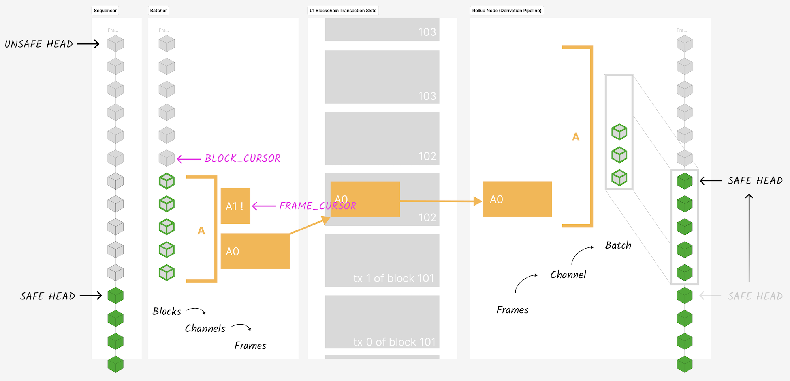

# op-batcher

The `op-batcher` is responsible for ensuring data availability. See the [specs](https://specs.optimism.io/protocol/batcher.html).


## Interactions & Dependencies
The `op-batcher` works together with the [sequencer](../op-node/) (which it reads unsafe blocks from), the data availability layer (e.g. Layer 1 or an [Alt DA](../op-alt-da/) layer, which it posts data to), and the [derivation pipeline](../op-node/) (which reads the data from the DA layer and progresses the safe chain).

It depends directly on some code shared with the derivation pipeline, namely the [`ChannelOut`](../op-node/rollup/derive/channel_out.go) implementation(s). It also depends directly on the shared [txmgr](../op-service/txmgr/) module.

## Testing
The batcher has a suite of unit test which can be triggered by running
```
go test ./...
```
from this directory. There are also end-to-end tests in [`op-e2e`](../op-e2e/) which integrate the batcher.

## Architecture

The architecture of this batcher implementation is shown on the left side of the following diagram:



Batch submitting (writing to the DA layer, in the middle of the diagram) works together with the derivation pipeline (on the right side of the diagram, reading from the DA layer) to progress the safe chain.

The philosophy behind the current architecture is:
* Blocks, channels and frames are kept around for as long as they might be needed, and discarded as soon as they are not needed. They are not moved from one part of state to another.
* We retain block data in a strict order for as long as necessary. We only garbage collect frames, channels and blocks when the safe head moves sufficiently and those structures have done their job.
* When something goes wrong, we rewind the state cursors by the minimal amount we need to get going again.


### Happy path

In the happy path, the batcher periodically:
1. Enqueues unsafe blocks and dequeues safe blocks from the sequencer to its internal state.
2. Enqueues a new channel, if necessary.
3. Processes some unprocessed blocks into the current channel, triggers the compression of the block data and the creation of frames.
4. Sends frames from the channel queue to the DA layer as (e.g. to Ethereum L1 as calldata or blob transactions).
5. If there is more transaction data to send, go to 2. Else wait for a tick and go to 1.


The `blockCursor` state variable tracks the next unprocessed block.
In each channel, the `frameCursor` tracks the next unsent frame.


### Reorgs
When an L2 unsafe reorg is detected, the batch submitter will reset its state, and wait for any in flight transactions to be ingested by the verifier nodes before starting work again.

### Tx Failed
When a Tx fails, an asynchronous receipts handler is triggered. The channel from whence the Tx's frames came has its `frameCursor` rewound, so that all the frames can be resubmitted in order.

### Channel Times Out
When at Tx is confirmed, an asynchronous receipts handler is triggered. We only update the batcher's state if the channel timed out on chain. In that case, the `blockCursor` is rewound to the first block added to that channel, and the channel queue is cleared out. This allows the batcher to start fresh building a new channel starting from the same block -- it does not need to refetch blocks from the sequencer.

## Design Principles and Optimization Targets
At the current time, the batcher should be optimized for correctness, simplicity and robustness. It is considered preferable to prioritize these properties, even at the expense of other potentially desirable properties such as frugality. For example, it is preferable to have the batcher resubmit some data from time to time ("wasting" money on data availability costs) instead of avoiding that by e.g. adding some persistent state to the batcher.

The batcher can almost always recover from unforeseen situations by being restarted.


Some complexity is permitted, however, for handling data availability switching, so that the batcher is not wasting money for longer periods of time.

## Known issues and future work

Link to [open issues with the `op-batcher` tag](https://github.com/ethereum-optimism/optimism/issues?q=is%3Aopen+is%3Aissue+label%3AA-op-batcher).

The batcher launches L1 transactions in parallel so that it can achieve higher throughput, particularly in situations where there is a large backlog of data which needs to be posted. Sometimes, transactions can get stuck in the L1 mempool. The batcher does have functionality to clear these stuck transactions, but it is not completely reliable.

The automatic data availability switching behavior is a somewhat new feature which may still have some bugs in it.
