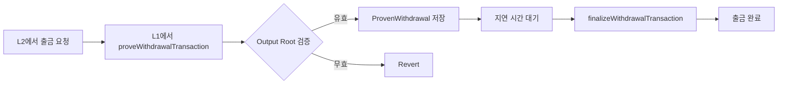
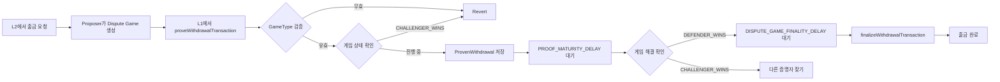
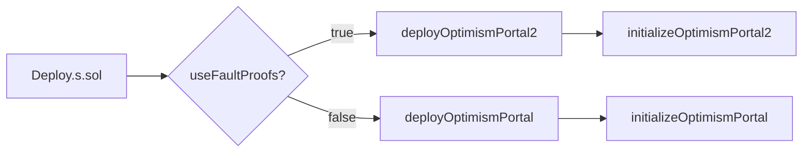
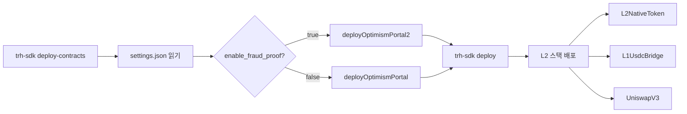

# OptimismPortal vs OptimismPortal2 비교

> ⚠️ **중요**: 이 문서는 Optimism 표준과 TRH-SDK의 실제 배포 상황을 모두 다룹니다.
>
> **TRH-SDK 현황** (2025-10-24):
> - **현재**: OptimismPortal (Legacy) + L2OutputOracle 사용 중

## 📋 목차

- [개요](#개요)
- [핵심 차이점](#핵심-차이점)
- [상세 비교](#상세-비교)
- [배포 구분](#배포-구분)
- [네트워크별 사용 현황](#네트워크별-사용-현황)
- [TRH-SDK 배포 가이드](#trh-sdk-배포-가이드)
- [결론](#결론)

---

## 개요

Optimism L2 시스템에서 **OptimismPortal**은 L1과 L2 간 메시지 전달 및 출금(withdrawal)을 담당하는 핵심 컨트랙트입니다. Fault Proof 시스템의 도입으로 기존 `OptimismPortal`에서 `OptimismPortal2`로 업그레이드되었으며, 두 버전은 **출금 검증 메커니즘**에서 근본적인 차이가 있습니다.

### TRH-SDK 특이사항

- **Optimism 표준**: 대부분의 네트워크가 이미 OptimismPortal2 사용 중
- **TRH-SDK**: ⚠️ 현재 OptimismPortal (Legacy) + L2OutputOracle 사용 중

---

## 핵심 차이점

| 구분 | **OptimismPortal** (Legacy) | **OptimismPortal2** (Fault Proofs) |
|------|---------------------------|--------------------------------|
| **검증 시스템** | **L2OutputOracle** | **DisputeGameFactory** |
| **아키텍처** | 단일 제안자 (Single Proposer) | 다중 게임 타입 (Multi-GameType) |
| **출금 증명** | Output Root 기반 | Dispute Game 기반 |
| **도전 메커니즘** | ❌ 없음 (신뢰 기반) | ✅ Fault Proof 게임 |
| **사용 플래그** | `useFaultProofs: false` | `useFaultProofs: true` |
| **탈중앙화** | ❌ 중앙화된 제안자 | ✅ 누구나 제안 가능 |
| **보안 수준** | 낮음 (신뢰 가정) | 높음 (암호학적 증명) |

---

## 상세 비교

### 1️⃣ OptimismPortal (기존 방식)

#### 의존 컨트랙트

```solidity
L2OutputOracle public l2Oracle;  // ⭐ Output Root 저장소
SystemConfig public systemConfig;
SuperchainConfig public superchainConfig;
```

#### 출금 증명 구조

```solidity
struct ProvenWithdrawal {
    bytes32 outputRoot;      // Output root
    uint128 timestamp;       // 증명 시간
    uint128 l2OutputIndex;   // L2 출력 인덱스
}

// 단순 매핑
mapping(bytes32 => ProvenWithdrawal) public provenWithdrawals;
```

#### 출금 검증 방식

```solidity
function proveWithdrawalTransaction(...) external {
    // 1. L2OutputOracle에서 Output Root 가져오기
    bytes32 outputRoot = l2Oracle.getL2Output(_l2OutputIndex).outputRoot;

    // 2. Output Root 검증
    require(
        outputRoot == Hashing.hashOutputRootProof(_outputRootProof),
        "OptimismPortal: invalid output root proof"
    );

    // 3. Merkle Proof 검증
    require(
        SecureMerkleTrie.verifyInclusionProof({
            _key: abi.encode(storageKey),
            _value: hex"01",
            _proof: _withdrawalProof,
            _root: _outputRootProof.messagePasserStorageRoot
        }),
        "OptimismPortal: invalid withdrawal inclusion proof"
    );

    // 4. ProvenWithdrawal 저장
    provenWithdrawals[withdrawalHash] = ProvenWithdrawal({
        outputRoot: outputRoot,
        timestamp: uint128(block.timestamp),
        l2OutputIndex: uint128(_l2OutputIndex)
    });
}
```

#### 특징

✅ **장점**:
- 단순한 구조로 이해하기 쉬움
- 빠른 출금 처리 (도전 기간 없음)
- 개발 및 테스트 용이

❌ **단점**:
- **중앙화**: 단일 제안자에 의존 (신뢰 가정 필요)
- **도전 불가**: 잘못된 Output Root를 도전할 수 없음
- **보안 취약**: 제안자가 악의적이면 무효한 출금 가능

---

### 2️⃣ OptimismPortal2 (Fault Proofs)

#### 의존 컨트랙트

```solidity
DisputeGameFactory public disputeGameFactory;  // ⭐ 게임 팩토리
GameType public respectedGameType;             // ⭐ 신뢰하는 GameType
uint64 public respectedGameTypeUpdatedAt;      // GameType 업데이트 시간
SystemConfig public systemConfig;
SuperchainConfig public superchainConfig;
```

#### 출금 증명 구조

```solidity
struct ProvenWithdrawal {
    IDisputeGame disputeGameProxy;  // ⭐ 게임 프록시 주소
    uint64 timestamp;               // 증명 시간
}

// ⭐ 증명자별로 별도 저장! (Multiple proofs per withdrawal)
mapping(bytes32 => mapping(address => ProvenWithdrawal)) public provenWithdrawals;

// ⭐ 증명자 목록 추적
mapping(bytes32 => address[]) public proofSubmitters;

// ⭐ 게임 블랙리스트
mapping(IDisputeGame => bool) public disputeGameBlacklist;
```

#### 출금 검증 방식

```solidity
function proveWithdrawalTransaction(...) external {
    // 1. DisputeGameFactory에서 게임 가져오기
    (GameType gameType,, IDisputeGame gameProxy) =
        disputeGameFactory.gameAtIndex(_disputeGameIndex);

    Claim outputRoot = gameProxy.rootClaim();

    // 2. GameType 검증 (respectedGameType과 일치해야 함)
    require(
        gameType.raw() == respectedGameType.raw(),
        "OptimismPortal: invalid game type"
    );

    // 3. Output Root 검증
    require(
        outputRoot.raw() == Hashing.hashOutputRootProof(_outputRootProof),
        "OptimismPortal: invalid output root proof"
    );

    // 4. 게임 상태 확인 (Challenger가 이기면 증명 불가)
    require(
        gameProxy.status() != GameStatus.CHALLENGER_WINS,
        "OptimismPortal: cannot prove against invalid dispute games"
    );

    // 5. Merkle Proof 검증 (동일)
    require(
        SecureMerkleTrie.verifyInclusionProof({...}),
        "OptimismPortal: invalid withdrawal inclusion proof"
    );

    // 6. ProvenWithdrawal 저장 (증명자별)
    provenWithdrawals[withdrawalHash][msg.sender] = ProvenWithdrawal({
        disputeGameProxy: gameProxy,
        timestamp: uint64(block.timestamp)
    });

    // 7. 증명자 목록에 추가
    proofSubmitters[withdrawalHash].push(msg.sender);
}
```

#### 출금 최종화 검증 (`checkWithdrawal`)

```solidity
function checkWithdrawal(bytes32 _withdrawalHash, address _proofSubmitter) public view {
    ProvenWithdrawal memory provenWithdrawal =
        provenWithdrawals[_withdrawalHash][_proofSubmitter];
    IDisputeGame disputeGameProxy = provenWithdrawal.disputeGameProxy;

    // 1. 블랙리스트 확인
    require(
        !disputeGameBlacklist[disputeGameProxy],
        "OptimismPortal: dispute game has been blacklisted"
    );

    // 2. 증명 존재 확인
    require(
        provenWithdrawal.timestamp != 0,
        "OptimismPortal: withdrawal has not been proven by proof submitter address yet"
    );

    // 3. 증명 시간이 게임 생성 시간 이후인지 확인
    uint64 createdAt = disputeGameProxy.createdAt().raw();
    require(
        provenWithdrawal.timestamp > createdAt,
        "OptimismPortal: withdrawal timestamp less than dispute game creation timestamp"
    );

    // 4. 증명 성숙도 확인 (PROOF_MATURITY_DELAY_SECONDS)
    require(
        block.timestamp - provenWithdrawal.timestamp > PROOF_MATURITY_DELAY_SECONDS,
        "OptimismPortal: proven withdrawal has not matured yet"
    );

    // 5. 게임 해결 확인 (DEFENDER가 이겨야 함)
    require(
        disputeGameProxy.status() == GameStatus.DEFENDER_WINS,
        "OptimismPortal: dispute game has not been resolved in favor of the root claim"
    );

    // 6. 게임 완료 후 충분한 시간 경과 확인
    require(
        block.timestamp > disputeGameProxy.resolvedAt().raw() + DISPUTE_GAME_FINALITY_DELAY_SECONDS,
        "OptimismPortal: dispute game has not been finalized"
    );

    // 7. 에어갭 확인 (respectedGameType 변경 후 안전 기간)
    require(
        block.timestamp > respectedGameTypeUpdatedAt + DISPUTE_GAME_FINALITY_DELAY_SECONDS,
        "OptimismPortal: output proposal claim period has not yet passed"
    );
}
```

#### 2단계 지연 시스템

```solidity
// Immutable 설정 (배포 시 결정)
uint256 internal immutable PROOF_MATURITY_DELAY_SECONDS;        // 증명 성숙 기간
uint256 internal immutable DISPUTE_GAME_FINALITY_DELAY_SECONDS; // 게임 최종화 기간
```

**총 출금 지연 시간**:
```
총 지연 = PROOF_MATURITY_DELAY_SECONDS + DISPUTE_GAME_FINALITY_DELAY_SECONDS
         (예: 7일 = 3일 + 4일)
```

#### 특징

✅ **장점**:
- **탈중앙화**: 누구나 Output Root 제안 가능
- **도전 가능**: Fault Proof로 잘못된 제안 도전
- **다중 GameType**: Cannon(0), Permissioned(1), **Asterisc(2)** 등 지원
- **보안 강화**: 2단계 지연 + 게임 상태 검증
- **증명자 독립성**: 각 증명자별로 독립적인 ProvenWithdrawal
- **블랙리스트**: 문제 있는 게임 차단 가능

⚠️ **단점**:
- 복잡한 검증 로직
- 긴 출금 지연 시간 (최소 7일)
- 높은 가스 비용

---

## 배포 구분

### 조건부 배포 로직

Optimism 표준과 Tokamak-Thanos(TRH-SDK) 모두 **동일한 조건부 배포 구조**를 사용합니다.

#### Optimism 표준 (`packages/contracts-bedrock/scripts/Deploy.s.sol`)

```solidity
// Deploy.s.sol Line 453-458
function initializeImplementations() public {
    console.log("Initializing implementations");

    // useFaultProofs 플래그로 구분
    if (cfg.useFaultProofs()) {
        console.log("Fault proofs enabled. Initializing OptimismPortal2.");
        initializeOptimismPortal2();  // ⭐ Portal2 사용
    } else {
        initializeOptimismPortal();   // ⭐ Portal 사용
    }

    initializeSystemConfig();
    // ... 기타 초기화
}
```

#### TRH-SDK (`packages/tokamak/contracts-bedrock/scripts/Deploy.s.sol`)

```solidity
// 동일한 조건부 로직 사용
function initializeImplementations() public {
    console.log("Initializing implementations");

    if (cfg.useFaultProofs()) {
        console.log("Fault proofs enabled. Initializing the OptimismPortal proxy with the OptimismPortal2.");
        initializeOptimismPortal2();  // ⭐ Portal2 사용
    } else {
        initializeOptimismPortal();   // ⭐ Portal 사용
    }

    initializeSystemConfig();
    initializeL1StandardBridge();
    initializeL1ERC721Bridge();
    // ... 기타 초기화 (Tokamak 특화 컨트랙트 포함)
}
```

**TRH-SDK 추가 배포 항목**:
- `L2NativeToken`: TON 네이티브 토큰 브릿지
- `L1UsdcBridge`: USDC 전용 브릿지
- Uniswap V3 관련 컨트랙트 (Factory, Router 등)

### 초기화 파라미터 비교

#### OptimismPortal 초기화

```solidity
OptimismPortal.initialize(
    L2OutputOracle(l2OutputOracleProxy),    // ⭐ Output Oracle
    SystemConfig(systemConfigProxy),
    SuperchainConfig(superchainConfigProxy)
)
```

#### OptimismPortal2 초기화

```solidity
OptimismPortal2.initialize(
    DisputeGameFactory(disputeGameFactoryProxy),  // ⭐ Dispute Game Factory
    SystemConfig(systemConfigProxy),
    SuperchainConfig(superchainConfigProxy),
    GameType.wrap(uint32(cfg.respectedGameType()))  // ⭐ 신뢰하는 GameType
)
```

---

## 네트워크별 사용 현황

### Optimism 표준 vs TRH-SDK 비교

| 네트워크 | SDK | `useFaultProofs` | 사용 Portal | 검증 방식 | 비고 |
|----------|-----|-----------------|------------|----------|------|
| **Optimism Mainnet** | Optimism | ✅ `true` | OptimismPortal2 | DisputeGameFactory | 프로덕션 |
| **Optimism Sepolia** | Optimism | ✅ `true` | OptimismPortal2 | DisputeGameFactory | 테스트넷 |
| **TRH-SDK (Sepolia)** | **TRH-SDK** | ⚠️ **`false`** | **OptimismPortal** | **L2OutputOracle** | **현재 프로덕션** |

### TRH-SDK 실제 배포 현황

**배포 일자**: 2025-08-25
**출처**: `tokamak-rollup-metadata-repository/data/sepolia/0xf2d5a15a5be10dbd478780664cfa228697d214d9.json`

```json
{
  "l1ChainId": 11155111,
  "l2ChainId": 111551160686,
  "name": "theo08251",
  "stack": {
    "name": "thanos",
    "version": "(devel)"
  },
  "l1Contracts": {
    "ProxyAdmin": "0x2BAeE8a03Eca65F5cfbB6fFe9D00a2f44f14b0A7",
    "SystemConfig": "0xf2d5A15a5BE10dBd478780664CFA228697D214D9",
    "DisputeGameFactory": "0x55c754a1321e96E9Ea33c3ACDEe0f5F7E5251A24",  // ⚠️ 배포됨
    "OptimismPortal": "0x2f82aD639ed650f28F2571088458C6e233e2b6Ee",    // ⚠️ Portal (Legacy)!
    "L2OutputOracle": "0xB9435AC47D54969a97B736A5741aaC85050bfA32",    // ⚠️ Oracle 사용 중!
    "Mips": "0xF5c7484C7DF66Fbb3f1B4cE119562045c1c38069",
    "PreimageOracle": "0x7217604900358c4843F5a5dea9E4D62603eD24Ee",
    "AnchorStateRegistry": "0xb222B83e0A89c7ca6538e8DD568976F6dD2B1644",
    "DelayedWETH": "0x84B287425202CA404ccc38235116b29012f481DD"
  },
  "withdrawalConfig": {
    "challengePeriod": 12,  // ⚠️ 매우 짧음 (12초)
    "expectedWithdrawalDelay": 1452,
    "monitoringInfo": {
      "l2OutputOracleAddress": "0xB9435AC47D54969a97B736A5741aaC85050bfA32"
    }
  }
}
```

**배포 상태 분석**:
- ✅ `DisputeGameFactory`: 배포됨 (하지만 미사용)
- ⚠️ **`OptimismPortal` (Legacy)**: 실제 사용 중
- ⚠️ **`L2OutputOracle`**: 실제 검증에 사용 중
- ⚠️ **`useFaultProofs: false`**: 실제 설정
- ⚠️ **`challengePeriod: 12초`**: 설치시 변경가능

### 주요 차이점

| 항목 | Optimism 표준 | TRH-SDK (실제) | 비고 |
|------|--------------|---------------|------|
| **배포 도구** | `forge script` | **`trh-sdk` CLI (Go)** | 별도 레포지토리 |
| **설정 플래그** | `useFaultProofs` | **`enable_fraud_proof`** | settings.json |
| **현재 설정** | ✅ `true` | ⚠️ **`false`** | Portal (Legacy) 사용 |
| **사용 Portal** | OptimismPortal2 | **OptimismPortal** | Legacy Portal |
| **검증 방식** | DisputeGameFactory | **L2OutputOracle** | 단일 제안자 모델 |
| **네이티브 토큰** | ETH | **TON** | Tokamak 고유 |
| **추가 컨트랙트** | - | L2NativeToken, L1UsdcBridge, UniswapV3 | TRH-SDK 전용 |
| **출금 지연** | ~7일 | **~24분** (12초 challenge) | 설치시 변경가능 |


---

## 출금 프로세스 비교

### OptimismPortal (Legacy)



**총 소요 시간**: ~7일 (설정에 따라 다름)

### OptimismPortal2 (Fault Proofs)



**총 소요 시간**:
- 최소: `PROOF_MATURITY_DELAY + DISPUTE_GAME_FINALITY_DELAY` (~7일)
- 최대: 게임 도전 시 더 길어질 수 있음

---

## 보안 모델 비교

### OptimismPortal (1-of-1 신뢰 모델)

```
신뢰 가정: L2OutputOracle의 제안자(Proposer)가 정직함

[Proposer] --> [L2OutputOracle] --> [OptimismPortal]
                                           |
                                           v
                                    사용자 출금 승인
```

**위험**: Proposer가 악의적이면 무효한 출금 가능

### OptimismPortal2 (1-of-N 정직 모델)

```
신뢰 가정: N명의 참가자 중 1명이라도 정직하면 안전

[Proposer 1] ──┐
[Proposer 2] ──┤
[Proposer N] ──┴──> [DisputeGameFactory] --> [OptimismPortal2]
                            |                         |
                    [Challenger] (도전)                |
                            |                         v
                            └──> [Fault Proof Game]  사용자 출금 승인
                                        |
                                        v
                              DEFENDER_WINS or CHALLENGER_WINS
```

**위험 완화**:
- Challenger가 잘못된 제안을 도전 가능
- Fault Proof로 암호학적 검증
- 여러 증명자 중 하나만 정직해도 출금 가능

---

## TRH-SDK 배포 가이드

### TRH-SDK 구조

TRH-SDK는 **Go 기반 CLI 도구**로 별도 레포지토리에서 관리됩니다.

```bash
trh-sdk (별도 레포지토리)
├── GitHub: https://github.com/tokamak-network/trh-sdk
├── 언어: Go 93.7%, Shell 6.2%
├── 버전: v1.0.0
└── 설정: settings.json
```

### 배포 명령어

#### TRH-SDK로 배포하기

```bash
# 1. TRH-SDK 설치
wget https://raw.githubusercontent.com/tokamak-network/trh-sdk/main/setup.sh
chmod +x setup.sh
./setup.sh

# 2. L1 컨트랙트 배포
trh-sdk deploy-contracts --network testnet --stack thanos

# 3. L2 스택 배포 (settings.json 필요)
trh-sdk deploy

# 4. 배포 정보 확인
trh-sdk info
```

#### settings.json 예시

```json
{
  "enable_fraud_proof": false,  // OptimismPortal (Legacy) 사용
  "stack": "thanos",
  "network": "testnet",
  "l1_chain_id": 11155111,
  "l2_chain_id": 111551160686,
  "admin_private_key": "...",
  "sequencer_private_key": "...",
  "batcher_private_key": "...",
  "proposer_private_key": "...",
  "l1_rpc_url": "...",
  "l1_beacon_url": "..."
}
```

**설정 설명**:
- `enable_fraud_proof: false` → OptimismPortal (Legacy) + L2OutputOracle 사용

### 배포 흐름 비교

#### Optimism 표준



#### TRH-SDK (Go CLI)



---

## 결론

### OptimismPortal (Legacy) 사용 시기
- ✅ 빠른 프로토타이핑 및 초기 테스트
- ✅ 단일 신뢰 제안자 모델 허용
- ⚠️ **현재 TRH-SDK 프로덕션 사용 중** (TRH-SDK V1)
- ⚠️ **장기 프로덕션 사용 비권장** (신뢰하는 L2에만 사용권장)

### OptimismPortal2 사용 시기
- ✅ **프로덕션 환경** (Optimism 표준)
- ✅ Fault Proof 시스템 활성화
- ✅ 탈중앙화된 제안 시스템
- ✅ 높은 보안 요구사항
- 📅 **TRH-SDK 추가 목표**

### Tokamak-Thanos (TRH-SDK) 현황

#### 현재 배포(샘플) 상태 (2025-08-25 기준) ⚠️

| 환경 | Portal | 검증 방식 | useFaultProofs | 출금 지연 |
|------|--------|----------|----------------|----------|
| **프로덕션 (Sepolia)** | **OptimismPortal (Legacy)** | **L2OutputOracle** | ⚠️ **`false`** | ~24분 (12초 challenge) |

**현재 상태**:
- ⚠️ **OptimismPortal (Legacy) + L2OutputOracle 사용 중**
- ⚠️ **단일 제안자 모델** (신뢰 가정 필요)
- ⚠️ **설정에 따라 변경 Challenge Period** (배포자가 결정)

---

## 참고 자료

### Optimism 공식 문서
- [Optimism Fault Proofs 개요](https://docs.optimism.io/stack/protocol/fault-proofs/overview)
- [Optimism Portal 스펙](https://specs.optimism.io/protocol/withdrawals.html)

### 소스 코드 (Optimism 표준)
- [`OptimismPortal.sol`](../../packages/tokamak/contracts-bedrock/src/L1/OptimismPortal.sol)
- [`OptimismPortal2.sol`](../../packages/tokamak/contracts-bedrock/src/L1/OptimismPortal2.sol)
- [`DisputeGameFactory.sol`](../../packages/tokamak/contracts-bedrock/src/dispute/DisputeGameFactory.sol)
- [`Deploy.s.sol`](../../packages/tokamak/contracts-bedrock/scripts/Deploy.s.sol)

### TRH-SDK (별도 레포지토리)
- GitHub: https://github.com/tokamak-network/trh-sdk
- 타입: Go 기반 CLI 배포 자동화 도구 (v1.0.0)
- CLI 명령어: `trh-sdk deploy`, `trh-sdk deploy-contracts`, `trh-sdk info`
- 설정 파일: `settings.json`
  - `enable_fraud_proof: false` → **OptimismPortal (Legacy)** 사용
  - `enable_fraud_proof: true` → **OptimismPortal2** 사용
- 실제 배포 정보: `tokamak-rollup-metadata-repository/data/sepolia/*.json`

**참고**: TRH-SDK는 CLI 도구이며, Solidity 컨트랙트는 포함하지 않습니다.

---
