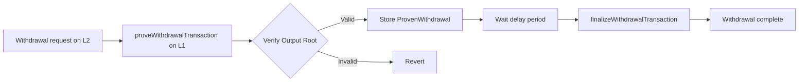
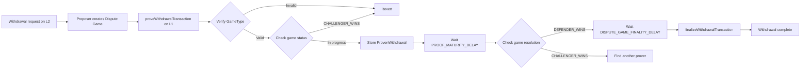
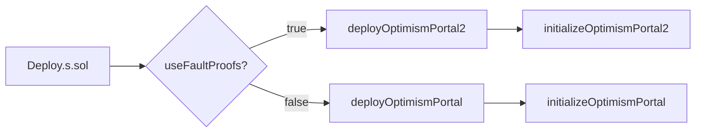
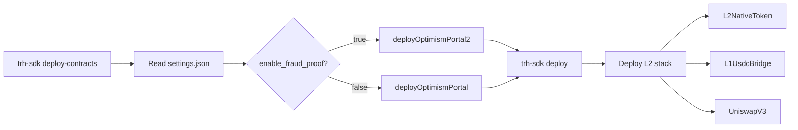

# OptimismPortal vs OptimismPortal2 Comparison

> ⚠️ **Important**: This document covers both Optimism standard and TRH-SDK's actual deployment status.
>
> **TRH-SDK Status** (2025-10-24):
> - **Current**: Using OptimismPortal (Legacy) + L2OutputOracle

## 📋 Table of Contents

- [Overview](#overview)
- [Key Differences](#key-differences)
- [Detailed Comparison](#detailed-comparison)
- [Deployment Logic](#deployment-logic)
- [Network Usage Status](#network-usage-status)
- [TRH-SDK Deployment Guide](#trh-sdk-deployment-guide)
- [Conclusion](#conclusion)

---

## Overview

In the Optimism L2 system, **OptimismPortal** is the core contract responsible for message passing and withdrawals between L1 and L2. With the introduction of the Fault Proof system, it was upgraded from `OptimismPortal` to `OptimismPortal2`, and the two versions have fundamental differences in **withdrawal verification mechanisms**.

### TRH-SDK Specifics

- **Optimism Standard**: Most networks already use OptimismPortal2
- **TRH-SDK**: ⚠️ Currently using OptimismPortal (Legacy) + L2OutputOracle

---

## Key Differences

| Category | **OptimismPortal** (Legacy) | **OptimismPortal2** (Fault Proofs) |
|----------|----------------------------|----------------------------------|
| **Verification System** | **L2OutputOracle** | **DisputeGameFactory** |
| **Architecture** | Single Proposer | Multi-GameType |
| **Withdrawal Proof** | Output Root based | Dispute Game based |
| **Challenge Mechanism** | ❌ None (trust-based) | ✅ Fault Proof game |
| **Flag** | `useFaultProofs: false` | `useFaultProofs: true` |
| **Decentralization** | ❌ Centralized proposer | ✅ Anyone can propose |
| **Security Level** | Low (trust assumption) | High (cryptographic proof) |

---

## Detailed Comparison

### 1️⃣ OptimismPortal (Legacy)

#### Dependent Contracts

```solidity
L2OutputOracle public l2Oracle;  // ⭐ Output Root storage
SystemConfig public systemConfig;
SuperchainConfig public superchainConfig;
```

#### Withdrawal Proof Structure

```solidity
struct ProvenWithdrawal {
    bytes32 outputRoot;      // Output root
    uint128 timestamp;       // Proof timestamp
    uint128 l2OutputIndex;   // L2 output index
}

// Simple mapping
mapping(bytes32 => ProvenWithdrawal) public provenWithdrawals;
```

#### Withdrawal Verification Process

```solidity
function proveWithdrawalTransaction(...) external {
    // 1. Get Output Root from L2OutputOracle
    bytes32 outputRoot = l2Oracle.getL2Output(_l2OutputIndex).outputRoot;

    // 2. Verify Output Root
    require(
        outputRoot == Hashing.hashOutputRootProof(_outputRootProof),
        "OptimismPortal: invalid output root proof"
    );

    // 3. Verify Merkle Proof
    require(
        SecureMerkleTrie.verifyInclusionProof({
            _key: abi.encode(storageKey),
            _value: hex"01",
            _proof: _withdrawalProof,
            _root: _outputRootProof.messagePasserStorageRoot
        }),
        "OptimismPortal: invalid withdrawal inclusion proof"
    );

    // 4. Store ProvenWithdrawal
    provenWithdrawals[withdrawalHash] = ProvenWithdrawal({
        outputRoot: outputRoot,
        timestamp: uint128(block.timestamp),
        l2OutputIndex: uint128(_l2OutputIndex)
    });
}
```

#### Features

✅ **Advantages**:
- Simple structure, easy to understand
- Fast withdrawal processing (no challenge period)
- Easy development and testing

❌ **Disadvantages**:
- **Centralized**: Relies on single proposer (trust assumption required)
- **No challenge**: Cannot challenge invalid Output Roots
- **Security vulnerability**: Malicious proposer can enable invalid withdrawals

---

### 2️⃣ OptimismPortal2 (Fault Proofs)

#### Dependent Contracts

```solidity
DisputeGameFactory public disputeGameFactory;  // ⭐ Game factory
GameType public respectedGameType;             // ⭐ Trusted GameType
uint64 public respectedGameTypeUpdatedAt;      // GameType update time
SystemConfig public systemConfig;
SuperchainConfig public superchainConfig;
```

#### Withdrawal Proof Structure

```solidity
struct ProvenWithdrawal {
    IDisputeGame disputeGameProxy;  // ⭐ Game proxy address
    uint64 timestamp;               // Proof timestamp
}

// ⭐ Store separately per prover! (Multiple proofs per withdrawal)
mapping(bytes32 => mapping(address => ProvenWithdrawal)) public provenWithdrawals;

// ⭐ Track proof submitters
mapping(bytes32 => address[]) public proofSubmitters;

// ⭐ Game blacklist
mapping(IDisputeGame => bool) public disputeGameBlacklist;
```

#### Withdrawal Verification Process

```solidity
function proveWithdrawalTransaction(...) external {
    // 1. Get game from DisputeGameFactory
    (GameType gameType,, IDisputeGame gameProxy) =
        disputeGameFactory.gameAtIndex(_disputeGameIndex);

    Claim outputRoot = gameProxy.rootClaim();

    // 2. Verify GameType (must match respectedGameType)
    require(
        gameType.raw() == respectedGameType.raw(),
        "OptimismPortal: invalid game type"
    );

    // 3. Verify Output Root
    require(
        outputRoot.raw() == Hashing.hashOutputRootProof(_outputRootProof),
        "OptimismPortal: invalid output root proof"
    );

    // 4. Check game status (cannot prove if CHALLENGER_WINS)
    require(
        gameProxy.status() != GameStatus.CHALLENGER_WINS,
        "OptimismPortal: cannot prove against invalid dispute games"
    );

    // 5. Verify Merkle Proof (same as before)
    require(
        SecureMerkleTrie.verifyInclusionProof({...}),
        "OptimismPortal: invalid withdrawal inclusion proof"
    );

    // 6. Store ProvenWithdrawal (per prover)
    provenWithdrawals[withdrawalHash][msg.sender] = ProvenWithdrawal({
        disputeGameProxy: gameProxy,
        timestamp: uint64(block.timestamp)
    });

    // 7. Add to proof submitters list
    proofSubmitters[withdrawalHash].push(msg.sender);
}
```

#### Withdrawal Finalization Check (`checkWithdrawal`)

```solidity
function checkWithdrawal(bytes32 _withdrawalHash, address _proofSubmitter) public view {
    ProvenWithdrawal memory provenWithdrawal =
        provenWithdrawals[_withdrawalHash][_proofSubmitter];
    IDisputeGame disputeGameProxy = provenWithdrawal.disputeGameProxy;

    // 1. Check blacklist
    require(
        !disputeGameBlacklist[disputeGameProxy],
        "OptimismPortal: dispute game has been blacklisted"
    );

    // 2. Check proof exists
    require(
        provenWithdrawal.timestamp != 0,
        "OptimismPortal: withdrawal has not been proven by proof submitter address yet"
    );

    // 3. Check proof timestamp is after game creation
    uint64 createdAt = disputeGameProxy.createdAt().raw();
    require(
        provenWithdrawal.timestamp > createdAt,
        "OptimismPortal: withdrawal timestamp less than dispute game creation timestamp"
    );

    // 4. Check proof maturity (PROOF_MATURITY_DELAY_SECONDS)
    require(
        block.timestamp - provenWithdrawal.timestamp > PROOF_MATURITY_DELAY_SECONDS,
        "OptimismPortal: proven withdrawal has not matured yet"
    );

    // 5. Check game resolution (DEFENDER must win)
    require(
        disputeGameProxy.status() == GameStatus.DEFENDER_WINS,
        "OptimismPortal: dispute game has not been resolved in favor of the root claim"
    );

    // 6. Check sufficient time after game completion
    require(
        block.timestamp > disputeGameProxy.resolvedAt().raw() + DISPUTE_GAME_FINALITY_DELAY_SECONDS,
        "OptimismPortal: dispute game has not been finalized"
    );

    // 7. Check air gap (safety period after respectedGameType change)
    require(
        block.timestamp > respectedGameTypeUpdatedAt + DISPUTE_GAME_FINALITY_DELAY_SECONDS,
        "OptimismPortal: output proposal claim period has not yet passed"
    );
}
```

#### Two-Stage Delay System

```solidity
// Immutable settings (determined at deployment)
uint256 internal immutable PROOF_MATURITY_DELAY_SECONDS;        // Proof maturity period
uint256 internal immutable DISPUTE_GAME_FINALITY_DELAY_SECONDS; // Game finality period
```

**Total withdrawal delay**:
```
Total delay = PROOF_MATURITY_DELAY_SECONDS + DISPUTE_GAME_FINALITY_DELAY_SECONDS
            (e.g., 7 days = 3 days + 4 days)
```

#### Features

✅ **Advantages**:
- **Decentralized**: Anyone can propose Output Roots
- **Challengeable**: Can challenge invalid proposals with Fault Proofs
- **Multi-GameType**: Supports Cannon(0), Permissioned(1), **Asterisc(2)**, etc.
- **Enhanced security**: 2-stage delay + game status verification
- **Prover independence**: Independent ProvenWithdrawal per prover
- **Blacklist**: Can block problematic games

⚠️ **Disadvantages**:
- Complex verification logic
- Long withdrawal delay (minimum 7 days)
- High gas costs

---

## Deployment Logic

### Conditional Deployment Logic

Both Optimism standard and Tokamak-Thanos (TRH-SDK) use **the same conditional deployment structure**.

#### Optimism Standard (`packages/contracts-bedrock/scripts/Deploy.s.sol`)

```solidity
// Deploy.s.sol Line 453-458
function initializeImplementations() public {
    console.log("Initializing implementations");

    // Distinguish by useFaultProofs flag
    if (cfg.useFaultProofs()) {
        console.log("Fault proofs enabled. Initializing OptimismPortal2.");
        initializeOptimismPortal2();  // ⭐ Use Portal2
    } else {
        initializeOptimismPortal();   // ⭐ Use Portal
    }

    initializeSystemConfig();
    // ... other initialization
}
```

#### TRH-SDK (`packages/tokamak/contracts-bedrock/scripts/Deploy.s.sol`)

```solidity
// Same conditional logic
function initializeImplementations() public {
    console.log("Initializing implementations");

    if (cfg.useFaultProofs()) {
        console.log("Fault proofs enabled. Initializing the OptimismPortal proxy with the OptimismPortal2.");
        initializeOptimismPortal2();  // ⭐ Use Portal2
    } else {
        initializeOptimismPortal();   // ⭐ Use Portal
    }

    initializeSystemConfig();
    initializeL1StandardBridge();
    initializeL1ERC721Bridge();
    // ... other initialization (including Tokamak-specific contracts)
}
```

**TRH-SDK Additional Deployments**:
- `L2NativeToken`: TON native token bridge
- `L1UsdcBridge`: USDC-specific bridge
- Uniswap V3 related contracts (Factory, Router, etc.)

### Initialization Parameters Comparison

#### OptimismPortal Initialization

```solidity
OptimismPortal.initialize(
    L2OutputOracle(l2OutputOracleProxy),    // ⭐ Output Oracle
    SystemConfig(systemConfigProxy),
    SuperchainConfig(superchainConfigProxy)
)
```

#### OptimismPortal2 Initialization

```solidity
OptimismPortal2.initialize(
    DisputeGameFactory(disputeGameFactoryProxy),  // ⭐ Dispute Game Factory
    SystemConfig(systemConfigProxy),
    SuperchainConfig(superchainConfigProxy),
    GameType.wrap(uint32(cfg.respectedGameType()))  // ⭐ Trusted GameType
)
```

---

## Network Usage Status

### Optimism Standard vs TRH-SDK Comparison

| Network | SDK | `useFaultProofs` | Portal Used | Verification | Notes |
|---------|-----|------------------|-------------|--------------|-------|
| **Optimism Mainnet** | Optimism | ✅ `true` | OptimismPortal2 | DisputeGameFactory | Production |
| **Optimism Sepolia** | Optimism | ✅ `true` | OptimismPortal2 | DisputeGameFactory | Testnet |
| **TRH-SDK (Sepolia)** | **TRH-SDK** | ⚠️ **`false`** | **OptimismPortal** | **L2OutputOracle** | **Current Production** |


### TRH-SDK Actual Deployment Status

**Deployment Date**: 2025-08-25
**Source**: `tokamak-rollup-metadata-repository/data/sepolia/0xf2d5a15a5be10dbd478780664cfa228697d214d9.json`

```json
{
  "l1ChainId": 11155111,
  "l2ChainId": 111551160686,
  "name": "theo08251",
  "stack": {
    "name": "thanos",
    "version": "(devel)"
  },
  "l1Contracts": {
    "ProxyAdmin": "0x2BAeE8a03Eca65F5cfbB6fFe9D00a2f44f14b0A7",
    "SystemConfig": "0xf2d5A15a5BE10dBd478780664CFA228697D214D9",
    "DisputeGameFactory": "0x55c754a1321e96E9Ea33c3ACDEe0f5F7E5251A24",  // ⚠️ Deployed
    "OptimismPortal": "0x2f82aD639ed650f28F2571088458C6e233e2b6Ee",    // ⚠️ Portal (Legacy)!
    "L2OutputOracle": "0xB9435AC47D54969a97B736A5741aaC85050bfA32",    // ⚠️ Oracle in use!
    "Mips": "0xF5c7484C7DF66Fbb3f1B4cE119562045c1c38069",
    "PreimageOracle": "0x7217604900358c4843F5a5dea9E4D62603eD24Ee",
    "AnchorStateRegistry": "0xb222B83e0A89c7ca6538e8DD568976F6dD2B1644",
    "DelayedWETH": "0x84B287425202CA404ccc38235116b29012f481DD"
  },
  "withdrawalConfig": {
    "challengePeriod": 12,  // ⚠️ Very short (12 seconds)
    "expectedWithdrawalDelay": 1452,
    "monitoringInfo": {
      "l2OutputOracleAddress": "0xB9435AC47D54969a97B736A5741aaC85050bfA32"
    }
  }
}
```

**Deployment Status Analysis**:
- ✅ `DisputeGameFactory`: Deployed (but not used)
- ⚠️ **`OptimismPortal` (Legacy)**: Actually in use
- ⚠️ **`L2OutputOracle`**: Actually used for verification
- ⚠️ **`useFaultProofs: false`**: Actual setting
- ⚠️ **`challengePeriod: 12 seconds`**: Configurable at deployment

### Key Differences

| Item | Optimism Standard | TRH-SDK (Actual) | Notes |
|------|-------------------|------------------|-------|
| **Deployment Tool** | `forge script` | **`trh-sdk` CLI (Go)** | Separate repository |
| **Config Flag** | `useFaultProofs` | **`enable_fraud_proof`** | settings.json |
| **Current Setting** | ✅ `true` | ⚠️ **`false`** | Using Portal (Legacy) |
| **Portal Used** | OptimismPortal2 | **OptimismPortal** | Legacy Portal |
| **Verification** | DisputeGameFactory | **L2OutputOracle** | Single proposer model |
| **Native Token** | ETH | **TON** | Tokamak-specific |
| **Additional Contracts** | - | L2NativeToken, L1UsdcBridge, UniswapV3 | TRH-SDK exclusive |
| **Withdrawal Delay** | ~7 days | **~24 min** (12 sec challenge) | Configurable at deployment |


---

## Withdrawal Process Comparison

### OptimismPortal (Legacy)



**Total time**: ~7 days (depends on configuration)

### OptimismPortal2 (Fault Proofs)



**Total time**:
- Minimum: `PROOF_MATURITY_DELAY + DISPUTE_GAME_FINALITY_DELAY` (~7 days)
- Maximum: Can be longer if game is challenged

---

## Security Model Comparison

### OptimismPortal (1-of-1 Trust Model)

```
Trust assumption: L2OutputOracle's Proposer is honest

[Proposer] --> [L2OutputOracle] --> [OptimismPortal]
                                           |
                                           v
                                    User withdrawal approved
```

**Risk**: Malicious proposer can enable invalid withdrawals

### OptimismPortal2 (1-of-N Honest Model)

```
Trust assumption: Safe if at least 1 out of N participants is honest

[Proposer 1] ──┐
[Proposer 2] ──┤
[Proposer N] ──┴──> [DisputeGameFactory] --> [OptimismPortal2]
                            |                         |
                    [Challenger] (challenge)           |
                            |                         v
                            └──> [Fault Proof Game]  User withdrawal approved
                                        |
                                        v
                              DEFENDER_WINS or CHALLENGER_WINS
```

**Risk Mitigation**:
- Challenger can challenge invalid proposals
- Cryptographic verification via Fault Proofs
- Withdrawal possible if even one prover is honest

---

## TRH-SDK Deployment Guide

### TRH-SDK Structure

TRH-SDK is a **Go-based CLI tool** managed in a separate repository.

```bash
trh-sdk (Separate Repository)
├── GitHub: https://github.com/tokamak-network/trh-sdk
├── Language: Go 93.7%, Shell 6.2%
├── Version: v1.0.0
└── Config: settings.json
```

### Deployment Commands

#### Deploy with TRH-SDK

```bash
# 1. Install TRH-SDK
wget https://raw.githubusercontent.com/tokamak-network/trh-sdk/main/setup.sh
chmod +x setup.sh
./setup.sh

# 2. Deploy L1 contracts
trh-sdk deploy-contracts --network testnet --stack thanos

# 3. Deploy L2 stack (requires settings.json)
trh-sdk deploy

# 4. Check deployment info
trh-sdk info
```

#### settings.json Example

```json
{
  "enable_fraud_proof": false,  // Uses OptimismPortal (Legacy)
  "stack": "thanos",
  "network": "testnet",
  "l1_chain_id": 11155111,
  "l2_chain_id": 111551160686,
  "admin_private_key": "...",
  "sequencer_private_key": "...",
  "batcher_private_key": "...",
  "proposer_private_key": "...",
  "l1_rpc_url": "...",
  "l1_beacon_url": "..."
}
```

**Configuration**:
- `enable_fraud_proof: false` → Uses OptimismPortal (Legacy) + L2OutputOracle

### Deployment Flow Comparison

#### Optimism Standard



#### TRH-SDK (Go CLI)



---

## Conclusion

### When to Use OptimismPortal (Legacy)
- ✅ Rapid prototyping and initial testing
- ✅ Single trusted proposer model acceptable
- ⚠️ **Currently used in TRH-SDK production** (TRH-SDK V1)
- ⚠️ **Not recommended for long-term production** (recommended only for trusted L2s)

### When to Use OptimismPortal2
- ✅ **Production environment** (Optimism standard)
- ✅ Fault Proof system activation
- ✅ Decentralized proposal system
- ✅ High security requirements
- 📅 **TRH-SDK future goal**

### Tokamak-Thanos (TRH-SDK) Status

#### Current Deployment Status (as of 2025-08-25) ⚠️

| Environment | Portal | Verification | useFaultProofs | Withdrawal Delay |
|-------------|--------|--------------|----------------|------------------|
| **Production (Sepolia)** | **OptimismPortal (Legacy)** | **L2OutputOracle** | ⚠️ **`false`** | ~24 min (12 sec challenge) |

**Current Status**:
- ⚠️ **OptimismPortal (Legacy) + L2OutputOracle in use**
- ⚠️ **Single proposer model** (trust assumption required)
- ⚠️ **Challenge Period configurable by deployer**

---

## References

### Optimism Official Documentation
- [Optimism Fault Proofs Overview](https://docs.optimism.io/stack/protocol/fault-proofs/overview)
- [Optimism Portal Spec](https://specs.optimism.io/protocol/withdrawals.html)

### Source Code (Optimism Standard)
- [`OptimismPortal.sol`](../../packages/contracts-bedrock/src/L1/OptimismPortal.sol)
- [`OptimismPortal2.sol`](../../packages/contracts-bedrock/src/L1/OptimismPortal2.sol)
- [`DisputeGameFactory.sol`](../../packages/contracts-bedrock/src/dispute/DisputeGameFactory.sol)
- [`Deploy.s.sol`](../../packages/contracts-bedrock/scripts/Deploy.s.sol)

### TRH-SDK (Separate Repository)
- GitHub: https://github.com/tokamak-network/trh-sdk
- Type: Go-based CLI deployment automation tool (v1.0.0)
- CLI Commands: `trh-sdk deploy`, `trh-sdk deploy-contracts`, `trh-sdk info`
- Config File: `settings.json`
  - `enable_fraud_proof: false` → Uses **OptimismPortal (Legacy)**
  - `enable_fraud_proof: true` → Uses **OptimismPortal2**
- Actual Deployment Info: `tokamak-rollup-metadata-repository/data/sepolia/*.json`

**Note**: TRH-SDK is a CLI tool and does not include Solidity contracts.

---
