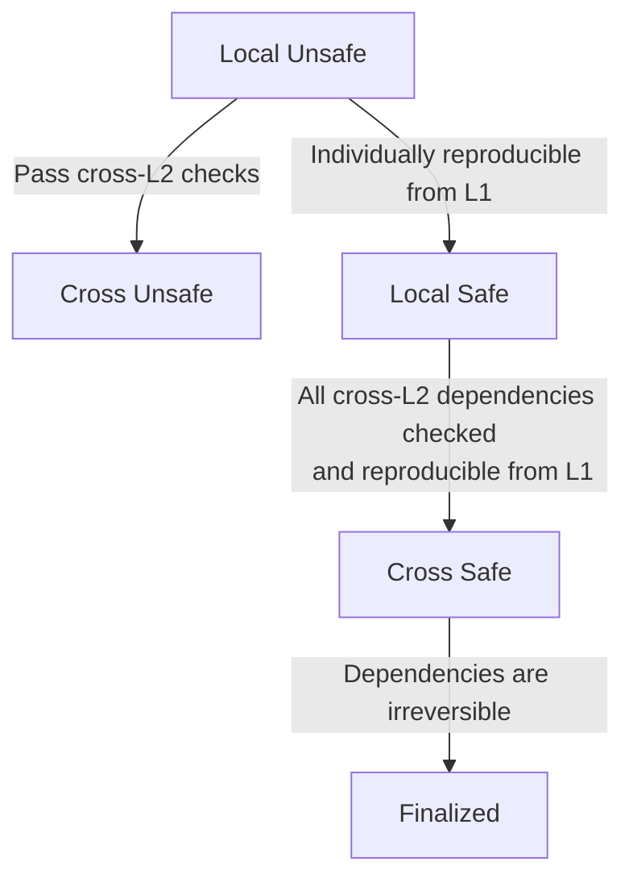
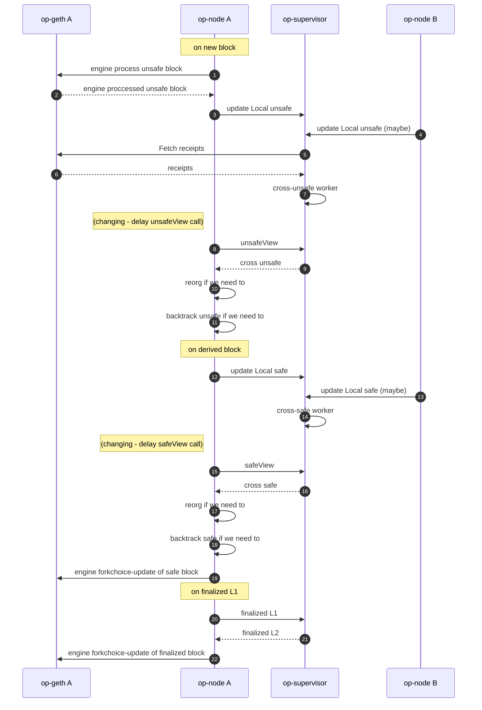
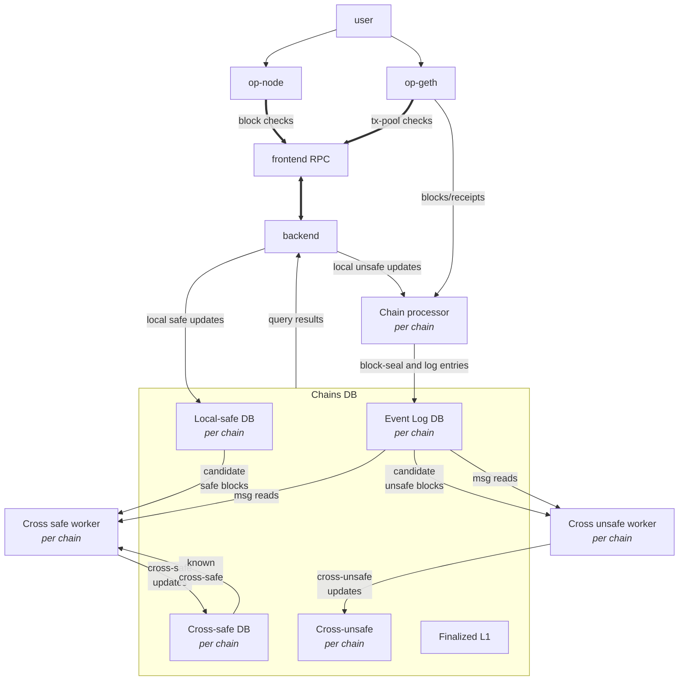

# `op-supervisor`

Issues: [monorepo](https://github.com/ethereum-optimism/optimism/issues?q=is%3Aissue%20state%3Aopen%20label%3AA-op-supervisor)

Pull requests: [monorepo](https://github.com/ethereum-optimism/optimism/pulls?q=is%3Aopen+is%3Apr+label%3AA-op-supervisor)

User docs:
- [op-supervisor](https://docs.optimism.io/stack/interop/op-supervisor)

Specs:
- [interop specs]

`op-supervisor` is a service to monitor chains, and quickly determine
cross-chain message safety, for native interoperability.
The `op-supervisor` functions as a [superchain backend], implementing the [interop specs].

[superchain backend]: https://github.com/ethereum-optimism/design-docs/blob/main/protocol/superchain-backend.md
[interop specs]: https://github.com/ethereum-optimism/specs/tree/main/specs/interop

*Warning: this implementation is a work in progress, in active development.*


## Quickstart

```bash
make op-supervisor

# Key configurables:
# datadir: where to store indexed interop data
# dependency-set: where to find chain dependencies (this format is changing, and may be fully onchain in a later iteration)
# l2-rpcs: L2 RPC endpoints to fetch data from (optional, can also be added using the `admin_addL2RPC in the admin-RPC)
./bin/op-supervisor \
  --datadir="./op-supervisor-data" \
  --dependency-set="./my-network-configs/dependency-set.json" \
  --l2-rpcs="ws://example1:8545,ws://example2:8545" \
  --rpc.enable-admin \
  --rpc.port=8545
```

## Usage

### Build from source

```bash
# from op-supervisor dir:
make op-supervisor
./bin/op-supervisor --help
```

### Run from source

```bash
# from op-supervisor dir:
go run ./cmd --help
```

### Build docker image

See `op-supervisor` docker-bake target.

## Overview

### About safety

There are 3 stages of block safety:

- `unsafe`: optimistically processed blocks
- `safe`: blocks reproducible from valid dependencies
- `finalized`: blocks reproducible from irreversibly valid dependencies

**Pre-interop**, the only dependency is DA (data availability), i.e. the batch data to derive the chain from.
**Post-interop**, other L2s may be a dependency also.
The op-supervisor tracks these dependencies, to maintain a global view of cross-chain message safety.

New blocks are considered `local unsafe`: sufficient to process the block locally, without guarantees.
Once the L2 dependencies are met we consider it `cross unsafe`: still missing DA, but forming a valid messaging graph.

Once the DA dependency is met, we consider it `local safe`:
enough to reproduce the local L2 chain content, but not to reason about cross-L2 interactions.

Once both L2 and DA dependencies are met, we consider it `cross safe`.
A `cross-safe` block may be "derived from" a L1 block that confirms all L2 data to reproduce
the local chain as well as the cross-L2 dependencies.
Hence this may take additional L1 data, beyond what a `local safe` block is derived from.

And once the dependencies become irreversibly valid, we consider it `finalized`.
We can thus look at what `cross-safe` has been derived from, and verify against the



### Verification flow

Warning: the data flow design is actively changing, see [design-doc 171].

[design-doc 171]: https://github.com/ethereum-optimism/design-docs/pull/171

Op-nodes, or any compatible consensus-layer L2 node, interact with the op-supervisor, to:

- share the "local" data with the supervisor
- view the "cross" safety once the supervisor has sufficient information



Implementers note: the op-supervisor needs "local" data
from the chains before being able to provide "cross" verified updated views.
The op-node is not currently notified when the "cross" verified view changes,
and thus relies on a revisit of the op-supervisor to determine change.

### Databases

The op-supervisor maintains a few databases:
- Log database (`events` kind): per chain, we maintain a running list of log-events,
  separated by block-seals.
  I.e. this persists the cross-L2 dependency information.
- `local safe` (`fromda` kind): per chain, we store which L2 block
  was locally derived from which L1 block.
  I.e. this persists the DA dependency information.
- `cross safe` (`fromda` kind): per chain, we store which L2 block
  became cross-safe, given all the L2 data available, at which L1 block.
  I.e. this persists the merged results of verifying both DA and cross-L2 dependencies.

Additionally, the op-supervisor tracks `cross unsafe` in memory, not persisting it to a database:
it can quickly reproduce this after data-loss by verifying if cross-L2 dependencies
are met by `unsafe` data, starting from the latest known `cross safe` block.

The latest `L1 finalized` block is tracked ephemerally as well:
the `L2 finalized` block is determined dynamically,
given what was `cross safe` at this finalized point in L1.

For both the `events` and `fromda` DB kinds an append-only format was chosen
to make the database efficient and robust:
data can be read in parallel, does not require compaction (a known problem with execution-layer databases),
and data can always be rewound to a previous consistent state by truncating to a checkpoint.
The database can be searched with binary lookups, and written with O(1) appends.

### Internal Architecture



Main components:
- `frontend`: public API surface
- `backend`: implements the API (updates, queries, reorgs)
- `ChainsDB`: hosts the databases, one of each kind, per chain
- `Chain processor`: indexes blocks/events, including unsafe blocks
- `Cross-unsafe worker`: updates cross-unsafe, by cross-verifying unsafe data
- `Cross-safe worker`: updates cross-safe, by cross-verifying safe data within a L1 view

Note that the `cross-unsafe` worker operates on any available L2 dependency data,
whereas the `cross-safe` worker incrementally expands the L1 scope,
to capture the `cross-safe` state relative to each L1 block.

Most supervisor branching logic deals with the edge-cases that come with
syncing dependency data, and updating the safety views as the dependencies change.
This is where the service differs most from interop development simulations:
*dependency verification is critical to safety*,
and requires dependencies on DA to be consolidated with the dependencies on cross-chain messaging.


## Product

### Optimization target

The `op-supervisor` implementation optimizes safe determination of cross-chain message safety,
with fast feedback to readers.

Data is indexed fast and optimistically to have a minimum level of feedback about a message or block.
Indexing changes are then propagated, allowing the safety-checks to quickly
follow up with asynchronous full verification of the safety.

### Vision

The `op-supervisor` is actively changing.
The most immediate changes are that to the architecture and data flow, as outlined in [design-doc 171].

Full support for chain reorgs (detecting them, and resolving them) is the
next priority after the above architecture and data changes.

Further background on the design-choices of op-supervisor can be found in the
[superchain backend desgin-doc](https://github.com/ethereum-optimism/design-docs/blob/main/protocol/superchain-backend.md).

## Design principles

- Each indexing or safety kind of change is encapsulated in its own asynchronous job.
- Increments in indexing and safety are propagated, such that other follow-up work can be triggered without delay.
- A read-only subset of the API is served, sufficient for nodes to stay in sync, assuming a healthy op-supervisor.
- Databases are rewound trivially by dropping trailing information.
- Databases can be copied at any time, for convenient snapshots.

## Failure modes

See [design-doc 171] for discussion of missing data and syncing related failure modes.

Generally the supervisor aims to provide existing static data in the case of disruption of cross-chain verification,
such that a chain which does not take on new interop dependencies, can continue to be extended with safe blocks.

I.e. safety must be guaranteed at all times,
but a minimal level of liveness can be maintained by holding off on cross-chain message acceptance
while allowing regular single-chain functionality to proceed.

## Testing

- `op-e2e/interop`: Go interop system-tests, focused on offchain aspects of services to run end to end.
- `op-e2e/actions/interop`: Go interop action-tests, focused on onchain aspects such as safety and state-transition.
- `interop-devnet`: docker-compose to run interoperable chains locally.
