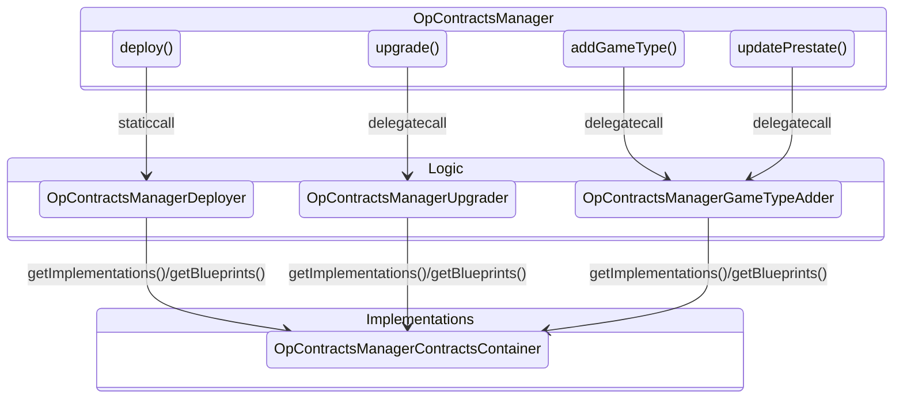

# OP Contracts Manager (OPCM)

The OPCM is an important smart contract that is used to orchestrate OP Chain deployments and upgrades. It is responsible
for the following:

1. Keeping track of the canonical implementation contracts for each [contracts release][versioning].
2. Deploying new L1 contracts for each OP Chain.
3. Upgrading from one contract release to another.
4. Maintaining the fault proof system by adding game types or updating prestates.

All contract upgrades that touch live chains **must** be performed via the OPCM. This guide will walk you through
the OPCM's architecture, and how to hook your contracts into it.

[versioning]: ../policies/versioning.md

## Architecture

The OPCM consists of multiple contracts:

1. `OPContractsManager`, which serves as the entry point.
2. `OPContractsManagerGameTypeAdder`, which is used to add new game types and update prestates.
3. `OPContractsManagerDeployer`, which is used to deploy new OP Chains.
4. `OPContractsManagerUpgrader`, which is used to upgrade existing OP Chains.
5. `OPContractsManagerContractsContainer`, which is a repository for contract implementations and blueprints.

They fit together like the diagram below:

One OPCM is deployed per smart contract release per chain. Each OPCM supports deploying a new chain at its
corresponding smart contract release, and upgrading existing chains from one version prior to its corresponding
smart contract release. Chains that are multiple versions behind must be upgraded in multiple stages across multiple
OPCMs.

The OPCM supports upgrading Superchain-wide contracts like `ProtocolVersions` and the `SuperchainConfig`. The OPCM will
perform the upgrade when the user calling the `upgrade` method is also the `UpgradeController`.

## Usage

Typically, users do not call into the OPCM directly. Instead, they use [OP Deployer][deployer] to either directly
call `deploy` when spinning up a new chain or generate calldate for use with `upgrade`.

If you want to call the OPCM directly, check out the implementation to see exactly what the inputs and outputs are
to each method. This changes between releases, and will not be covered directly here.

[deployer]: https://devdocs.optimism.io/op-deployer

## Updating the OPCM

Whenever you make updates to in-protocol contracts, you'll need to make corresponding changes inside the OPCM. While
the details of each change will vary, we've included some general guidelines below.

### Updating Logic Contracts

As their name implies, the logic contracts contain the actual logic used to deploy or upgrade contracts. When
modifying these contracts keep the following tips in mind:

- The `deploy` method can typically be modified in-place since the deployment process doesn't change much from
  release to release. For example, most changes to the `deploy` method will involve either adding a new contract or
  modifying the constructor/initializer for existing contracts. You can use the existing implementation as a guide.
- The `upgrade` method changes much more frequently. That said, you can still use the existing implementation as a
  guide. Just make sure to delete any old upgrade code that is no longer needed. The `OPContractsManagerUpgrader`
  logic contract also contains helpers for things like deploying new dispute games and upgrading proxies to new
  implementations. See the `upgradeTo` method for an example.
- The `upgrade` method will _always_ set the RC on the OPCM to false when called by the upgrade controller. It will
  only sometimes (depending on your specific upgrade) upgrade Superchain contracts.

### Fork Tests

The OPCM is tested using fork tests. These tests fork mainnet and "run" the upgrade against OP Mainnet. This allows
us to validate that the upgrades work as expected in CI prior to deploying them to betanets or production.

To run fork tests, run `just test-upgrade`. You will need to set `ETH_RPC_URL` to an archival mainnet node.

When multiple upgrades are in flight at the same time, the fork tests stack upgrades on top of one another. Since the
tip of `develop` must contain the implementation for the latest upgrade only, fork tests that run upgrades prior to 
the latest one must use deployed instances of the OPCM. For example, as of this writing upgrades 13, 14, and 15 are 
all in flight. Therefore, the fork tests will use deployed versions of the OPCM for upgrades 13 and 14 and whatever 
is on `develop` for upgrade 15. See `OPContractsManager.t.sol` for the implementation of the fork tests.