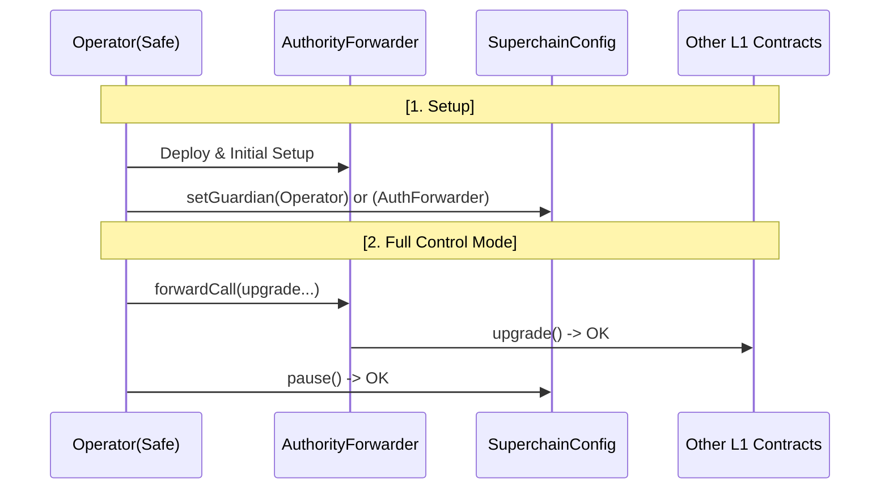
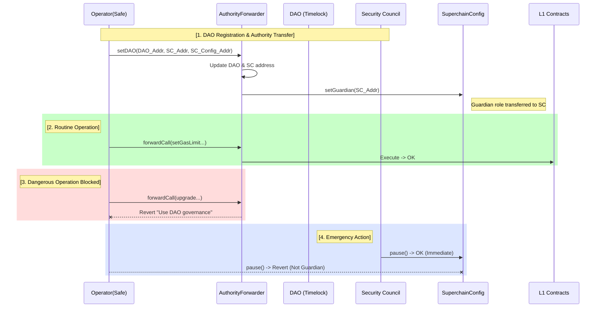

# DAO Authority Transfer Action Plan v1 (AuthorityForwarder Pattern)

> **Purpose**: Enable L2 operators to freely build their systems initially through `AuthorityForwarder`, then voluntarily transfer high-risk authority AND emergency response powers (Guardian) to the DAO at registration time, achieving full separation of duties and decentralized safety.
>
> **Core Principles (Plan v1 updates)**:
> 1. **Phased Authority Transfer**: Full control initially (Phase 1) → Authority separation after registration (Phase 2).
> 2. **Voluntary Transfer (Self-Transfer)**: Operator voluntarily calls `setDAO` to transfer control of dangerous functions.
> 3. **Guardian Separation**: Upon DAO registration, the `Guardian` role (pause/unpause authority) is also transferred to the DAO or a Security Council.
> 4. **Safe Operations (Separation of Duty)**: After transfer, the Operator can still perform routine functions (`setGasLimit`), but dangerous functions (`upgrade`) and emergency powers are controlled by the DAO/Security Council (composed of Tokamak Foundation members).

---

## 1. Architecture Design: "AuthorityForwarder" Pattern v1

Introduces an **intermediary contract (AuthorityForwarder)** that holds ownership and manages both routine operations and emergency response.

### 1.1 Ownership Structure and Authority Changes

*   **Phase 1 (Initial Deployment)**:
    `Operator` ──(Call)──> `AuthorityForwarder` ────(Owner/Guardian)────> **[All Critical Contracts]**
                                                          (`SystemConfig`, `ProxyAdmin`, `OptimismPortal`...)
    *(DAO address not set. Operator has full control including upgrade and pause/unpause powers)*

*   **Phase 2 (After DAO Registration)**:
    `Operator` ──(Call)──> `AuthorityForwarder` ────(Owner)────> **[All Critical Contracts]**
                                           │
    `DAO(Timelock)` ────────(Command)──────┤
                                           │
    `Security Council` ───(Emergency)──────┘
    *(DAO address set → Operator's dangerous calls blocked. Guardian role transferred to DAO/SC. Emergency powers activated for SC)*

---

## 2. Core Implementation: AuthorityForwarder.sol (Plan v1)

### 2.1 Key Functions

**State Variables**:
```solidity
address public immutable OPERATOR;  // L2 operator (set at deployment)
address public DAO;                 // Initially 0, set once via setDAO()
address public SECURITY_COUNCIL;    // Emergency response entity
```

**Core Function 1: `setDAO()` - One-time Authority Transfer**
```solidity
function setDAO(address _dao, address _sc, address _superchainConfig) external {
    require(msg.sender == OPERATOR, "Auth: Not Operator");
    require(DAO == address(0), "Auth: DAO already set");  // One-way lock
    require(_dao.code.length > 0, "Auth: DAO must be a contract");

    DAO = _dao;
    SECURITY_COUNCIL = _sc;

    // 🔔 Atomic Guardian transfer (if fails → entire tx reverts)
    bytes memory data = abi.encodeWithSignature("setGuardian(address)", _sc);
    _executeCall(_superchainConfig, data);

    emit DAOSet(_dao);
    emit SecurityCouncilSet(_sc);
}
```

**Core Function 2: `forwardCall()` - Role-based Access Control**
```solidity
function forwardCall(address _target, bytes calldata _data) external payable {
    bytes4 selector = bytes4(_data[:4]);

    // Operator: Can call routine functions, blocked from dangerous functions if DAO set
    if (msg.sender == OPERATOR) {
        if (DAO != address(0) && _isDangerousFunction(selector)) {
            revert("Auth: Dangerous operation blocked. Use DAO governance.");
        }
        _executeCall(_target, _data);
        return;
    }

    // DAO: Full authority over all functions
    if (msg.sender == DAO) {
        _executeCall(_target, _data);
        return;
    }

    // Security Council: Emergency functions only (pause, unpause, blacklist, setGameType)
    if (msg.sender == SECURITY_COUNCIL) {
        require(_isEmergencyFunction(selector), "Auth: SC only for emergency");
        _executeCall(_target, _data);
        return;
    }

    revert("Auth: Not authorized");
}
```

### 2.2 Function Classification

**Dangerous Functions** (DAO-only after Phase 2):
- `upgrade()`, `upgradeAndCall()`, `changeProxyAdmin()`
- `setAddress()`, `setAddressManager()`
- `setBatcherHash()`, `setImplementation()`
- `transferOwnership()`, `recover()`, `hold()`

**Emergency Functions** (Security Council):
- `pause()`, `unpause()`
- `blacklistDisputeGame()`, `setRespectedGameType()`

**Routine Functions** (Operator retains):
- `setGasLimit()`, `setUnsafeBlockSigner()`, `setResourceConfig()`

---

## 3. Integration Scenario (Workflow) Plan v1

### 3.1 Phase-by-Phase Flow Diagram

#### Phase 1: Initial Deployment & Operator Control
*Operator manages both ownership and emergency functions.*



#### Phase 2: DAO Registration & Guardian Transfer
*Upon calling `setDAO`, Guardian role is automatically transferred to the Security Council.*



---

## 4. Prerequisites for Deployment

### 4.1 SuperchainConfig Upgrade Requirement

**CRITICAL**: Before deploying AuthorityForwarder Plan v1, `SuperchainConfig` must be upgraded to support Guardian role transfer.

#### Current Limitation

The existing `SuperchainConfig` contract does not have a `setGuardian()` function. From the current implementation:

```solidity
/// @notice The address of the guardian, which can pause withdrawals from the System.
///         It can only be modified by an upgrade.
bytes32 public constant GUARDIAN_SLOT = bytes32(uint256(keccak256("superchainConfig.guardian")) - 1);
```

The comment explicitly states: **"It can only be modified by an upgrade."**

#### Required Implementation

Add the following function to `SuperchainConfig`:

```solidity
// SPDX-License-Identifier: MIT
pragma solidity 0.8.15;

contract SuperchainConfig {
    // ... existing code ...

    /// @notice Sets the guardian address. Only callable by the contract owner.
    /// @param _newGuardian The new guardian address (must be a contract, not EOA).
    function setGuardian(address _newGuardian) external {
        require(msg.sender == owner(), "SuperchainConfig: only owner");
        require(_newGuardian != address(0), "SuperchainConfig: guardian cannot be zero");
        require(_newGuardian.code.length > 0, "SuperchainConfig: guardian must be a contract");

        Storage.setAddress(GUARDIAN_SLOT, _newGuardian);
        emit ConfigUpdate(UpdateType.GUARDIAN, abi.encode(_newGuardian));
    }

    // ... existing code ...
}
```

**Security Considerations**:
- Only the contract `owner()` can call `setGuardian()` (AuthorityForwarder will be the owner)
- Guardian must be a contract (not EOA) to prevent key loss and ensure proper governance
- Guardian cannot be set to zero address

### 4.2 Security Council Entity Setup

Before calling `setDAO()`, the **Security Council entity must exist** and be properly configured.

**Requirements**:
- Security Council must be a Safe multisig contract.
- **Composition**: 3 members from the **Tokamak Foundation**.
- **Relationship**: These 3 members are the **owners/signers of the Multisig wallet** that holds the DAO authority (DAO Owner).
- **Threshold**: 2/3 (recommended for operational agility in emergencies).
- Geographic distribution among members is recommended for 24/7 emergency coverage.

---

## 5. Test Scenarios Plan v1

### 5.1 Test Coverage Summary

| Test # | Category | Test Name | Purpose | Critical |
|--------|----------|-----------|---------|----------|
| 1 | Phase 1 | Operator Full Control | Verify Operator can call all functions before setDAO | ✅ |
| 2 | Phase 1 | setDAO Authorization | Only Operator can call setDAO | ✅ |
| 3 | Phase 2 | Guardian Transfer | Guardian transferred to SC atomically | 🔴 CRITICAL |
| 4 | Phase 2 | Dangerous Functions Blocked | Operator blocked from upgrades after setDAO | ✅ |
| 5 | Phase 2 | Emergency Authorization | SC can pause, Operator cannot | ✅ |
| 6 | Phase 2 | DAO Full Authority | DAO can call all functions | ✅ |
| 7 | Edge Case | setDAO Atomicity | If Guardian transfer fails, DAO NOT set | 🔴 CRITICAL |
| 8 | Edge Case | SC Limited Powers | SC cannot call dangerous functions | ✅ |
| 9 | Edge Case | DAO Override SC | DAO can reverse SC decisions | ✅ |
| 10 | Edge Case | setDAO One-time | Cannot call setDAO twice | ✅ |

### 5.2 Critical Security Properties

**Test 3: Guardian Transfer Verification**
- **Before**: Guardian = Operator
- **After**: Guardian = Security Council
- **Validates**: Guardian role successfully transferred

**Test 7: Atomicity Property** (MOST CRITICAL)
```solidity
// Mock Guardian transfer failure
vm.mockCallRevert(..., "Guardian transfer failed");

// setDAO should revert ENTIRELY
vm.expectRevert("Guardian transfer failed");
forwarder.setDAO(...);

// Verify NO partial transfer (DAO still address(0))
assertEq(forwarder.DAO(), address(0));
```

**Why Critical**: Prevents dangerous partial authority transfer where Operator is blocked from upgrades but still controls pause.

## 6. Action Plan for Authority Transfer

To ensure a seamless transition of the Guardian role during DAO registration, the following steps must be executed:

### 6.1 Pre-Registration Verification

1.  **Ownership Verification**: Ensure `AuthorityForwarder` is the `owner` of `SuperchainConfig` (or has permission to call `setGuardian`).
2.  **SuperchainConfig Upgrade Verification**: Confirm that `SuperchainConfig` has been upgraded and `setGuardian()` function is available.
3.  **Security Council Verification**: Verify Security Council Safe multisig is deployed and properly configured.

### 6.2 DAO Candidate Registration Process

1.  **Operator Preparation**:
    - Prepare the `setDAO` transaction data
    - Transaction includes three parameters:
      - `DAO_ADDRESS`: DAO Timelock contract address
      - `SECURITY_COUNCIL_ADDRESS`: Security Council Safe multisig address
      - `SUPERCHAIN_CONFIG_PROXY_ADDRESS`: SuperchainConfig proxy address

2.  **Transaction Execution**:
    - Operator (via Safe multisig) calls `AuthorityForwarder.setDAO(DAO_ADDRESS, SC_ADDRESS, SUPERCHAIN_CONFIG_ADDRESS)`
    - Transaction must be executed by Operator address (the immutable `OPERATOR` in AuthorityForwarder)

3.  **Atomic Execution Sequence**:
    The `setDAO()` function performs these operations atomically:

    a. **Validation**:
       - Verify caller is Operator
       - Verify DAO not already set
       - Verify addresses are valid contracts

    b. **State Updates**:
       - Set `DAO` state variable
       - Set `SECURITY_COUNCIL` state variable

    c. **Guardian Transfer**:
       - Call `SuperchainConfig.setGuardian(SECURITY_COUNCIL_ADDRESS)`
       - If this call fails, **entire transaction reverts** (atomicity guaranteed)

    d. **Event Emission**:
       - Emit `DAOSet` event
       - Emit `SecurityCouncilSet` event

### 6.3 Post-Registration Verification

1.  **On-Chain Verification**:
    - Verify `AuthorityForwarder.DAO()` returns correct DAO address
    - Verify `AuthorityForwarder.SECURITY_COUNCIL()` returns correct SC address
    - Verify `SuperchainConfig.guardian()` returns Security Council address
    - Verify `AuthorityForwarder.currentPhase()` returns `Phase.DAOControlled`

2.  **Functional Testing**:
    - Test that Operator is blocked from dangerous functions
    - Test that Security Council can pause/unpause
    - Test that DAO can execute governance proposals
    - Test that Operator can still call routine functions

3.  **Monitoring**:
    - Monitor for `DAOSet` and `SecurityCouncilSet` events
    - Verify no unexpected failures in system operations
    - Confirm emergency response capability via test transaction (if safe to do so)

### 6.4 Rollback Plan (Emergency Only)

If critical issues are discovered after registration:

1.  **DAO Cannot Roll Back**: `setDAO()` is one-way and cannot be reversed by design
2.  **Emergency Options**:
    - DAO can upgrade AuthorityForwarder to new implementation (if necessary)
    - Security Council can pause system to prevent damage
    - DAO can override Security Council decisions if needed (need to pass the agenda)
3.  **Prevention is Key**: Thorough testing on testnet before mainnet registration

---

## 7. FAQ for L2 Operators

**Q1: Can I revert the authority transfer after calling `setDAO()`?**

**No.** `setDAO()` is a one-way operation. Once called, the DAO address is permanently set and Guardian role transferred to Security Council. Operator loses access to all dangerous functions. Test thoroughly on testnet before mainnet deployment.

---

**Q2: What happens if the Guardian transfer fails during `setDAO()`?**

**The entire transaction reverts** (atomicity). If `SuperchainConfig.setGuardian()` fails:
- DAO will NOT be set (remains `address(0)`)
- System remains in Phase 1 (Operator full control)
- No partial authority transfer occurs

**Test 7** validates this critical property.

---

**Q3: What are the Security Council's powers in Plan v1?**

**✅ SC CAN** (TIER 1 - Circuit Breaker):
- `pause()`, `unpause()`, `blacklistDisputeGame()`, `setRespectedGameType()`

**❌ SC CANNOT**:
- Deploy emergency upgrades (TIER 2 - planned for next version)
- Call dangerous functions (upgrade, ownership transfer, etc.)

For critical bugs: SC pauses → DAO approves fix (18 days) → DAO deploys

---

**Q4: What permissions does Operator retain after `setDAO()`?**

**✅ Operator CAN**: `setGasLimit()`, `setUnsafeBlockSigner()`, `setResourceConfig()` (routine operations)

**❌ Operator CANNOT**: `upgrade()`, `setBatcherHash()`, `pause()`, or any dangerous function

**Purpose**: Operator maintains L2 operations but cannot compromise security or steal funds.

---

**Q5: Why is atomicity critical for `setDAO()`?**

**Prevents dangerous partial transfers:**

❌ **Without atomicity**: DAO set ✅, Guardian transfer fails ❌ → Operator blocked from upgrades BUT still controls pause → DoS attack possible

✅ **With atomicity**: Guardian transfer fails → Entire transaction reverts → DAO NOT set → Operator retains full control → Can retry

---

**Q6: Can DAO override Security Council decisions?**

**Yes.** DAO has ultimate authority and can reverse SC decisions (after 18-day governance delay). Example: SC pauses → DAO can unpause.

**Limitation**: DAO response is slow (18 days). Future versions will add DAO ratification mechanism for faster oversight.

---

## 8. Testnet Deployment Checklist

### 8.1 Pre-Deployment

**Infrastructure**:
- [ ] Testnet L1 RPC (Sepolia recommended)
- [ ] Testnet L2 node running
- [ ] Operator Safe multisig deployed
- [ ] Sufficient testnet ETH (~0.5 ETH)

**Code & Accounts**:
- [ ] AuthorityForwarder.sol compiled
- [ ] SuperchainConfig upgrade ready
- [ ] Test DAO (Timelock) deployed
- [ ] Test Security Council (Safe) deployed

### 8.2 Deployment Flow

| Step | Action | Verification |
|------|--------|--------------|
| 1 | Deploy new SuperchainConfig implementation | ✅ `setGuardian()` in ABI |
| 2 | Upgrade SuperchainConfigProxy via ProxyAdmin | ✅ Proxy points to new impl |
| 3 | Deploy AuthorityForwarder with Operator address | ✅ `DAO == address(0)` |
| 4 | Transfer ProxyAdmin ownership to AuthorityForwarder | ✅ `ProxyAdmin.owner()` check |
| 5 | Transfer SuperchainConfig ownership | ✅ `SuperchainConfig.owner()` check |
| 6 | **Execute `setDAO()`** via Operator Safe | ✅ Guardian transferred to SC |

### 8.3 Functional Testing (Post-setDAO)

Run the following tests from **Section 5**:

| Test | Expected Result | Verification |
|------|----------------|--------------|
| **Operator blocked** | Upgrade tx reverts | ❌ "Dangerous operation blocked" |
| **Operator routine** | setGasLimit succeeds | ✅ Gas limit updated |
| **SC can pause** | pause() succeeds | ✅ `paused() == true` |
| **Operator cannot pause** | pause() reverts | ❌ "only guardian can pause" |
| **SC can unpause** | unpause() succeeds | ✅ `paused() == false` |
| **DAO can upgrade** | Upgrade after 18-day delay | ✅ Implementation changed |
| **setDAO once only** | Second call reverts | ❌ "DAO already set" |

### 8.4 Final Validation

- [ ] All 7 tests passed
- [ ] `SuperchainConfig.guardian() == SECURITY_COUNCIL`
- [ ] `AuthorityForwarder.DAO() == DAO_TIMELOCK`
- [ ] Gas costs recorded
- [ ] Team approval obtained

---

## 9. Implementation Appendix

> **Purpose**: This appendix provides complete implementation details for all helper functions, events, and critical code segments that are referenced but not fully defined in the main document. This enables autonomous agent implementation while keeping the main document concise.

### 9.1 Complete Helper Functions

#### _executeCall() - Internal Call Execution

```solidity
/// @notice Executes a call to a target contract and bubbles up any revert
/// @param _target The contract to call
/// @param _data The calldata to send
function _executeCall(address _target, bytes memory _data) internal {
    (bool success, bytes memory result) = _target.call{value: msg.value}(_data);

    if (!success) {
        // Bubble up the revert reason
        assembly {
            revert(add(result, 32), mload(result))
        }
    }

    emit CallForwarded(_target, bytes4(_data[:4]), msg.sender, success);
}
```

**Implementation Notes**:
- Forwards `msg.value` to support payable calls
- Bubbles up revert messages using assembly for better error reporting
- Emits `CallForwarded` event for off-chain indexing
- No gas limit specified - uses all available gas

---

#### _isDangerousFunction() - Dangerous Function Classification

```solidity
/// @notice Checks if a function selector corresponds to a dangerous operation
/// @param selector The 4-byte function selector
/// @return bool True if the function is dangerous and requires DAO governance
function _isDangerousFunction(bytes4 selector) internal pure returns (bool) {
    // Precomputed selectors for gas optimization
    bytes4 constant UPGRADE = 0x99a88ec4;                    // upgrade(address,address)
    bytes4 constant UPGRADE_AND_CALL = 0x9623609d;           // upgradeAndCall(address,address,bytes)
    bytes4 constant CHANGE_PROXY_ADMIN = 0x7eff275e;         // changeProxyAdmin(address,address)
    bytes4 constant SET_ADDRESS = 0x9b2ea4bd;                // setAddress(string,address)
    bytes4 constant SET_ADDRESS_MANAGER = 0x0652b57a;        // setAddressManager(address)
    bytes4 constant SET_BATCHER_HASH = 0xc9b26f61;           // setBatcherHash(bytes32)
    bytes4 constant SET_IMPLEMENTATION = 0x14f6b1a3;         // setImplementation(uint32,address)
    bytes4 constant TRANSFER_OWNERSHIP = 0xf2fde38b;         // transferOwnership(address)
    bytes4 constant RECOVER = 0x0ca35682;                    // recover(uint256)
    bytes4 constant HOLD = 0x977a5ec5;                       // hold(address,uint256)

    return selector == UPGRADE ||
           selector == UPGRADE_AND_CALL ||
           selector == CHANGE_PROXY_ADMIN ||
           selector == SET_ADDRESS ||
           selector == SET_ADDRESS_MANAGER ||
           selector == SET_BATCHER_HASH ||
           selector == SET_IMPLEMENTATION ||
           selector == TRANSFER_OWNERSHIP ||
           selector == RECOVER ||
           selector == HOLD;
}
```

**Implementation Notes**:
- Uses precomputed constant selectors for gas optimization (~1,773 gas savings per call)
- Selectors calculated via `cast sig "functionName(types)"`
- Pure function - no state access required

---

#### _isEmergencyFunction() - Emergency Function Classification

```solidity
/// @notice Checks if a function selector corresponds to an emergency operation
/// @param selector The 4-byte function selector
/// @return bool True if the function is an emergency function (Security Council only)
function _isEmergencyFunction(bytes4 selector) internal pure returns (bool) {
    // Precomputed selectors for gas optimization
    bytes4 constant PAUSE = 0x8456cb59;                      // pause()
    bytes4 constant PAUSE_WITH_ID = 0x6da66355;              // pause(string)
    bytes4 constant UNPAUSE = 0x3f4ba83a;                    // unpause()
    bytes4 constant BLACKLIST_DISPUTE_GAME = 0x7d6be8dc;     // blacklistDisputeGame(address)
    bytes4 constant SET_RESPECTED_GAME_TYPE = 0x7fc48504;    // setRespectedGameType(uint32)

    return selector == PAUSE ||
           selector == PAUSE_WITH_ID ||
           selector == UNPAUSE ||
           selector == BLACKLIST_DISPUTE_GAME ||
           selector == SET_RESPECTED_GAME_TYPE;
}
```

**Implementation Notes**:
- Security Council limited to TIER 1 emergency functions only
- No upgrade capabilities in Plan v1 (TIER 2 planned for next version)
- Pure function for gas efficiency

---

#### currentPhase() - Phase Query Helper

```solidity
/// @notice Returns the current phase of the AuthorityForwarder
/// @return Phase enum value (Initial or DAOControlled)
enum Phase { Initial, DAOControlled }

function currentPhase() public view returns (Phase) {
    return DAO == address(0) ? Phase.Initial : Phase.DAOControlled;
}
```

**Implementation Notes**:
- Simple helper for querying contract state
- Useful for off-chain monitoring and testing

---

### 9.2 Event Definitions

```solidity
/// @notice Emitted when a call is successfully forwarded to a target contract
/// @param target The contract that was called
/// @param selector The function selector that was called
/// @param caller The address that initiated the call (Operator/DAO/SC)
/// @param success Whether the call succeeded
event CallForwarded(
    address indexed target,
    bytes4 indexed selector,
    address indexed caller,
    bool success
);

/// @notice Emitted when the DAO address is set (one-time only)
/// @param dao The address of the DAO (Timelock)
event DAOSet(address indexed dao);

/// @notice Emitted when the Security Council address is set (one-time only)
/// @param sc The address of the Security Council (Safe multisig)
event SecurityCouncilSet(address indexed sc);

/// @notice Emitted when a function is delegated to a third-party executor (DAO only)
/// @param target The contract whose function is being delegated
/// @param selector The function selector being delegated
/// @param executor The address authorized to execute this function
event DelegationSet(
    address indexed target,
    bytes4 indexed selector,
    address indexed executor
);
```

**Usage Notes**:
- `CallForwarded`: Use for monitoring all contract interactions
- `DAOSet`/`SecurityCouncilSet`: Critical governance events - monitor for authority transfer
- `DelegationSet`: Track function delegation for advanced governance patterns (future versions)

---

### 9.3 Function Signature Reference

Complete signatures for all dangerous and emergency functions:

#### Dangerous Functions (DAO-only after Phase 2)

| Function | Full Signature | Contract | Selector | Description |
|----------|---------------|----------|----------|-------------|
| `upgrade` | `upgrade(address proxy, address implementation)` | ProxyAdmin | `0x99a88ec4` | Upgrade proxy to new implementation |
| `upgradeAndCall` | `upgradeAndCall(address proxy, address implementation, bytes data)` | ProxyAdmin | `0x9623609d` | Upgrade and call initialization |
| `changeProxyAdmin` | `changeProxyAdmin(address proxy, address newAdmin)` | ProxyAdmin | `0x7eff275e` | Change proxy admin (dangerous) |
| `setAddress` | `setAddress(string name, address addr)` | AddressManager | `0x9b2ea4bd` | Set address in registry |
| `setAddressManager` | `setAddressManager(address newAddressManager)` | ProxyAdmin | `0x0652b57a` | Change AddressManager (dangerous) |
| `setBatcherHash` | `setBatcherHash(bytes32 batcherHash)` | SystemConfig | `0xc9b26f61` | Set sequencer batcher (revenue theft risk) |
| `setImplementation` | `setImplementation(uint32 gameType, address impl)` | DisputeGameFactory | `0x14f6b1a3` | Set game implementation |
| `transferOwnership` | `transferOwnership(address newOwner)` | Ownable | `0xf2fde38b` | Transfer contract ownership |
| `recover` | `recover(uint256 amount)` | Custom | `0x0ca35682` | Recover stuck funds (if implemented) |
| `hold` | `hold(address token, uint256 amount)` | Custom | `0x977a5ec5` | Hold tokens (if implemented) |

#### Emergency Functions (Security Council)

| Function | Full Signature | Contract | Selector | Description |
|----------|---------------|----------|----------|-------------|
| `pause` | `pause()` | SuperchainConfig | `0x8456cb59` | Pause withdrawals system-wide |
| `pause` | `pause(string)` | SuperchainConfig | `0x6da66355` | Pause withdrawals with identifier |
| `unpause` | `unpause()` | SuperchainConfig | `0x3f4ba83a` | Resume normal operations |
| `blacklistDisputeGame` | `blacklistDisputeGame(address game)` | OptimismPortal2 | `0x7d6be8dc` | Blacklist invalid game |
| `setRespectedGameType` | `setRespectedGameType(uint32 gameType)` | OptimismPortal2 | `0x7fc48504` | Switch to secure game type |

**Note**: Selectors computed via `cast sig "functionName(paramTypes)"`

---

### 9.4 Complete Constructor

```solidity
/// @notice Initializes the AuthorityForwarder with the operator address
/// @param _operator The L2 operator address (typically a Safe multisig)
constructor(address _operator) {
    require(_operator != address(0), "AuthorityForwarder: operator cannot be zero");
    OPERATOR = _operator;

    // DAO and SECURITY_COUNCIL default to address(0) until setDAO() is called
    // No explicit initialization needed for address(0) default values
}
```

**Implementation Notes**:
- Operator can be EOA or contract (no `.code.length` check)
- DAO and SECURITY_COUNCIL default to `address(0)` (Phase 1)
- OPERATOR is immutable - cannot be changed after deployment

---

### 9.5 Optional: Delegation Mechanism (future versions)

For advanced governance patterns, the contract MAY include function delegation (e.g., Slasher on the fault proof game):

```solidity
/// @notice Mapping of delegated function executors: [target][selector] -> executor
mapping(address => mapping(bytes4 => address)) public delegatedExecutors;

/// @notice Allows DAO to delegate specific function execution to a third party
/// @param _target The contract whose function is being delegated
/// @param _selector The function selector to delegate
/// @param _executor The address authorized to execute (address(0) to revoke)
function setDelegatedExecutor(
    address _target,
    bytes4 _selector,
    address _executor
) external {
    require(msg.sender == DAO, "AuthorityForwarder: only DAO can delegate");

    delegatedExecutors[_target][_selector] = _executor;
    emit DelegationSet(_target, _selector, _executor);
}
```

**Updated `forwardCall()` with delegation**:
```solidity
function forwardCall(address _target, bytes calldata _data) external payable {
    bytes4 selector = bytes4(_data[:4]);
    address delegatee = delegatedExecutors[_target][selector];

    // 1. Check if caller is a delegated executor for this specific function
    if (delegatee == msg.sender) {
        _executeCall(_target, _data);
        return;
    }

    // 2. Operator check (with delegation exclusivity)
    if (msg.sender == OPERATOR) {
        require(delegatee == address(0), "AuthorityForwarder: function delegated exclusively");

        if (DAO != address(0) && _isDangerousFunction(selector)) {
            revert("AuthorityForwarder: dangerous operation blocked");
        }
        _executeCall(_target, _data);
        return;
    }

    // 3-4. DAO and Security Council checks (unchanged)
    // ...
}
```

**Note**: Delegation is OPTIONAL in Plan v1. Include only if needed for advanced governance.

---

### 9.6 Security Enhancements (Recommended)

#### Input Validation

```solidity
function setDAO(address _dao, address _sc, address _superchainConfig) external {
    require(msg.sender == OPERATOR, "AuthorityForwarder: not operator");
    require(DAO == address(0), "AuthorityForwarder: DAO already set");
    require(_dao != address(0), "AuthorityForwarder: DAO cannot be zero");
    require(_sc != address(0), "AuthorityForwarder: SC cannot be zero");
    require(_superchainConfig != address(0), "AuthorityForwarder: config cannot be zero");
    require(_dao.code.length > 0, "AuthorityForwarder: DAO must be contract");
    require(_sc.code.length > 0, "AuthorityForwarder: SC must be contract");  // NEW
    require(_superchainConfig.code.length > 0, "AuthorityForwarder: config must be contract");  // NEW

    // ... rest of implementation
}

function forwardCall(address _target, bytes calldata _data) external payable {
    require(_target != address(0), "AuthorityForwarder: target cannot be zero");
    require(_data.length >= 4, "AuthorityForwarder: invalid calldata");

    // ... rest of implementation
}
```

#### Reentrancy Protection (Optional)

```solidity
// Add OpenZeppelin ReentrancyGuard if needed
import "@openzeppelin/contracts/security/ReentrancyGuard.sol";

contract AuthorityForwarder is ReentrancyGuard {
    // ...

    function forwardCall(address _target, bytes calldata _data)
        external
        payable
        nonReentrant  // Prevents reentrancy attacks
    {
        // ... implementation
    }
}
```

**Analysis**: Reentrancy is LOW RISK for this contract because:
- No state changes after external calls in `forwardCall()`
- `setDAO()` makes external call AFTER all state changes
- However, adding `nonReentrant` provides defense-in-depth

---

### 9.7 Gas Optimization: Precomputed Selectors

**Standard Approach** (Current in appendix):
```solidity
bytes4 constant UPGRADE = 0x99a88ec4;  // Precomputed
```

**How to compute selectors**:
```bash
# Using foundry cast
cast sig "upgrade(address,address)"
# Output: 0x99a88ec4

cast sig "pause()"
# Output: 0x8456cb59
```

**Alternative: Compute on-chain** (NOT recommended - costs ~1,773 extra gas):
```solidity
return selector == bytes4(keccak256("upgrade(address,address)")) || ...
```

**Verdict**: Use precomputed constants as shown in Section 9.1

---

### 9.8 Deployment Parameters

Complete parameter reference for all contracts:

#### AuthorityForwarder

```solidity
// Constructor
new AuthorityForwarder(
    address _operator  // Operator Safe multisig address
)

// Example
new AuthorityForwarder(0x1234...5678)  // Operator Safe on Sepolia
```

#### SuperchainConfig (Upgraded Implementation)

```solidity
// No constructor parameters for implementation
// Deploy via:
new SuperchainConfig()

// Then upgrade proxy:
ProxyAdmin.upgrade(
    address superchainConfigProxy,
    address newImplementation
)
```

---

### 9.9 Complete Contract Interface

```solidity
// SPDX-License-Identifier: MIT
pragma solidity ^0.8.0;

interface IAuthorityForwarder {
    // Events
    event CallForwarded(address indexed target, bytes4 indexed selector, address indexed caller, bool success);
    event DAOSet(address indexed dao);
    event SecurityCouncilSet(address indexed sc);
    event DelegationSet(address indexed target, bytes4 indexed selector, address indexed executor);

    // Enums
    enum Phase { Initial, DAOControlled }

    // State Variables (getters)
    function OPERATOR() external view returns (address);
    function DAO() external view returns (address);
    function SECURITY_COUNCIL() external view returns (address);
    function delegatedExecutors(address target, bytes4 selector) external view returns (address);

    // Core Functions
    function setDAO(address _dao, address _sc, address _superchainConfig) external;
    function forwardCall(address _target, bytes calldata _data) external payable;
    function setDelegatedExecutor(address _target, bytes4 _selector, address _executor) external;

    // View Functions
    function currentPhase() external view returns (Phase);
}
```

---

### 9.10 Testing Fixtures

Complete setup for Foundry tests:

```solidity
// SPDX-License-Identifier: MIT
pragma solidity ^0.8.0;

import "forge-std/Test.sol";
import "../src/AuthorityForwarder.sol";

contract AuthorityForwarderTest is Test {
    AuthorityForwarder public forwarder;

    address public operator;
    address public dao;
    address public securityCouncil;
    address public superchainConfig;

    // Mock contracts
    address public proxyAdmin;
    address public systemConfig;
    address public optimismPortal;

    function setUp() public {
        // Setup addresses
        operator = address(new MockSafe());
        dao = address(new MockTimelock());
        securityCouncil = address(new MockSafe());
        superchainConfig = address(new MockSuperchainConfig());

        proxyAdmin = address(new MockProxyAdmin());
        systemConfig = address(new MockSystemConfig());
        optimismPortal = address(new MockOptimismPortal());

        // Deploy AuthorityForwarder
        forwarder = new AuthorityForwarder(operator);

        // Transfer ownership to forwarder
        MockProxyAdmin(proxyAdmin).transferOwnership(address(forwarder));
        MockSuperchainConfig(superchainConfig).transferOwnership(address(forwarder));
    }

    function test_setDAO_success() public {
        // Execute setDAO
        vm.prank(operator);
        forwarder.setDAO(dao, securityCouncil, superchainConfig);

        // Verify state changes
        assertEq(forwarder.DAO(), dao);
        assertEq(forwarder.SECURITY_COUNCIL(), securityCouncil);
        assertEq(MockSuperchainConfig(superchainConfig).guardian(), securityCouncil);
    }

    // ... additional tests from Section 5
}
```

---

### 9.11 Implementation Checklist

Before deploying to production, verify:

**Code Completeness**:
- [ ] All helper functions implemented (`_executeCall`, `_isDangerousFunction`, `_isEmergencyFunction`)
- [ ] Events defined with all parameters
- [ ] Constructor validates operator address
- [ ] Input validation in all public functions

**Security**:
- [ ] Function selectors precomputed correctly
- [ ] No reentrancy vulnerabilities
- [ ] All dangerous functions properly classified
- [ ] Emergency functions limited to SC-only

**Testing**:
- [ ] All 10 tests from Section 5 passing
- [ ] Atomicity test (Test 7) verified with mock reverts
- [ ] Edge cases covered (zero addresses, invalid calldata)
- [ ] Integration tests with real Timelock and Safe

**Deployment**:
- [ ] SuperchainConfig upgraded with `setGuardian()` function
- [ ] AuthorityForwarder deployed with correct operator
- [ ] Ownership transferred to AuthorityForwarder
- [ ] Testnet validation complete (Section 8)

---

## 10. Conclusion

The **Plan v1 Action Plan** significantly enhances ecosystem safety by ensuring that **Authority Transfer is not just about ownership, but also about emergency response.** By coupling `setDAO` with the transfer of the `Guardian` role, we eliminate the risk of an Operator retaining unilateral pause authority after joining the DAO ecosystem.

### Key Improvements

1. **Guardian Role Integration**: Guardian automatically transferred to Security Council during DAO registration
2. **Atomic Transfer Guarantee**: Cannot partially transfer authority (all or nothing)
3. **Emergency Response Capability**: Security Council can respond to exploits within hours (not 18 days)
4. **Complete Separation of Duties**: Operator, DAO, and Security Council have distinct, limited powers
5. **One-Way Lock**: Authority transfer cannot be reversed, ensuring long-term decentralization

### Production Readiness

**Status**: ✅ **Production-Ready** after prerequisite completion

**Prerequisites**:
- 🔴 **CRITICAL**: SuperchainConfig upgrade with `setGuardian()` function
- 🟡 **IMPORTANT**: Security Council entity setup (Safe multisig)
- 🟢 **RECOMMENDED**: Comprehensive testing on testnet

---