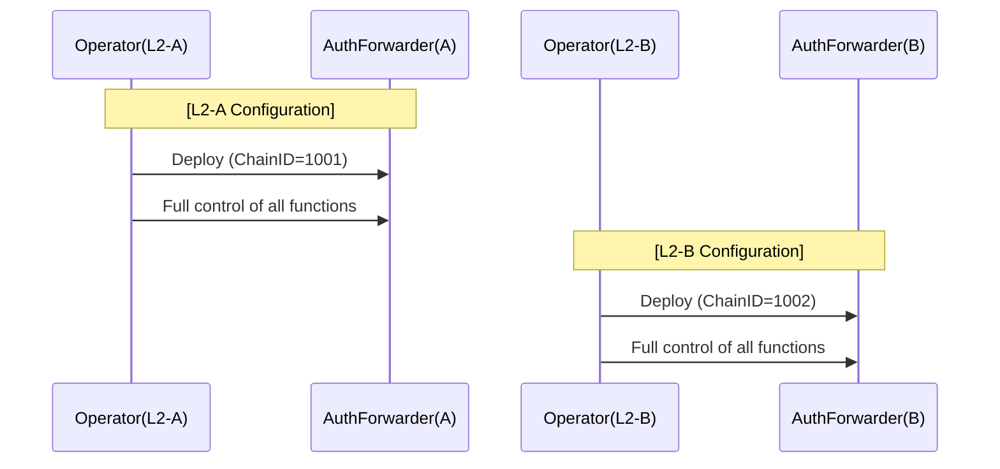
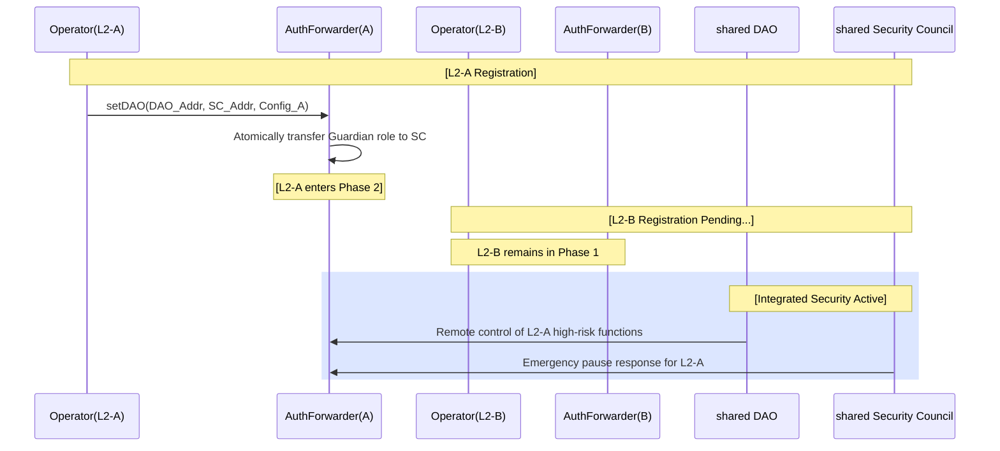

# DAO Authority Transfer Action Plan v2 (AuthorityForwarder Pattern - Multi-L2 and Deterministic Address Support)

> **Objective**: L2 operators initially build their systems autonomously using `AuthorityForwarder` and voluntarily transfer high-risk permissions and emergency response (Guardian) authority to the DAO at the time of registration. This achieves complete separation of duties and decentralized security within a multi-L2 ecosystem.
>
> **Core Principles (Plan v2 Updates)**:
> 1. **Phased Authority Transfer**: Initial full operator control (Phase 1) → Post-registration separation of duties (Phase 2).
> 2. **Voluntary Transfer (Self-Transfer)**: The operator voluntarily transfers high-risk function control to the DAO by calling `setDAO`.
> 3. **Guardian Role Separation**: At DAO registration, pause/unpause (Guardian) authority is atomically transferred to the Security Council.
> 4. **Maximizing Operational Efficiency**: Deploy via **deterministic addresses (CREATE2)** using the **L2 Chain ID as Salt**, minimizing operator configuration burden and providing management convenience for the DAO.
> 5. **Multi-L2 Ecosystem Support**: Multiple L2 networks independently register with a shared DAO and Security Council to implement integrated governance.

---

## 1. Architecture Design: "AuthorityForwarder" Pattern v2

To support numerous L2 networks within the ecosystem, we introduce an **intermediary contract (AuthorityForwarder)** that holds ownership and manages daily operations and emergency responses.

### 1.1 Multi-L2 Deployment Model

**v2 Key Improvements**: Each L2 has its own AuthorityForwarder instance, but they share a common DAO and Security Council.

```
Tokamak Ecosystem Architecture (v2)

┌─────────────────────────────────────────────────────────────┐
│                    Shared Governance Layer                  │
│                                                              │
│  ┌────────────────────┐        ┌──────────────────────┐    │
│  │   DAO (Timelock)   │        │   Security Council   │    │
│  │  18-day Delay      │        │  (Safe 2/3 multisig) │    │
│  └────────────────────┘        └──────────────────────┘    │
│           │                              │                   │
└───────────┼──────────────────────────────┼──────────────────┘
            │                              │
    ┌───────┴───────┬──────────────────────┴─────┬────────────┐
    │               │                            │            │
┌───▼─────────┐ ┌───▼─────────┐           ┌────▼──────────┐ │
│   L2-A      │ │   L2-B      │           │   L2-C        │ │
│   Network   │ │   Network   │    ...    │   Network     │ │
│             │ │             │           │               │ │
│ ┌─────────┐ │ │ ┌─────────┐ │           │ ┌───────────┐ │ │
│ │Authority│ │ │ │Authority│ │           │ │ Authority │ │ │
│ │Forwarder│ │ │ │Forwarder│ │           │ │ Forwarder │ │ │
│ │   (A)   │ │ │ │   (B)   │ │           │ │    (C)    │ │ │
│ └────┬────┘ │ │ └────┬────┘ │           │ └─────┬─────┘ │ │
│      │      │ │      │      │           │       │       │ │
│ ┌────▼────┐ │ │ ┌────▼────┐ │           │ ┌─────▼─────┐ │ │
│ │Operator │ │ │ │Operator │ │           │ │ Operator  │ │ │
│ │  (A)    │ │ │ │  (B)    │ │           │ │   (C)     │ │ │
│ └─────────┘ │ │ └─────────┘ │           │ └───────────┘ │ │
│             │ │             │           │               │ │
│ [L1         │ │ [L1         │           │ [L1           │ │
│  Contracts] │ │  Contracts] │           │  Contracts]   │ │
└─────────────┘ └─────────────┘           └───────────────┘ │
```

**Key Features**:
- **Shared Components**: Single DAO (Timelock) + Single Security Council (Safe multisig).
- **L2-Specific Components**: Individual AuthorityForwarder and Operator per L2.
- **Independent Registration**: Each L2 can transition to Phase 2 independently at different times.
- **Deterministic Addresses**: Uses Chain ID as Salt to fix the forwarder address, allowing the DAO to immediately identify each chain's forwarder.

### 1.2 Ownership Structure and Permission Changes

*   **Phase 1 (Initial Deployment) - Per L2**:
    `Operator(L2-A)` ──> `AuthorityForwarder(A)` ────> **[L2-A Critical Contracts]**
    *(DAO address is not set. Operator holds all control, including upgrades and pause/unpause permissions.)*

*   **Phase 2 (Post-DAO Registration) - Integrated Governance**:
    ```
    Operator(L2-A) ──> AuthorityForwarder(A) ────> [L2-A Contracts]
                              │
    Operator(L2-B) ──> AuthorityForwarder(B) ────> [L2-B Contracts]
                              │
                         ┌────┴────┐
           DAO(Timelock)─┤         ├─Security Council(SC)
                         └─────────┘
    ```
    *(Calls to high-risk functions from each L2 are blocked for the operator. The Guardian role is transferred to the SC. The integrated emergency response system is activated.)*

---

## 2. Core Implementation: AuthorityForwarder.sol (Plan v2)

### 2.1 Chain ID-based Identifier

**State Variables**:
```solidity
address public immutable OPERATOR;      // L2 Operator (set at deployment)
uint256 public immutable L2_CHAIN_ID;  // Unique L2 identifier (uses Chain ID)
address public DAO;                     // Initially 0, set once via setDAO()
address public SECURITY_COUNCIL;        // Emergency response entity
```

**Deterministic Address Deployment (CREATE2)**:
To reduce operator errors and management costs, deployment is performed using `L2_CHAIN_ID` as the Salt.
```solidity
// Deployment Script Example
bytes32 salt = bytes32(cfg.l2ChainID());
AuthorityForwarder forwarder = new AuthorityForwarder{salt: salt}(operator, cfg.l2ChainID());
```

### 2.2 Critical Function Access Control

**Core Function: `forwardCall()` - Role-Based Access Control**
```solidity
function forwardCall(address _target, bytes calldata _data) external payable {
    bytes4 selector = bytes4(_data[:4]);

    // 1. Operator: Allows only routine functions (High-risk functions blocked after Phase 2)
    if (msg.sender == OPERATOR) {
        if (DAO != address(0) && _isDangerousFunction(selector)) {
            revert("Auth: Dangerous operation blocked. Use DAO governance.");
        }
        _executeCall(_target, _data);
        return;
    }

    // 2. DAO: Holds full permissions for all functions
    if (msg.sender == DAO) {
        _executeCall(_target, _data);
        return;
    }

    // 3. Security Council: Allows only emergency functions (pause, unpause, blacklist, etc.)
    if (msg.sender == SECURITY_COUNCIL) {
        require(_isEmergencyFunction(selector), "Auth: SC only for emergency");
        _executeCall(_target, _data);
        return;
    }

    revert("Auth: Not authorized");
}

**Core Function 2: `setDAO()` - Authority Transfer and Automatic Registry Registration**
```solidity
function setDAO(address _dao, address _sc, address _config, address _registry) external {
    require(msg.sender == OPERATOR, "Auth: Not Operator");
    require(DAO == address(0), "Auth: DAO already set");

    // Address validation and contract checks omitted (included in actual implementation)
    DAO = _dao;
    SECURITY_COUNCIL = _sc;

    // 1. Atomic transfer of Guardian role
    bytes memory data = abi.encodeWithSignature("setGuardian(address)", _sc);
    _executeCall(_config, data);

    // 2. Automatic registration in the Foundation-managed Registry
    if (_registry != address(0)) {
        // Automatically register L2 info via Registry interface call
        (bool success, ) = _registry.call(
            abi.encodeWithSignature("register(uint256,address)", L2_CHAIN_ID, address(this))
        );
        require(success, "Auth: Registration failed");
    }

    emit DAORegistered(_dao, _sc, L2_CHAIN_ID);
}
```
---

### 2.3 Events for Multi-L2 Tracking

```solidity
/// @notice Emitted when a call is successfully forwarded
event CallForwarded(
    address indexed target,
    bytes4 indexed selector,
    address indexed caller,
    uint256 indexed chainId,
    bool success
);

/// @notice Emitted when the DAO and Security Council are set (for indexing)
event DAORegistered(
    address indexed dao,
    address indexed securityCouncil,
    uint256 indexed chainId
);
```

---

### 2.4 AuthorityForwarderRegistry.sol (Foundation-Managed Central Registry)

This contract is deployed once on L1 by the Foundation and manages all L2 forwarder addresses in the ecosystem. Registration is automatically completed when the operator calls `setDAO`.

```solidity
contract AuthorityForwarderRegistry {
    /// @notice L2 Chain ID => AuthorityForwarder Address mapping
    mapping(uint256 => address) public getForwarder;

    /// @notice Emitted when a new forwarder is registered
    event ForwarderRegistered(uint256 indexed chainId, address indexed forwarder);

    /**
     * @notice Registers a forwarder address.
     * @param _chainId The L2 chain ID to register.
     * @param _forwarder The forwarder address for that L2.
     */
    function register(uint256 _chainId, address _forwarder) external {
        // Security: Only the forwarder itself can register its own chain ID,
        // enforcing data trust on-chain.
        require(msg.sender == _forwarder, "Registry: Only forwarder can register itself");
        require(getForwarder[_chainId] == address(0), "Registry: Already registered");

        getForwarder[_chainId] = _forwarder;
        emit ForwarderRegistered(_chainId, _forwarder);
    }

    /**
     * @notice Returns the forwarder address for a given chain ID.
     * @param _chainId The chain ID of the L2 to query.
     * @return The forwarder address for that L2.
     */
    function getForwarderAddress(uint256 _chainId) external view returns (address) {
        return getForwarder[_chainId];
    }
}
```

---

## 3. Integration Scenarios (Workflow)

### 3.1 Step-by-Step Flowchart

#### Phase 1: Autonomous Operation (Per L2)
*Each operator autonomously manages their region.*



#### Phase 2: DAO Registration and Integrated Security
*Each L2 independently registers with the shared DAO/SC.*



---

## 4. Operation and Management Guide

### 4.1 Minimizing Operator Burden
Operators do not need to input separate identifier strings during deployment. The system uses the pre-defined `l2ChainID` to:
1. Generate a **deterministic address** for deployment.
2. Automatically assign that value as the internal **unique identifier**.

### 4.2 Autonomous Forwarder Identification for DAO/SC
When the DAO or Security Council needs to manage a specific chain, they don't need to manually maintain a list of addresses.
*   **Off-chain**: The forwarder address can be immediately calculated using the chain ID and bytecode.
*   **On-chain**: If necessary, it can be queried via the lightweight registry: `registry.getForwarderAddress(chainId)`.
*   **Events**: The list of chains that have joined governance is managed in real-time by indexing `DAORegistered` events.

### 4.3 Selective Emergency Response
In case of a security incident on a specific chain:
- The Security Council can **pause only that specific chain (L2-A)**.
- Other chains (L2-B, C) continue to operate normally, minimizing damage to the overall ecosystem.

---

## 5. Conclusion

Plan v2 is a model that most efficiently manages a multi-L2 ecosystem through **"Automation of Identifiers"** and **"Deterministic Addresses."**

- **Stability**: Prevents manual configuration errors by operators at the source.
- **Scalability**: Even with hundreds of L2s, they can be managed via a unified governance interface (Chain ID).
- **Transparency**: All administrator actions are recorded alongside the chain ID, enabling a clear **Audit Trail**.

This model ensures that the Tokamak ecosystem can expand horizontally while maintaining the same level of security and decentralization guarantees.
