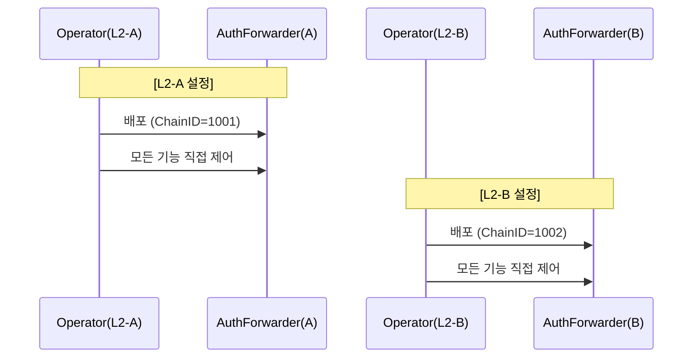
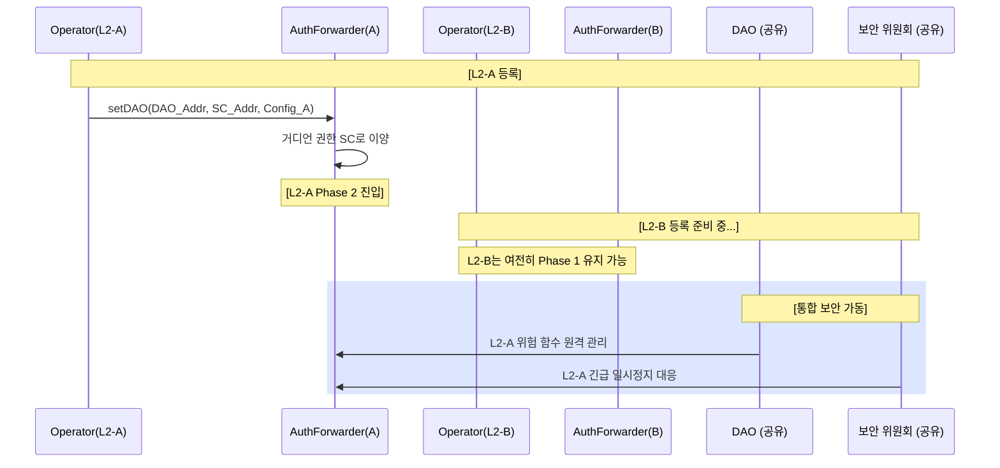

# DAO 권한 이양 액션 플랜 v2 (AuthorityForwarder 패턴 - 다중 L2 및 결정적 주소 지원)

> **목적**: L2 운영자가 초기에는 `AuthorityForwarder`를 통해 자율적으로 시스템을 구축하고, 등록 시점에 고위험 권한 및 긴급 대응 권한(Guardian)을 DAO로 자발적으로 이양함으로써 다중 L2 생태계에서 완벽한 직무 분리와 탈중앙화된 보안을 실현합니다.
>
> **핵심 원칙 (Plan v2 업데이트)**:
> 1. **단계적 권한 이양**: 초기 모든 제어 권한(Phase 1) → 등록 후 권한 분리(Phase 2).
> 2. **자발적 이양 (Self-Transfer)**: 운영자가 `setDAO`를 호출하여 위험 함수 제어권을 DAO에 자발적으로 이양.
> 3. **거디언(Guardian) 권한 분리**: DAO 등록 시 일시정지/해제 권한(Guardian)을 보안 위원회(Security Council)로 원자적으로 이양.
> 4. **관리 효율성 극대화**: **L2 Chain ID를 Salt로 한 결정적 주소(CREATE2)** 배포를 통해 운영자의 설정 부담을 최소화하고 DAO의 관리 편의성 제공.
> 5. **다중 L2 생태계 지원**: 여러 L2 네트워크가 공유된 DAO 및 보안 위원회에 독립적으로 등록하여 통합 거버넌스 구현.

---

## 1. 아키텍처 설계: "AuthorityForwarder" 패턴 v2

생태계 내 수많은 L2 네트워크를 지원하기 위해 소유권을 보유하고 일상 운영 및 긴급 대응을 관리하는 **중계 컨트랙트(AuthorityForwarder)**를 도입합니다.

### 1.1 다중 L2 배포 모델

**v2 주요 개선 사항**: 각 L2는 자신만의 AuthorityForwarder 인스턴스를 가지지만, 공통의 DAO 및 보안 위원회를 공유합니다.

```
Tokamak 생태계 아키텍처 (v2)

┌─────────────────────────────────────────────────────────────┐
│                       공유 거버넌스 계층                        │
│                                                              │
│  ┌────────────────────┐        ┌──────────────────────┐    │
│  │   DAO (Timelock)   │        │  보안 위원회 (SC)      │    │
│  │   18일 대기 기간     │        │  (Safe 2/3 multisig) │    │
│  └────────────────────┘        └──────────────────────┘    │
│           │                              │                   │
└───────────┼──────────────────────────────┼──────────────────┘
            │                              │
    ┌───────┴───────┬──────────────────────┴─────┬────────────┐
    │               │                            │            │
┌───▼─────────┐ ┌───▼─────────┐           ┌────▼──────────┐ │
│  L2-A       │ │  L2-B       │           │  L2-C         │ │
│  네트워크     │ │  네트워크     │    ...    │  네트워크     │ │
│             │ │             │           │               │ │
│ ┌─────────┐ │ │ ┌─────────┐ │           │ ┌───────────┐ │ │
│ │Authority│ │ │ │Authority│ │           │ │ Authority │ │ │
│ │Forwarder│ │ │ │Forwarder│ │           │ │ Forwarder │ │ │
│ │   (A)   │ │ │ │   (B)   │ │           │ │    (C)    │ │ │
│ └────┬────┘ │ │ └────┬────┘ │           │ └─────┬─────┘ │ │
│      │      │ │      │      │           │       │       │ │
│ ┌────▼────┐ │ │ ┌────▼────┐ │           │ ┌─────▼─────┐ │ │
│ │Operator │ │ │ │Operator │ │           │ │ Operator  │ │ │
│ │  (A)    │ │ │ │  (B)    │ │           │ │   (C)     │ │ │
│ └─────────┘ │ │ └─────────┘ │           │ └───────────┘ │ │
│             │ │             │           │               │ │
│ [L1         │ │ [L1         │           │ [L1           │ │
│  컨트랙트들]  │ │  컨트랙트들]  │           │  컨트랙트들]  │ │
└─────────────┘ └─────────────┘           └───────────────┘ │
```

**주요 특징**:
- **공유 컴포넌트**: 단일 DAO(Timelock) + 단일 보안 위원회(Safe multisig).
- **L2 전용 컴포넌트**: 각 L2마다 개별적인 AuthorityForwarder와 운영자(Operator).
- **독립적 등록**: 각 L2는 서로 다른 시점에 독립적으로 Phase 2로 전환 가능.
- **결정적 주소**: Chain ID를 Salt로 사용하여 포워더 주소를 고정, DAO가 각 체인의 포워더를 즉시 식별 가능.

### 1.2 소유권 구조 및 권한 변화

*   **Phase 1 (초기 배포) - 각 L2별**:
    `Operator(L2-A)` ──> `AuthorityForwarder(A)` ────> **[L2-A 핵심 컨트랙트]**
    *(DAO 주소가 설정되지 않음. 운영자가 업그레이드 및 일시정지/해제 권한을 포함한 모든 제어권 보유)*

*   **Phase 2 (DAO 등록 후) - 통합 거버넌스**:
    ```
    Operator(L2-A) ──> AuthorityForwarder(A) ────> [L2-A 컨트랙트]
                              │
    Operator(L2-B) ──> AuthorityForwarder(B) ────> [L2-B 컨트랙트]
                              │
                         ┌────┴────┐
           DAO(Timelock)─┤         ├─보안 위원회(SC)
                         └─────────┘
    ```
    *(각 L2의 위험 함수 호출 차단. 거디언 역할이 SC로 이양. 통합 긴급 대응 체계 가동)*

---

## 2. 핵심 구현: AuthorityForwarder.sol (Plan v2)

### 2.1 Chain ID 기반 식별자

**상태 변수**:
```solidity
address public immutable OPERATOR;      // L2 운영자 (배포 시 설정)
uint256 public immutable L2_CHAIN_ID;  // L2 고유 식별자 (Chain ID 사용)
address public DAO;                     // 초기값 0, setDAO()를 통해 1회 설정
address public SECURITY_COUNCIL;        // 긴급 대응 주체
```

**결정적 주소 배포 (CREATE2)**:
운영자의 실수와 관리 비용을 줄이기 위해 `L2_CHAIN_ID`를 Salt로 사용하여 배포합니다.
```solidity
// 배포 스크립트 예시
bytes32 salt = bytes32(cfg.l2ChainID());
AuthorityForwarder forwarder = new AuthorityForwarder{salt: salt}(operator, cfg.l2ChainID());
```

### 2.2 주요 함수 권한 제어

**Core Function: `forwardCall()` - 역할 기반 액세스 제어**
```solidity
function forwardCall(address _target, bytes calldata _data) external payable {
    bytes4 selector = bytes4(_data[:4]);

    // 1. 운영자(Operator): 일상적인 루틴 함수만 허용 (Phase 2 이후 위험 함수 차단)
    if (msg.sender == OPERATOR) {
        if (DAO != address(0) && _isDangerousFunction(selector)) {
            revert("Auth: Dangerous operation blocked. Use DAO governance.");
        }
        _executeCall(_target, _data);
        return;
    }

    // 2. DAO: 모든 함수에 대한 전체 권한 보유
    if (msg.sender == DAO) {
        _executeCall(_target, _data);
        return;
    }

    // 3. 보안 위원회: 긴급 함수만 허용 (pause, unpause, blacklist 등)
    if (msg.sender == SECURITY_COUNCIL) {
        require(_isEmergencyFunction(selector), "Auth: SC only for emergency");
        _executeCall(_target, _data);
        return;
    }

    revert("Auth: Not authorized");
}

**Core Function 2: `setDAO()` - 권한 이양 및 레지스트리 자동 등록**
```solidity
function setDAO(address _dao, address _sc, address _config, address _registry) external {
    require(msg.sender == OPERATOR, "Auth: Not Operator");
    require(DAO == address(0), "Auth: DAO already set");

    // 주소 유효성 및 컨트랙트 여부 체크 생략 (실제 구현에는 포함)
    DAO = _dao;
    SECURITY_COUNCIL = _sc;

    // 1. 거디언 권한 원자적 이양
    bytes memory data = abi.encodeWithSignature("setGuardian(address)", _sc);
    _executeCall(_config, data);

    // 2. 재단 관리 레지스트리에 자동 등록
    if (_registry != address(0)) {
        // Registry 인터페이스 호출을 통해 자동으로 L2 정보를 등록
        (bool success, ) = _registry.call(
            abi.encodeWithSignature("register(uint256,address)", L2_CHAIN_ID, address(this))
        );
        require(success, "Auth: Registration failed");
    }

    emit DAORegistered(_dao, _sc, L2_CHAIN_ID);
}
```
```

### 2.3 다중 L2 추적을 위한 이벤트

```solidity
/// @notice 호출이 성공적으로 전달되었을 때 발생
event CallForwarded(
    address indexed target,
    bytes4 indexed selector,
    address indexed caller,
    uint256 indexed chainId,
    bool success
);

/// @notice DAO 및 보안 위원회가 설정될 때 발생 (인덱싱용)
event DAORegistered(
    address indexed dao,
    address indexed securityCouncil,
    uint256 indexed chainId
);
```

### 2.4 AuthorityForwarderRegistry.sol (재단 관리 중앙 레지스트리)

이 컨트랙트는 재단에 의해 L1에 단 하나만 배포되며, 생태계 내 모든 L2 포워더 주소를 통합 관리합니다. 운영자가 `setDAO`를 호출할 때 해당 주소를 입력하면 자동으로 등록이 완료됩니다.

```solidity
contract AuthorityForwarderRegistry {
    /// @notice L2 Chain ID => AuthorityForwarder 주소 매핑
    mapping(uint256 => address) public getForwarder;

    /// @notice 새로운 포워더가 등록될 때 발생
    event ForwarderRegistered(uint256 indexed chainId, address indexed forwarder);

    /**
     * @notice 포워더 주소를 등록합니다.
     * @param _chainId 등록할 L2의 체인 ID
     * @param _forwarder 해당 L2의 포워더 주소
     */
    function register(uint256 _chainId, address _forwarder) external {
        // 보안 권한: 해당 포워더 본인만 자신의 체인 ID를 등록할 수 있게 함으로써
        // 데이터의 신뢰성을 온체인에서 강제합니다.
        require(msg.sender == _forwarder, "Registry: Only forwarder can register itself");
        require(getForwarder[_chainId] == address(0), "Registry: Already registered");

        getForwarder[_chainId] = _forwarder;
        emit ForwarderRegistered(_chainId, _forwarder);
    }

    /**
     * @notice 체인 ID에 해당하는 포워더 주소를 반환합니다.
     * @param _chainId 조회할 L2의 체인 ID
     * @return 해당 L2의 포워더 주소
     */
    function getForwarderAddress(uint256 _chainId) external view returns (address) {
        return getForwarder[_chainId];
    }
}
```

---

## 3. 통합 시나리오 (워크플로우)

### 3.1 단계별 흐름도

#### Phase 1: 독립적 운영 (Per L2)
*각 운영자는 자신의 리전을 자율적으로 관리합니다.*



#### Phase 2: DAO 등록 및 통합 보안
*각 L2는 개별적으로 공유 DAO/SC에 등록합니다.*



---

## 4. 운영 및 관리 가이드

### 4.1 운영자(Operator) 부하 최소화
운영자는 배포 시 별도의 식별자 문자열을 입력할 필요가 없습니다. 시스템은 이미 정의된 `l2ChainID`를 사용하여:
1.  **결정적 주소**를 생성하여 배포하고,
2.  해당 값을 내부 **고유 식별자**로 자동 할당합니다.

### 4.2 DAO/SC의 자율적 포워더 식별
DAO나 보안 위원회가 특정 체인을 관리하려 할 때, 주소 리스트를 일일이 관리할 필요가 없습니다.
*   **오프체인**: 체인 ID와 바이트코드를 알면 포워더 주소를 즉시 계산할 수 있습니다.
*   **온체인**: 필요한 경우 경량 레지스트리를 두어 `registry.getForwarder(chainId)`로 조회할 수 있습니다.
*   **이벤트**: `DAORegistered` 이벤트를 인덱싱하여 거버넌스에 합류한 체인 목록을 실시간으로 관리합니다.

### 4.3 선택적 긴급 대응
보안 위원회는 특정 체인에서 보안 사고가 발생했을 때:
- 해당 체인(L2-A)만 개별적으로 일시정지(`pause`) 할 수 있습니다.
- 다른 체인(L2-B, C)은 정상 운영되므로 생태계 전체의 피해를 최소화합니다.

---

## 5. 결론

Plan v2는 **"식별자의 자동화"**와 **"주소의 결정성"**을 통해 다중 L2 생태계를 가장 효율적으로 관리할 수 있는 모델입니다.

- **안정성**: 운영자의 수동 설정 오류를 원천 차단합니다.
- **확장성**: 수백 개의 L2가 도입되더라도 통일된 거버넌스 인터페이스(Chain ID)로 관리할 수 있습니다.
- **투명성**: 모든 관리자 액션이 체인 ID와 함께 기록되어 명확한 감사 추적(Audit Trail)이 가능합니다.

이 모델은 Tokamak 생태계가 수평적으로 확장되면서도 동일한 수준의 보안 및 탈중앙화 보증을 유지할 수 있게 합니다.
