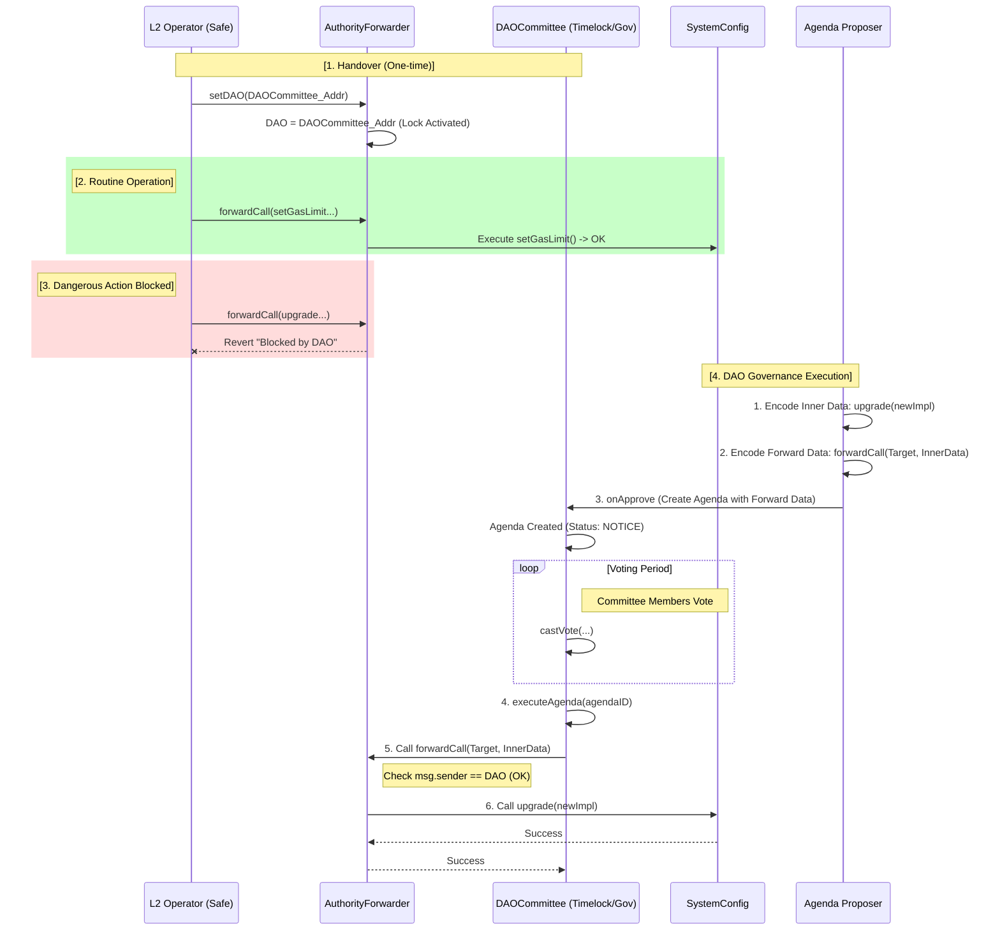

# DAO Authority Transfer Action Plan (AuthorityForwarder Pattern)

> **Purpose**: Enable L2 operators to freely build their systems initially through `AuthorityForwarder`, then voluntarily transfer high-risk authority to the DAO at registration time, achieving separation of duties.
>
> **Core Principles**:
> 1. **Phased Authority Transfer**: Full control initially (Phase 1) → Authority separation after registration (Phase 2).
> 2. **Voluntary Transfer (Self-Transfer)**: Operator voluntarily calls `setDAO` to transfer control of dangerous functions.
> 3. **Safe Operations (Separation of Duty)**: After transfer, the Operator can still perform routine functions (`setGasLimit`), but dangerous functions (`upgrade`) can only be executed by the DAO.

---

## 1. Architecture Design: "AuthorityForwarder" Pattern

Introduces an **intermediary contract (AuthorityForwarder)** that temporarily holds ownership without modifying the structure of existing `Ownable` contracts.

### 1.1 Ownership Structure and Authority Changes

*   **Phase 1 (Initial Deployment)**:
    `Operator` ──(Call)──> `AuthorityForwarder` ────(Owner)────> **[All Critical Contracts]**
                                                          (`SystemConfig`, `ProxyAdmin`, `OptimismPortal`...)
    *(DAO address not set, Operator can execute all functions including upgrade on all target contracts)*

*   **Phase 2 (After DAO Registration)**:
    `Operator` ──(Call)──> `AuthorityForwarder` ────(Owner)────> **[All Critical Contracts]**
                                           │
    `DAO(Timelock)` ────────(Command)──────┘
    *(DAO address set → Operator's dangerous function calls blocked / Only routine functions allowed)*

---

## 2. Detailed Implementation Specification: AuthorityForwarder.sol

```solidity
// SPDX-License-Identifier: MIT
pragma solidity ^0.8.0;

import { Ownable } from "@openzeppelin/contracts/access/Ownable.sol";

contract AuthorityForwarder {
    // State variables
    address public immutable OPERATOR; // L2 operator
    address public DAO;                // Initially 0, set at registration

    // Delegation info: [Target][Selector] -> [Executor]
    mapping(address => mapping(bytes4 => address)) public delegatedExecutors;

    // Events
    event CallForwarded(address indexed target, bool success);
    event DAOSet(address indexed dao);
    event DelegationSet(address indexed target, bytes4 indexed selector, address indexed executor);

    constructor(address _operator) {
        require(_operator != address(0), "Invalid addresses");
        OPERATOR = _operator;
    }

    // [Core] Call Forwarding Logic
    function forwardCall(address _target, bytes calldata _data) external payable {
        bytes4 selector = bytes4(_data[:4]);
        address delegatee = delegatedExecutors[_target][selector];

        // 1. Is caller a specially authorized third party?
        if (delegatee == msg.sender) {
             _executeCall(_target, _data);
             return;
        }

        // 2. Is caller the Operator?
        if (msg.sender == OPERATOR) {
            // ⛔ If delegated, Operator cannot call (Exclusive)
            require(delegatee == address(0), "Auth: Function execution is delegated exclusively to another.");

            // 🔒 [Authority Control] If DAO is set, block dangerous functions
            // When DAO == address(0), no blocking (free initial setup)
            if (DAO != address(0) && _isDangerousFunction(selector)) {
                revert("Auth: Dangerous operation blocked. Use DAO governance.");
            }

            _executeCall(_target, _data);
            return;
        }

        // 3. Is caller the DAO? (DAO can always call all functions)
        if (msg.sender == DAO) {
            _executeCall(_target, _data);
            return;
        }

        revert("Auth: Not authorized");
    }

    function _executeCall(address _target, bytes memory _data) internal {
        (bool success, bytes memory result) = _target.call{value: msg.value}(_data);
        if (!success) {
            assembly {
                revert(add(result, 32), mload(result))
            }
        }
        emit CallForwarded(_target, success);
    }

    // [Authority Transfer] Operator voluntarily sets DAO address
    // Once set, cannot be reverted (One-way Lock)
    function setDAO(address _dao) external {
        require(msg.sender == OPERATOR, "Auth: Not Operator");
        require(DAO == address(0), "Auth: DAO already set");
        require(_dao != address(0), "Auth: Invalid DAO address");

        // 🔒 [Security Enhancement] Verify DAO is a contract (prevent EOA)
        require(_dao.code.length > 0, "Auth: DAO must be a contract");

        DAO = _dao;
        emit DAOSet(_dao);
    }

    // [Helper] Query current Phase (improved readability)
    enum Phase { Initial, DAOControlled }

    function currentPhase() public view returns (Phase) {
        return DAO == address(0) ? Phase.Initial : Phase.DAOControlled;
    }

    // [DAO Only] Delegate specific function execution to third party
    function setDelegatedExecutor(address _target, bytes4 _selector, address _executor) external {
        require(msg.sender == DAO, "Auth: Not DAO");
        delegatedExecutors[_target][_selector] = _executor;
        emit DelegationSet(_target, _selector, _executor);
    }

    // Identify dangerous functions (upgrades, fund theft, etc.)
    function _isDangerousFunction(bytes4 selector) internal pure returns (bool) {
        return selector == bytes4(keccak256("upgrade(address,address)")) ||
               selector == bytes4(keccak256("upgradeAndCall(address,address,bytes)")) ||
               selector == bytes4(keccak256("changeProxyAdmin(address,address)")) ||
               selector == bytes4(keccak256("setAddress(string,address)")) ||
               selector == bytes4(keccak256("setBatcherHash(bytes32)")) ||
               selector == bytes4(keccak256("setImplementation(uint32,address)")) ||
               selector == bytes4(keccak256("transferOwnership(address)")) ||
               selector == bytes4(keccak256("recover(uint256)")) ||
               selector == bytes4(keccak256("hold(address,uint256)"));
    }
}
```

---

## 3. Integration Scenario (Workflow)

### 3.1 Phase-by-Phase Flow Diagram (Sequence Diagram)

#### Phase 1: Initial Deployment & Full Control via Safe (Deployment & Operations)
*Operator(Safe) exercises authority over **all L1 contracts including SystemConfig, ProxyAdmin** through `AuthorityForwarder`.*

```mermaid
sequenceDiagram
    participant EOA as Signer (EOA)
    participant Safe as SystemOwnerSafe
    participant AuthForwarder as AuthorityForwarder
    participant Targets as All L1 Contracts

    Note over EOA, Targets: [1. Initial Deployment & Setup]
    EOA->>AuthForwarder: Deploy AuthorityForwarder(Safe_Addr)
    EOA->>Targets: transferOwnership(AuthForwarder_Addr)
    Note right of Targets: ProxyAdmin, SystemConfig, Portal... owners updated

    Note over EOA, Targets: [2. Execution Flow (e.g. upgrade)]

    EOA->>EOA: 1. Encode Inner Data: upgrade(impl)
    EOA->>EOA: 2. Encode Forward Data: forwardCall(TargetAddr, InnerData)

    EOA->>Safe: 3. Propose Transaction (to: AuthForwarder, data: ForwardData)
    EOA->>Safe: 4. Sign Transaction (Threshold Reached)

    Safe->>AuthForwarder: 5. Call forwardCall(TargetAddr, InnerData)
    Note right of AuthForwarder: Check msg.sender == Safe (OK)
    Note right of AuthForwarder: Check DAO == 0x0 (Dangerous Func Allowed)

    AuthForwarder->>Targets: 6. Call upgrade(impl) on Specific Target
    Note right of Targets: Check msg.sender == AuthForwarder (Owner OK)
    Targets-->>AuthForwarder: Execution Success
    AuthForwarder-->>Safe: Success
```



#### Phase 2: DAO Registration & Authority Handover (Handover & Operation)
*Once DAO address is set, Operator's dangerous function execution is blocked and can only be executed through DAO Agenda.*




### 3.2 Phase-by-Phase Strategy
1.  **Initial Build**: Operator manages ownership through `AuthorityForwarder`, freely modifying code and optimizing the system until DAO is set.
2.  **Authority Separation (Self-Constraint)**: When ready to enter the ecosystem, call `setDAO`. From this moment, the Operator's role **shrinks from "Admin" to "Manager"**.
3.  **Safe Ecosystem**: The DAO accepts the L2 as an ecosystem member with confidence (Trustless) that the Operator cannot arbitrarily change the system.

---

## 4. Test Scenarios

### 4.1 Phase 1 Tests (Initial Phase)

#### Test 1: All Functions Allowed
```solidity
function test_phase1_allFunctionsAllowed() public {
    // Setup: DAO not set
    assertEq(forwarder.DAO(), address(0));
    assertEq(uint(forwarder.currentPhase()), uint(AuthorityForwarder.Phase.Initial));

    // Operator can call dangerous functions in Phase 1
    vm.prank(operator);
    forwarder.forwardCall(
        address(proxyAdmin),
        abi.encodeCall(ProxyAdmin.upgrade, (systemConfig, newImpl))
    );
    // ✅ Should succeed

    // Operator can also call routine functions
    vm.prank(operator);
    forwarder.forwardCall(
        address(systemConfig),
        abi.encodeCall(SystemConfig.setGasLimit, (30_000_000))
    );
    // ✅ Should succeed
}
```

#### Test 2: setDAO() Authorization Check
```solidity
function test_setDAO_onlyOperator() public {
    // Non-operator cannot call setDAO
    vm.prank(attacker);
    vm.expectRevert("Auth: Not Operator");
    forwarder.setDAO(dao);

    // Operator can call setDAO
    vm.prank(operator);
    forwarder.setDAO(dao);
    assertEq(forwarder.DAO(), dao);
}
```

#### Test 3: setDAO() Can Only Be Called Once
```solidity
function test_setDAO_onlyOnce() public {
    // First call succeeds
    vm.prank(operator);
    forwarder.setDAO(dao);
    assertEq(forwarder.DAO(), dao);

    // Second call reverts
    vm.prank(operator);
    vm.expectRevert("Auth: DAO already set");
    forwarder.setDAO(dao2);
}
```

#### Test 4: DAO Must Be a Contract
```solidity
function test_setDAO_mustBeContract() public {
    address eoa = address(0x1234); // EOA address

    vm.prank(operator);
    vm.expectRevert("Auth: DAO must be a contract");
    forwarder.setDAO(eoa);
}
```

### 4.2 Phase 2 Tests (DAO-Controlled Phase)

#### Test 5: Dangerous Functions Blocked
```solidity
function test_phase2_dangerousFunctionsBlocked() public {
    // Setup: Set DAO
    vm.prank(operator);
    forwarder.setDAO(dao);
    assertEq(uint(forwarder.currentPhase()), uint(AuthorityForwarder.Phase.DAOControlled));

    // Operator cannot call upgrade (dangerous function)
    vm.prank(operator);
    vm.expectRevert("Auth: Dangerous operation blocked. Use DAO governance.");
    forwarder.forwardCall(
        address(proxyAdmin),
        abi.encodeCall(ProxyAdmin.upgrade, (systemConfig, newImpl))
    );

    // Operator cannot call other dangerous functions
    vm.prank(operator);
    vm.expectRevert("Auth: Dangerous operation blocked. Use DAO governance.");
    forwarder.forwardCall(
        address(proxyAdmin),
        abi.encodeCall(ProxyAdmin.changeProxyAdmin, (systemConfig, attacker))
    );

    vm.prank(operator);
    vm.expectRevert("Auth: Dangerous operation blocked. Use DAO governance.");
    forwarder.forwardCall(
        address(systemConfig),
        abi.encodeCall(SystemConfig.setBatcherHash, (bytes32(0)))
    );
}
```

#### Test 6: Routine Functions Allowed
```solidity
function test_phase2_routineFunctionsAllowed() public {
    // Setup: Set DAO
    vm.prank(operator);
    forwarder.setDAO(dao);

    // Operator can still call routine functions
    vm.prank(operator);
    forwarder.forwardCall(
        address(systemConfig),
        abi.encodeCall(SystemConfig.setGasLimit, (30_000_000))
    );
    // ✅ Should succeed
}
```

#### Test 7: DAO Can Call All Functions
```solidity
function test_phase2_daoCanCallAllFunctions() public {
    // Setup: Set DAO
    vm.prank(operator);
    forwarder.setDAO(dao);

    // DAO can call dangerous functions
    vm.prank(dao);
    forwarder.forwardCall(
        address(proxyAdmin),
        abi.encodeCall(ProxyAdmin.upgrade, (systemConfig, newImpl))
    );
    // ✅ Should succeed

    // DAO can also call routine functions
    vm.prank(dao);
    forwarder.forwardCall(
        address(systemConfig),
        abi.encodeCall(SystemConfig.setGasLimit, (30_000_000))
    );
    // ✅ Should succeed
}
```

### 4.3 Delegation Tests

#### Test 8: Delegation Priority
```solidity
function test_delegation_priority() public {
    vm.prank(operator);
    forwarder.setDAO(dao);

    // DAO delegates upgrade function to security council
    bytes4 selector = ProxyAdmin.upgrade.selector;
    vm.prank(dao);
    forwarder.setDelegatedExecutor(address(proxyAdmin), selector, securityCouncil);

    // Operator cannot call (delegated exclusively)
    vm.prank(operator);
    vm.expectRevert("Auth: Function execution is delegated exclusively to another.");
    forwarder.forwardCall(
        address(proxyAdmin),
        abi.encodeCall(ProxyAdmin.upgrade, (systemConfig, newImpl))
    );

    // Security Council can call (has delegation)
    vm.prank(securityCouncil);
    forwarder.forwardCall(
        address(proxyAdmin),
        abi.encodeCall(ProxyAdmin.upgrade, (systemConfig, newImpl))
    );
    // ✅ Should succeed
}
```

#### Test 9: Only DAO Can Set Delegation
```solidity
function test_delegation_onlyDAO() public {
    vm.prank(operator);
    forwarder.setDAO(dao);

    bytes4 selector = ProxyAdmin.upgrade.selector;

    // Operator cannot set delegation
    vm.prank(operator);
    vm.expectRevert("Auth: Not DAO");
    forwarder.setDelegatedExecutor(address(proxyAdmin), selector, securityCouncil);

    // DAO can set delegation
    vm.prank(dao);
    forwarder.setDelegatedExecutor(address(proxyAdmin), selector, securityCouncil);
    assertEq(forwarder.delegatedExecutors(address(proxyAdmin), selector), securityCouncil);
}
```

### 4.4 Dangerous Function List Verification

#### Test 10: All Dangerous Functions Blocked
```solidity
function test_allDangerousFunctionsBlocked() public {
    vm.prank(operator);
    forwarder.setDAO(dao);

    // Test all 9 dangerous functions
    vm.startPrank(operator);

    // 1. upgrade
    vm.expectRevert("Auth: Dangerous operation blocked. Use DAO governance.");
    forwarder.forwardCall(address(proxyAdmin), abi.encodeCall(ProxyAdmin.upgrade, (systemConfig, newImpl)));

    // 2. upgradeAndCall
    vm.expectRevert("Auth: Dangerous operation blocked. Use DAO governance.");
    forwarder.forwardCall(address(proxyAdmin), abi.encodeCall(ProxyAdmin.upgradeAndCall, (systemConfig, newImpl, "")));

    // 3. changeProxyAdmin
    vm.expectRevert("Auth: Dangerous operation blocked. Use DAO governance.");
    forwarder.forwardCall(address(proxyAdmin), abi.encodeCall(ProxyAdmin.changeProxyAdmin, (systemConfig, attacker)));

    // 4. setAddress
    vm.expectRevert("Auth: Dangerous operation blocked. Use DAO governance.");
    forwarder.forwardCall(address(proxyAdmin), abi.encodeCall(ProxyAdmin.setAddress, ("test", attacker)));

    // 5. setBatcherHash
    vm.expectRevert("Auth: Dangerous operation blocked. Use DAO governance.");
    forwarder.forwardCall(address(systemConfig), abi.encodeCall(SystemConfig.setBatcherHash, (bytes32(0))));

    // 6. setImplementation
    vm.expectRevert("Auth: Dangerous operation blocked. Use DAO governance.");
    forwarder.forwardCall(address(disputeGameFactory), abi.encodeCall(DisputeGameFactory.setImplementation, (GameType.wrap(0), IDisputeGame(attacker))));

    // 7. transferOwnership
    vm.expectRevert("Auth: Dangerous operation blocked. Use DAO governance.");
    forwarder.forwardCall(address(systemConfig), abi.encodeCall(SystemConfig.transferOwnership, (attacker)));

    // 8. recover
    vm.expectRevert("Auth: Dangerous operation blocked. Use DAO governance.");
    forwarder.forwardCall(address(delayedWETH), abi.encodeCall(DelayedWETH.recover, (1 ether)));

    // 9. hold
    vm.expectRevert("Auth: Dangerous operation blocked. Use DAO governance.");
    forwarder.forwardCall(address(delayedWETH), abi.encodeCall(DelayedWETH.hold, (attacker, 1 ether)));

    vm.stopPrank();
}
```

### 4.5 Edge Case Tests

#### Test 11: Unauthorized Caller Blocked
```solidity
function test_unauthorizedCallerBlocked() public {
    vm.prank(operator);
    forwarder.setDAO(dao);

    // Random address cannot call
    vm.prank(attacker);
    vm.expectRevert("Auth: Not authorized");
    forwarder.forwardCall(
        address(systemConfig),
        abi.encodeCall(SystemConfig.setGasLimit, (30_000_000))
    );
}
```

#### Test 12: Phase Transition Verification
```solidity
function test_phaseTransition() public {
    // Phase 1: Initial
    assertEq(uint(forwarder.currentPhase()), uint(AuthorityForwarder.Phase.Initial));

    // Transition
    vm.prank(operator);
    forwarder.setDAO(dao);

    // Phase 2: DAOControlled
    assertEq(uint(forwarder.currentPhase()), uint(AuthorityForwarder.Phase.DAOControlled));
}
```

---

## 5. Conclusion

This **"AuthorityForwarder + Self-Transfer"** approach provides the following advantages:

1. **Simplicity**: Achieves authority separation with a single contract
2. **Voluntariness**: Minimizes trust through Operator's voluntary transfer
3. **Safety**: Blocks 9 dangerous functions + contract verification
4. **Flexibility**: Future extensibility through delegation mechanism
5. **Verifiability**: Complete test scenario coverage

Can be applied immediately if `SystemOwnerSafe` is confirmed at initial deployment, and the DAO address can be set later via `setDAO()`.
